# Análise exploratória de dados

Fomos contratados por uma grande empresa distribuidora de vinhos. Nosso cliente deseja melhorar as vendas entregando produtos que agradem os diversos perfis de clientes. O foco do nosso projeto aqui é desenvolver uma análise exploratória nos [dados de avaliações de vinhos](https://www.kaggle.com/zynicide/wine-reviews).

Uma análise exploratória bem elaborada consiste em algumas etapas:

- Compreensão do negócio
- Compreensão dos dados
- Preparar os dados (limpeza e tratamento)
- Análise de dados (extrair informações relevantes e responder perguntas)
- Avaliação dos resultados

Nosso objetivo ao concluir esse projeto é responder as seguintes perguntas:

1. De onde vem o melhor vinho ?
2. O preço do vinho está relacionado com a qualidade ?
3. Certos variedades de uvas são de maior qualidade ?
4. Qual é o melhor vinho em cada faixa de preço ?
5. Que palavras são mais utilizadas para descrever um vinho ?

Vamos começar!

## Verificando os dados

Agora que já sabemos que perguntas devemos responder durante a análise, vamos dar uma olhada nos dados. Começaremos com alguns imports:

```python
import pandas as pd
import numpy as np
import matplotlib.pyplot as plt
import seaborn as sns
sns.set()
```

Utilizaremos a biblioteca [Seaborn](https://seaborn.pydata.org/), uma opção de biblioteca para visualização baseada na `Matplotlib` que fornece uma interface mais simples para plotar os gráficos (escreveremos menos código).

Vamos examinar o dataset:

```python
df = pd.read_csv("winemag-data-130k-v2.csv")
df.head()
```

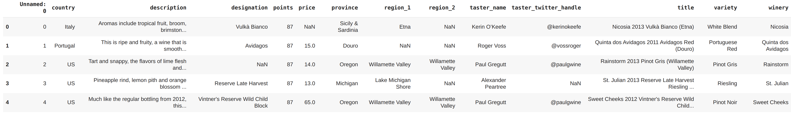

```python
df.columns

Index(['Unnamed: 0', 'country', 'description', 'designation', 'points',
       'price', 'province', 'region_1', 'region_2', 'taster_name',
       'taster_twitter_handle', 'title', 'variety', 'winery'],
      dtype='object')
```

Vamos elaborar um pequeno sumário para essas colunas e ver o que iremos utilizar em nossa análise:

- **unnamed** - parece ser uma coluna de índice que podemos remover
- **country** - país onde o vinho foi feito (interessante)
- **description** - descrição do vinho
- **designation** - vinhedo dentro da adega de onde as uvas que fizeram o vinho foram coletadas.
- **points** - é o número de pontos que o vinho obteve em sua avaliação (precisamos entender a escala de pontos)
- **price** - preço da garrafa de vinho
- **province** - é a província (estado) onde o vinho foi feito
- **region_1** - é a região onde o vinho foi feito
- **region_2** - região mais específica dentro de uma vitícola (podemos remover isso)
- **taster_name** - nome do revisor
- **taster_twitter_handle** - perfil do Twitter do avaliador
- **title** - nome do vinho analisado (o ano de fabricação está no título)
- **variety** - tipo de uvas utilizadas na fabricação do vinho
- **winery** - adega onde o vinho foi feito.

Agora, uma olhada rápida nos tipos de dados:

```
df.info()

<class 'pandas.core.frame.DataFrame'>
RangeIndex: 129971 entries, 0 to 129970
Data columns (total 14 columns):
 #   Column                 Non-Null Count   Dtype  
---  ------                 --------------   -----  
 0   Unnamed: 0             129971 non-null  int64  
 1   country                129908 non-null  object 
 2   description            129971 non-null  object 
 3   designation            92506 non-null   object 
 4   points                 129971 non-null  int64  
 5   price                  120975 non-null  float64
 6   province               129908 non-null  object 
 7   region_1               108724 non-null  object 
 8   region_2               50511 non-null   object 
 9   taster_name            103727 non-null  object 
 10  taster_twitter_handle  98758 non-null   object 
 11  title                  129971 non-null  object 
 12  variety                129970 non-null  object 
 13  winery                 129971 non-null  object 
dtypes: float64(1), int64(2), object(11)
memory usage: 13.9+ MB
```

Ao todo temos 129.971 linhas e 14 colunas no dataset. Existem algumas colunas com dados ausentes e podemos descartar algumas dessas colunas, como por exemplo `region_2`, `taster_name` e `taster_twitter_handle`.

```python
df.describe()
```

|       |    Unnamed: 0 |        points |         price |
| ----: | ------------: | ------------: | ------------: |
| count | 129971.000000 | 129971.000000 | 120975.000000 |
|  mean |  64985.000000 |     88.447138 |     35.363389 |
|   std |  37519.540256 |      3.039730 |     41.022218 |
|   min |      0.000000 |     80.000000 |      4.000000 |
|   25% |  32492.500000 |     86.000000 |     17.000000 |
|   50% |  64985.000000 |     88.000000 |     25.000000 |
|   75% |  97477.500000 |     91.000000 |     42.000000 |
|   max | 129970.000000 |    100.000000 |   3300.000000 |

O `describe()` nos mostra uma distribuição de pontos para uma garrafa de vinho, onde o mínimo é `80` e o máximo é `100`. Também é possível notar que a garrafa de vinho mais barata custa `$4` e a mais cara `$3.300`. Segundo [esse site](https://www.wine-searcher.com/critics-17-wine+enthusiast) temos a seguinte classificação por pontos:

- **98-100** - Clássico
- **94-97**- Soberbo
- **90-93**- Excelente
- **87-89**- Muito bom
- **83-86**- Bom
- **80-82**- Aceitável

Por meio da função `value_counts()` podemos contar quantos vinhos foram avaliados por cada país:

```python
df["country"].value_counts()
```

```
US                        54504
France                    22093
Italy                     19540
Spain                      6645
Portugal                   5691
Chile                      4472
Argentina                  3800
Austria                    3345
Australia                  2329
Germany                    2165
New Zealand                1419
South Africa               1401
Israel                      505
Greece                      466
Canada                      257
Hungary                     146
Bulgaria                    141
Romania                     120
Uruguay                     109
Turkey                       90
Slovenia                     87
Georgia                      86
England                      74
Croatia                      73
Mexico                       70
Moldova                      59
Brazil                       52
Lebanon                      35
Morocco                      28
Peru                         16
Ukraine                      14
Serbia                       12
Czech Republic               12
Macedonia                    12
Cyprus                       11
India                         9
Switzerland                   7
Luxembourg                    6
Bosnia and Herzegovina        2
Armenia                       2
Slovakia                      1
China                         1
Egypt                         1
Name: country, dtype: int64
```

> Note que a maioria dos vinhos avaliados é dos EUA, França, Itália, Espanha e Portugal.

Também podemos utilizar `value_counts()` para verificar quais tipos de uva foram mais utilizadas na fabricação dos vinhos avaliados:

```python
df["variety"].value_counts()

Pinot Noir                    13272
Chardonnay                    11753
Cabernet Sauvignon             9472
Red Blend                      8946
Bordeaux-style Red Blend       6915
                              ...  
Cabernet Sauvignon-Barbera        1
Sauvignonasse                     1
Forcallà                          1
Meseguera                         1
Bobal-Cabernet Sauvignon          1
Name: variety, Length: 707, dtype: int64
```

Nossa próxima tarefa é limpar os dados, agora que verificamos podemos concluir que os campos: `Unamed: 0`, `designation`, `region_1`, `region_2`, `taster_name` e `taster_twitter_handle` podem ser removidos, pois não fornecem dados úteis para nossa análise.

## Limpando os dados

A primeira coisa a ser feita no processo de limpeza dos dados é uma cópia do DataFrame. Em seguida vamos remover as colunas que não iremos utilizar e tratar os problemas identificados.

A função `copy()` faz uma cópia do DataFrame:

```python
df1 = df.copy()
```

Agora que fizemos a cópia, vamos começar removendo as colunas que não vamos precisar para nossa análise:

```python
df1 = df1.drop(["Unnamed: 0", "designation", "region_1", "region_2", "taster_name", "taster_twitter_handle"], axis=1)
df1.head()
```

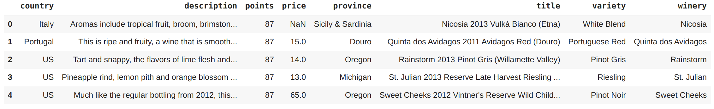

Aida temos o problema dos dados ausentes para resolver:

```python
df1.info()

<class 'pandas.core.frame.DataFrame'>
RangeIndex: 129971 entries, 0 to 129970
Data columns (total 8 columns):
 #   Column       Non-Null Count   Dtype  
---  ------       --------------   -----  
 0   country      129908 non-null  object 
 1   description  129971 non-null  object 
 2   points       129971 non-null  int64  
 3   price        120975 non-null  float64
 4   province     129908 non-null  object 
 5   title        129971 non-null  object 
 6   variety      129970 non-null  object 
 7   winery       129971 non-null  object 
dtypes: float64(1), int64(1), object(6)
memory usage: 7.9+ MB
```

Podemos fazer alguns cálculos de proporção na coluna de preço (que é bastante importante para nossa análise) e apresenta dados ausentes:

```python
print("{:.0%}".format(df1["price"].count() / df1.shape[0]))

93%
```

Ok, se removermos as linhas com valores nulos da coluna preço (`price`), ficaremos com `93%` das linhas restantes. Como a base de dados é suficientemente grande, podemos remover essas linhas filtrando também por país e uvas (`country` e `variety`) que também contém dados nulos.

```python
df1 = df1.dropna(subset=["country", "price", "variety"])

df1.info()
```

```
<class 'pandas.core.frame.DataFrame'>
Int64Index: 120915 entries, 1 to 129970
Data columns (total 8 columns):
 #   Column       Non-Null Count   Dtype  
---  ------       --------------   -----  
 0   country      120915 non-null  object 
 1   description  120915 non-null  object 
 2   points       120915 non-null  int64  
 3   price        120915 non-null  float64
 4   province     120915 non-null  object 
 5   title        120915 non-null  object 
 6   variety      120915 non-null  object 
 7   winery       120915 non-null  object 
dtypes: float64(1), int64(1), object(6)
memory usage: 8.3+ MB
```

> Agora nosso DataFrame está sem nulos e pronto para a etapa de análise!

## Análise exploratória

Sempre que houver dúvidas por onde começar, visualize os dados! Vamos olhar para a distribuição dos pontos dados durante as avaliações dos vinhos, parece um bom ponto de partida.

```python
plt.figure(figsize=(10, 7))
plt.hist(data=df1, x='points',
         bins=np.arange (80, df1['points'].max()+1, 1),
         color = 'purple')
plt.xlim(80,100)
plt.title('Distribuição dos pontos', fontsize=16)
plt.xlabel('Pontos')
plt.ylabel('Frequência');
```

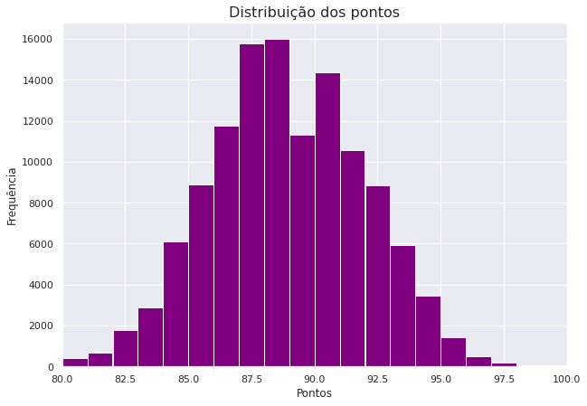

Existe uma distribuição quase normal dos pontos variando a escala entre `80` e `100`. Vamos ver quais países estão no `Top 10` que mais produzem vinhos.

```python
country_top_10 = df1["country"].value_counts()[:10]
country_top_10

US           54265
France       17776
Italy        16914
Spain         6573
Portugal      4875
Chile         4415
Argentina     3756
Austria       2799
Australia     2294
Germany       2120
Name: country, dtype: int64
```

Com base nesse filtro podemos gerar um gráfico para comparar os países que mais tiveram vinhos avaliados:

```python
plt.figure(figsize=(10, 7))
country_top_10.plot(kind='bar', color = 'purple')
plt.title('Número de classificações de vinhos por país', fontsize = 16)
plt.xlabel('País')
plt.ylabel('Total de avaliações');
```

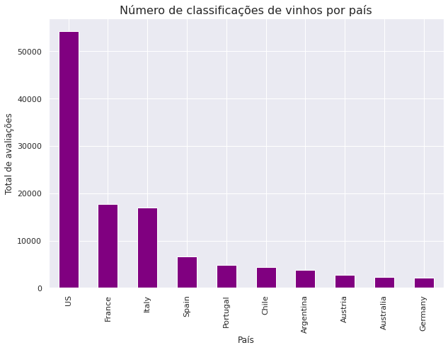

Com base nessa ordenação do gráfico acima, vamos investigar quantos países produzem vinho de melhor qualidade de acordo com as classificações.

```python
melhor_qualidade = df1.groupby("country").agg("mean")
melhor_qualidade = melhor_qualidade.sort_values(by="points", ascending=False)[:10]
melhor_qualidade.style.background_gradient(cmap='Purples',high=0.5, subset=["points"])
```

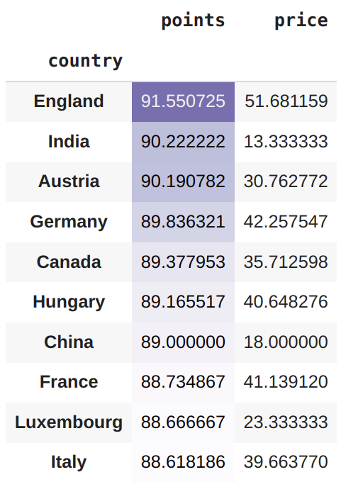

Podemos gerar um gráfico desse filtro:

```python
y = melhor_qualidade.index.to_series()
x = melhor_qualidade["points"]

plt.figure(figsize=(10, 7))
plt.xlim(80, 92)
sns.barplot(x=x, y=y, palette='Purples_r')
plt.title('Top 10 média de vinhos de melhor qualidade por país', fontsize = 16)
plt.xlabel('Média de pontos')
plt.ylabel('País');
```

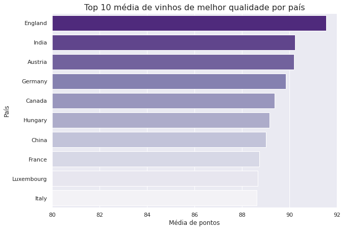

Ao verificar a média de pontos, podemos perceber que o país com melhor avaliação (que produziu o vinho de melhor qualidade) foi a Inglaterra. Isso ocorre, porque talvez haja menos vinhos da Inglaterra no nosso DataFrame e eles tenham uma pontuação alta, representando um aumento na média. Vale a pena investigarmos isso mais a fundo, podemos olhar para os países com pontuação máxima acima de `95` (vinhos excelentes).

```python
# número de vinhos por país com classificações mais altas 95-100
high_scores = df1[df1["points"]>=95]
high_scores["country"].value_counts()

US              991
France          509
Italy           326
Austria         103
Portugal         96
Germany          62
Spain            51
Australia        47
Argentina        11
Hungary           5
England           3
South Africa      3
Chile             2
New Zealand       2
Name: country, dtype: int64
```

Os países com classificação mais alta `95-100` pontos, diferem do nosso gráfico de pontuações mais altas com base nas médias. Podemos criar um gráfico do tipo `boxplot` que nos permitirá ver o máximo, o mínimo e a média das pontuações por cada país. Como essa base de dados apresenta mais vinhos avaliados dos EUA, é provável que haja uma grande variedade de vinhos do país, enquanto a Inglaterra, que teve a melhor pontuação média, apresenta menos vinhos na base de dados, o que resulta em uma comparação injusta.

```python
plt.figure(figsize=(20, 18))
sns.boxplot(data=df1, x='points', y='country', color = 'Purple')
plt.title('Pontos por país', fontsize = 16)
plt.xlabel('Pontos')
plt.ylabel('País');
```

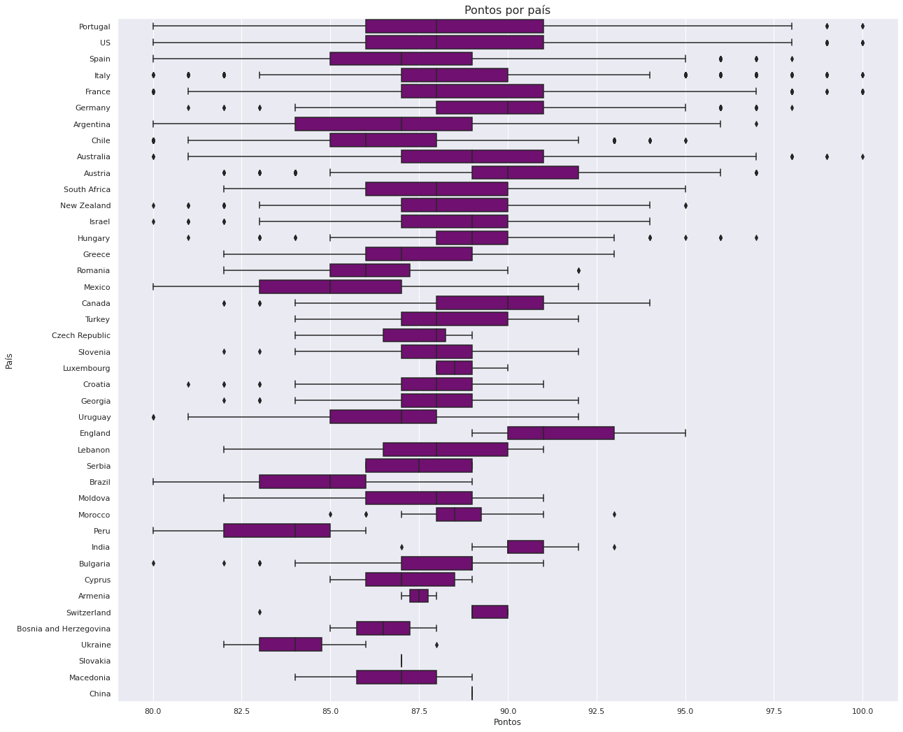

Embora os vinhos da Inglaterra tenham os pontos mais altos em média, os vinhos de Portugal, EUA, Itália, França e Austrália, receberam uma pontuação perfeita de `100`. Há mais vinhos desses países na base de dados, por tanto eles receberam uma gama maior de pontos.

Ok, agora que vimos as distribuições de pontos por cada país, vamos investigar o preço do vinho nos países:

```python
average_price = df1.groupby("country").agg("mean")
average_price = average_price.sort_values(by="price", ascending=False)
y = average_price.index.to_series()
x = average_price["price"]

plt.figure(figsize=(12, 8))
sns.barplot(x=x, y=y, palette='Purples_r')
plt.title('Preço médio da garrafa de vinho por país', fontsize = 16)
plt.xlabel('Preço médio ($)')
plt.ylabel('País');
```

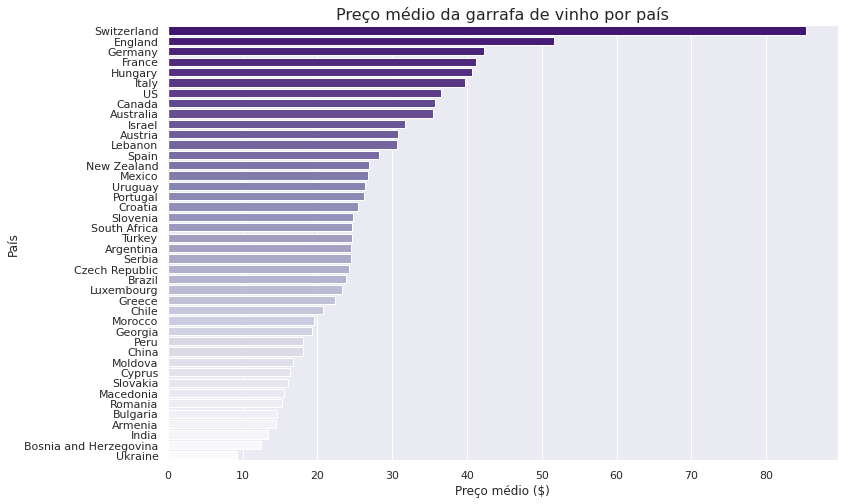

A Suíça, produz o vinho mais caro, com o preço médio da garrafa de mais de $80. Já o vinho da Ucrânia, está no outro extremo, com o preço médio mais baixo, $10 a garrafa. Vamos investigar se o preço está relacionado a qualidade do vinho. A utilização de histogramas para essa tarefa parece um bom plano:

```python
plt.figure(figsize=(10, 7))
bins = np.arange (0, df1["price"].max()+5, 5)
plt.hist(data=df1, x='price', bins=bins, color = 'Purple')
plt.xlim(0,200)
plt.title('Distribuição dos preços dos vinhos', fontsize=16)
plt.xlabel('Preço($)')
plt.ylabel('Frequência');
```

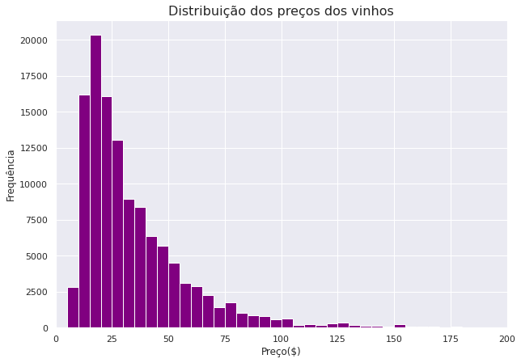

Interessante, os dados de preço dos vinhos apresentam uma distorção grande para a direita. Nesse caso precisamos de uma transformação logarítmica nos dados.

```python
# distribuição normal
df1["price"].describe()

count    120915.000000
mean         35.368796
std          41.031188
min           4.000000
25%          17.000000
50%          25.000000
75%          42.000000
max        3300.000000
Name: price, dtype: float64

# distribuição logarítmica
np.log10(df1["price"].describe())

count    5.082480
mean     1.548620
std      1.613114
min      0.602060
25%      1.230449
50%      1.397940
75%      1.623249
max      3.518514
Name: price, dtype: float64
```

Agora utilizando os dados com a transformação logarítmica para o nosso histograma:

```python
plt.figure(figsize=(12, 8))
bins = 10 ** np.arange(0.5, 3.5 + 0.05, 0.05)
ticks = [1, 3, 10, 30, 100, 300, 1000, 3000, 10000]
plt.hist(data=df1, x='price', bins=bins, color='Purple')
plt.title('Distribuição dos preços dos vinhos', fontsize=16)
plt.xscale('log')
plt.xticks(ticks, ticks)
plt.xlabel('Preço($)')
plt.ylabel('Frequência');
```

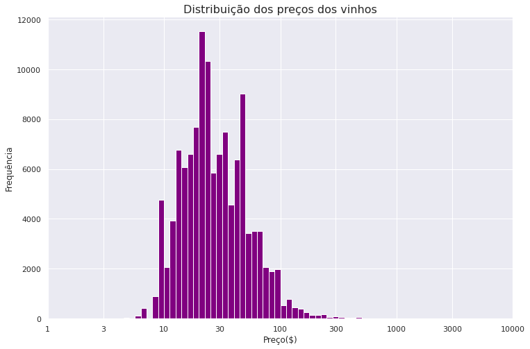

Bem melhor! Agora é possível ver uma distribuição (*quase normal*). Existe um salto na região dos 10 dólares e um pico mais visível em pouco mais de 20 dólares. Depois temos outro pico acima de $50. Agora podemos plotar um gráfico do tipo `scatter` para visualizar se existe uma correlação entre a pontuação e o valor da garrafa.

```python
x = [1, 3, 10, 30, 100, 300, 1000, 3000, 10000]

plt.figure(figsize=(12, 8))
sns.regplot(x='price', y='points', data=df1, color='Purple', logx=True, scatter_kws={'alpha':0.3})
plt.title("Pontos vs. Preço", fontsize=14)
plt.xscale('log')
plt.xticks(x, x)
plt.xlabel("Preço($)")
plt.ylabel("Pontos");
```

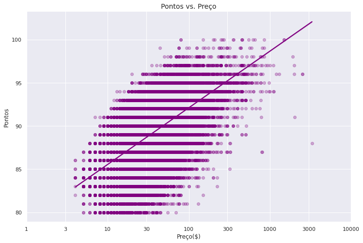

O gráfico nos mostra uma relação positiva entre as duas variáveis (*pontos e preços*), ou seja, vinhos mais caros tendem a receber melhores avaliações.

