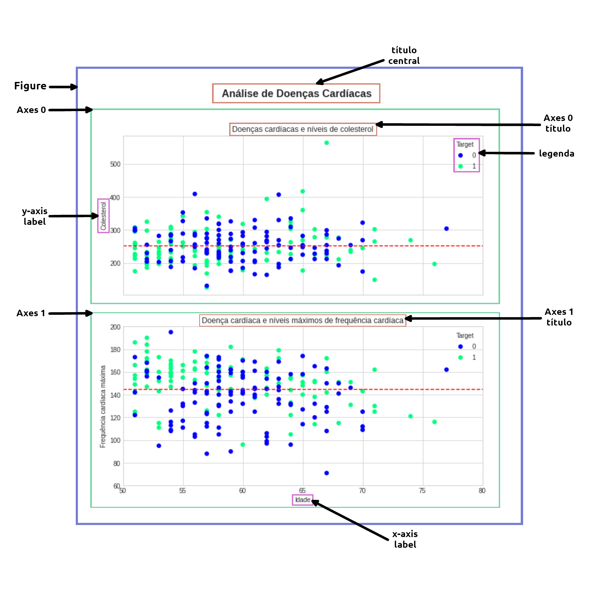
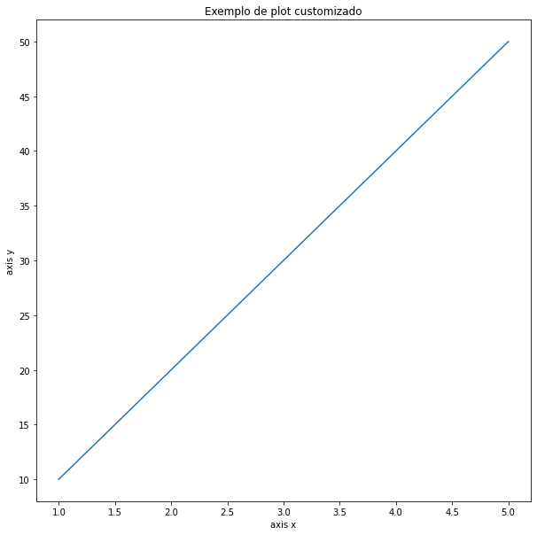

# Matplotlib - Anatomia de um gráfico

>WIP



## Workflow

```python
# importe da biblioteca
import matplotlib.pyplot as plt

# preparando os dados
x = [1, 2, 3, 4, 5]
y = [10, 20, 30, 40, 50]

# configuração do plot
fig, ax = plt.subplots(figsize=(10, 10))

# plotando os dados
ax.plot(x, y)

# customizando o plot
ax.set(title="Exemplo de plot customizado", xlabel="axis x", ylabel="axis y")

# exibindo o plot
plt.show()
```



---

WIP
