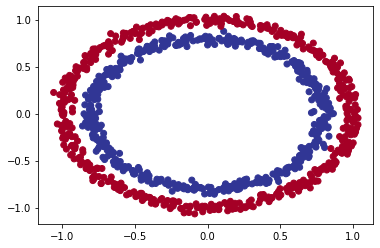

# Redes neurais com TensorFlow

Para entender como funciona uma rede neural, vamos resolver alguns problemas de classificação. Pegaremos alguns conjuntos de dados para tentar prever a que classe os dados de entrada pertencem.

A arquitetura de uma rede neural de classificação pode variar bastante, dependendo do problema que você estiver trabalhando. Porém, existem alguns fundamentos que todas as redes neurais utilizam:

- Camada de entrada de dados
- Camadas ocultas (pré-processamento de dados)
- Camada de saída

Abaixo temos alguns padrões que veremos com frequência nas redes neurais de classificação.


Não se preocupe se nada do que foi visto acima fizer sentido, faremos muitos experimentos no decorrer do capítulo para entender. Vamos começar importando o TensorFlow com o alias `tf` como visto antes.

```python
import tensorflow as tf
```

## Criando os dados

Vamos começar criando um conjunto de dados simples para utilizar em nossos experimentos. Como o problema de classificação está tentando prever se algo é uma coisa ou outra, criaremos alguns dados para refletir isso. Usaremos a função `make_circles()` do `Scikit-Learn`.

```python
from sklearn.datasets import make_circles

# Cria 1000 exemplos
n_samples = 1000

# Criando os círculos
X, y = make_circles(n_samples, 
                    noise=0.03, 
                    random_state=42)
```

Vamos olhar os valores de `X` e `y`:

```
X
array([[ 0.75424625,  0.23148074],
       [-0.75615888,  0.15325888],
       [-0.81539193,  0.17328203],
       ...,
       [-0.13690036, -0.81001183],
       [ 0.67036156, -0.76750154],
       [ 0.28105665,  0.96382443]])
```

```
y[:10]

array([1, 1, 1, 1, 0, 1, 1, 1, 1, 0])
```

Já temos nossos dados e rótulos, hora de avançarmos para as visualizações.
Começando com um DataFrame:

```python
import pandas as pd
circles = pd.DataFrame({"X0":X[:, 0], "X1":X[:, 1], "label":y})
circles.head()
```

|     |        X0 |        X1 | label |
| --: | --------: | --------: | ----: |
|   0 |  0.754246 |  0.231481 |     1 |
|   1 | -0.756159 |  0.153259 |     1 |
|   2 | -0.815392 |  0.173282 |     1 |
|   3 | -0.393731 |  0.692883 |     1 |
|   4 |  0.442208 | -0.896723 |     0 |

O conjunto de dados criado representa um problema de classificação binária. É binário porque possui apenas dois rótulos (0 e 1). Podemos contabilizar o total criado para cada rótulo com `value_counts()`:

```python
circles.label.value_counts()

1    500
0    500
Name: label, dtype: int64
```

Ok, agora vamos adiante e dar mai um passo nas visualizações, hora de plotar os dados:

```python
import matplotlib.pyplot as plt
plt.scatter(X[:, 0], X[:, 1], c=y, cmap=plt.cm.RdYlBu);
```



> Com base nos dados, vamos desenvolver um modelo para classificar o pontos azuis ou vermelhos.

## Formas de entrada e saída

Um dos principais problemas ao construir redes neurais são as incompatibilidades de forma. Ou seja a forma dos dados de entrada e a forma dos dados de saída. No nosso exemplo, queremos inserir `X` e fazer com que o modelo consiga prever `y`. Precisamos verificar as formas de `X` e `y`:

```python
X.shape, y.shape

((1000, 2), (1000,))

X[0], y[0]

(array([0.75424625, 0.23148074]), 1)
```

Aparentemente `X` disponibiliza de 2 recursos que combinados levam a um valor `y`. Isso quer dizer que a forma de entrada da rede neural precisa aceitar um `tensor` com pelo menos uma dimensão com dois valores e outro de saída com pelo menos uma dimensão e um valor.

Agora que sabemos quais dados temos, bem como as formas de entrada e saída, vamos iniciar a etapa de modelagem para desenvolver uma rede neural. Utilizando o TensorFlow, geralmente temos 3 etapas fundamentais para criar e treinar um modelo: criar o modelo, compilar o modelo e ajustar o modelo. Veremos isso em ação utilizando a [API Sequential](https://www.tensorflow.org/api_docs/python/tf/keras/Sequential):

```python
# Seed aleatório
tf.random.set_seed(42)

# 1. Cria o modelo usando a API Sequential
model_1 = tf.keras.Sequential([
  tf.keras.layers.Dense(1)
])

# 2. Compila o modelo
# escolhemos BinaryCrossentropy(), já que o problema envolve 2 classes (0 e 1)
model_1.compile(loss=tf.keras.losses.BinaryCrossentropy(),
                optimizer=tf.keras.optimizers.SGD(),
                metrics=['accuracy'])

# 3. Treina o modelo
model_1.fit(X, y, epochs=5)
```

```
Epoch 1/5
32/32 [==============================] - 1s 1ms/step - loss: 2.8544 - accuracy: 0.4600
Epoch 2/5
32/32 [==============================] - 0s 2ms/step - loss: 0.7131 - accuracy: 0.5430
Epoch 3/5
32/32 [==============================] - 0s 1ms/step - loss: 0.6973 - accuracy: 0.5090
Epoch 4/5
32/32 [==============================] - 0s 1ms/step - loss: 0.6950 - accuracy: 0.5010
Epoch 5/5
32/32 [==============================] - 0s 2ms/step - loss: 0.6942 - accuracy: 0.4830
<keras.callbacks.History at 0x7f57aeb03350>
```

Observando a métrica de precisão (`accuracy`), o modelo tem um péssimo desempenho (*50% de precisão em um problema de classificação é o mesmo que adivinhar*). Podemos dar mais tempo para o modelo treinar:

```python
# Treinando o modelo por mais tempo
# (resulta em mais chances de analisar os dados)
model_1.fit(X, y, epochs=200, verbose=0)
model_1.evaluate(X, y)
```

```
32/32 [==============================] - 0s 2ms/step - loss: 0.6935 - accuracy: 0.5000
[0.6934831142425537, 0.5]
```

Bem, o modelo funciona como se estivesse adivinhando, mesmo com 200 passes (`epochs`). Vamos tentar melhorar isso adicionando uma camada extra e treinar por um pouco mais de tempo (superior ao total da primeira tentativa):

```python
# Seed aleatório
tf.random.set_seed(42)

# 1. Mesmo modelo que model_1, dessa vez com uma camada extra
model_2 = tf.keras.Sequential([
  tf.keras.layers.Dense(1), # camada extra
  tf.keras.layers.Dense(1) 
])

# 2. Compila o modelo
model_2.compile(loss=tf.keras.losses.BinaryCrossentropy(),
                optimizer=tf.keras.optimizers.SGD(),
                metrics=['accuracy'])

# 3. Treina o modelo
model_2.fit(X, y, epochs=100, verbose=0)
```

Com o modelo treinado, vamos avaliar o desempenho:

```
model_2.evaluate(X, y)

32/32 [==============================] - 0s 3ms/step - loss: 0.6933 - accuracy: 0.5000
[0.6933314800262451, 0.5]
```

Não melhorou muito, continua em 50% de precisão. A seguir veremos como melhorar um modelo.

## Melhorando um modelo

Para melhorar um modelo, podemos alterar quase todas as partes das etapas que passamos anteriormente.

1. Criando o modelo - é onde podemos adicionar as camadas, aumentando o número de unidades ocultas (*neurônios*) em cada camada, alterando as funções de ativação de cada camada.

2. Compilando o modelo - onde podemos escolher funções de otimização diferentes (*Ex: Adam*) ou talvez alterar a taxa de aprendizado na função de otimização.

3. Treinando o modelo - podemos fazer ajustes em um modelo para ajustar os (*epochs*), deixando o modelo treinar por mais tempo.


Temos muitas formas diferentes de melhorar o desempenho de uma rede neural. Algumas das formas mais comuns incluem: aumentar o número de camadas (*o que torna a rede mais profunda*) e alterando a taxa de aprendizado. Como podemos ajustar esses valores manualmente, são chamados de hiperparâmetros. Vamos ao teste:

```python
# Seed aleatório
tf.random.set_seed(42)

# 1. Criação do modelo (dessa vez com 3 camadas)
model_3 = tf.keras.Sequential([
  # 1 camada com 100 neuronios
  tf.keras.layers.Dense(100, input_shape=(None, 1)),
  tf.keras.layers.Dense(10), # outra camada com 10 neuronios
  tf.keras.layers.Dense(1)
])

# 2. Compila o modelo
model_3.compile(loss=tf.keras.losses.BinaryCrossentropy(),
                optimizer=tf.keras.optimizers.Adam(), # Adam em vez de SGD
                metrics=['accuracy'])

# 3. Treina o modelo
model_3.fit(X, y, epochs=100, verbose=0)
```

```
model_3.evaluate(X, y)

32/32 [==============================] - 0s 3ms/step - loss: 0.6939 - accuracy: 0.5000
[0.6939496994018555, 0.5]
```

Mesmo com as alterações feitas, inserindo novos truques, o nosso modelo não está conseguindo melhorar. Quando isso acontece a melhor alternativa para investigar é `visualizar`. Vamos fazer agora algumas visualizações para identificar o que está acontecendo.

Para visualizar as previsões do modelo, vamos implementar uma função `plot_decision()` que recebe um modelo treinado (recursos `X` e rótulos `y`), cria uma tabela dos diferentes valores de `X`, realiza as previsões em toda a "tabela" e marca as previsões traçando uma linha entre as diferentes zonas (onde cada classe única aparece). Sei que parece confuso, então veremos o código e em seguida o resultado do plot.

```python
import numpy as np

def plot_decision(model, X, y):
  
  # Define os limites dos eixos do gráfico
  # e cria uma "tabela", grade de malha
  x_min, x_max = X[:, 0].min() - 0.1, X[:, 0].max() + 0.1
  y_min, y_max = X[:, 1].min() - 0.1, X[:, 1].max() + 0.1
  xx, yy = np.meshgrid(np.linspace(x_min, x_max, 100),
                       np.linspace(y_min, y_max, 100))
  
  # Adiciona os valores de X (que vamos prever)
  x_in = np.c_[xx.ravel(), yy.ravel()]
  
  # Faz previsões utilizando o modelo treinado
  y_pred = model.predict(x_in)

  # Verifica se o problema é multiclasse
  if len(y_pred[0]) > 1:
    print("aplicando classificação multiclasse...")
    # Faz um "reshape" nas previsões para a plotagem
    y_pred = np.argmax(y_pred, axis=1).reshape(xx.shape)
  else:
    print("aplicando classificação binária...")
    y_pred = np.round(y_pred).reshape(xx.shape)
  
  # Limite de decisão de plotagem
  plt.contourf(xx, yy, y_pred, cmap=plt.cm.RdYlBu, alpha=0.7)
  plt.scatter(X[:, 0], X[:, 1], c=y, s=40, cmap=plt.cm.RdYlBu)
  plt.xlim(xx.min(), xx.max())
  plt.ylim(yy.min(), yy.max())
  ```

Agora, com a função para traçar o limite de decisão do modelo, ou seja, identificar o ponto de corte entre os pontos vermelhos e azuis, vamos testar:

```python
plot_decision(model_3, X, y)

aplicando classificação multiclasse...
```


O gráfico revela que o modelo está tentando traçar uma linha reta através dos dados. E o problema é que esses dados não são separáveis por uma linha reta. A arquitetura do nosso modelo pode funcionar melhor em um problema de regressão.