# Redes neurais convolucionais e visão computacional com TensorFlow

Vamos nos aprofundar em algo específico, veremos um tipo especial de rede neural, as redes neurais convolucionais (`CNNs`) que podem ser utilizadas para visão computacional (*detecção de padrões em dados visuais*).

> Em `Deep Learning`, vários tipos diferentes de arquiteturas de modelo podem ser utilizados para diferentes problemas. Podemos utilizar uma `CNNs` para realizar previsões em dados de imagem ou texto por exemplo. Na prática, algumas arquiteturas funcionam melhor que outras.

Imagine poder classificar uma foto de comida se é pizza ou carne (*no capítulo passado fizemos algo parecido classificando raças de cães*). Detectar se um objeto está presente ou não em uma imagem ou ainda, se uma pessoa específica foi gravada por uma câmera de segurança. Neste capítulo, seguiremos com o workflow do TensorFlow que já vimos, ao mesmo tempo em que aprendemos sobre como construir e utilizar `CNNs`.

As redes neurais convolucionais funcionam muito bem com imagens, para aprender sobre elas, vamos resolver um problema de classificação utilizando uma base de dados de imagens. Usaremos o [Food-101](https://data.vision.ee.ethz.ch/cvl/datasets_extra/food-101/), uma coleção composta por 101 categorias diferentes de 101.000 imagens reais de pratos de comida.
Utilizaremos apenas duas categorias, pizza e carne para construir um classificado binário.

No Google Colab, vamos baixar o arquivo `.zip` com as imagens e descompactá-lo.

```python
import zipfile

# download dos arquivos de imagens zipados
!wget https://infoslack.pro/pizza_steak.zip

# descompactando o zip
zip_ref = zipfile.ZipFile("pizza_steak.zip", "r")
zip_ref.extractall()
zip_ref.close()
```

```
--2022-02-22 23:32:44--  https://infoslack.pro/pizza_steak.zip
Resolving infoslack.pro (infoslack.pro)... 35.202.40.163
Connecting to infoslack.pro (infoslack.pro)|35.202.40.163|:443... connected.
HTTP request sent, awaiting response... 200 OK
Length: 109497985 (104M) [application/zip]
Saving to: ‘pizza_steak.zip’

pizza_steak.zip     100%[===================>] 104.42M  25.6MB/s    in 4.3s    

2022-02-22 23:32:49 (24.5 MB/s) - ‘pizza_steak.zip’ saved [109497985/109497985]
```

Vamos dar uma olhada nos dados, queremos verificar quantas imagens temos para treinamento:

```python
num_steak_images_train = len(os.listdir("pizza_steak/train/steak"))
num_steak_images_train

750
```

Uma boa ideia agora seria visualizar uma das imagens (*sempre que estiver trabalhando com dados é importante visualizá-los o máximo possível*):

```python
# Visualiza uma imagem
import matplotlib.pyplot as plt
import matplotlib.image as mpimg
import random
import os

def view_random_image(target_dir, target_class):
  # diretório de destino
  target_folder = target_dir+target_class

  # Pega um caminho de imagem aleatório
  random_image = random.sample(os.listdir(target_folder), 1)

  # lendo a imagem e plotando com matplotlib
  img = mpimg.imread(target_folder + "/" + random_image[0])
  plt.imshow(img)
  plt.title(target_class)
  plt.axis("off");

  print(f"Image shape: {img.shape}") # mostra o formato da imagem (tamanho)

  return img
```

Criamos uma função para visualizar uma imagem aleatório, agora vamos utilizá-la:

```python
img = view_random_image(target_dir="pizza_steak/train/", target_class="steak")
```

```
Image shape: (512, 508, 3)
```

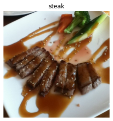

Agora que temos ideia do tipo de imagem que vamos trabalhar, todo o conjunto é composto por imagens semelhantes, no nosso caso em 2 classes.

```python
img.shape

(512, 512, 3)
```

Observe a forma (shape) da imagem, temos a largura, altura e os canais de cores (RGB). No nosso caso, a largura e altura variam entre as imagens da base de dados, já o valor do `RGB` é sempre igual a 3. Note os valores da matriz `img` abaixo:

```
img

array([[[182, 150, 103],
        [171, 138,  93],
        [175, 141,  96],
        ...,
        [155, 122,  89],
        [162, 129,  98],
        [169, 136, 105]],

       [[174, 142,  95],
        [166, 132,  87],
        [170, 136,  91],

       ...,

       [[118, 106,  68],
        [117, 105,  67],
        [131, 117,  80],
        ...,
        [ 85,  59,  46],
        [ 91,  68,  54],
        [122,  98,  86]],
        ...,
        [ 95,  67,  55],
        [101,  72,  64],
        [124,  95,  87]]], dtype=uint8)
```

Os valores da matriz estão entre 0 e 255. Isso acontece porque esse é o intervalo possível para os valores de vermelho, verde e azul (`RGB`). Imagine um pixel com um valor vermelho=0, verde=0, azul=255, esse pixel será muito azul! Quando desenvolvermos um modelo para diferenciar entre as imagens de pizza e carne, encontraremos padrões nesses diferentes valores de pixel, que determinam a aparência de cada classe.

Como vimos no capítulo passado, os modelos de `ML`, preferem trabalhar com valores entre 0 e 1. Ou seja, uma das etapas de pré-processamento mais comuns para trabalhar com imagens é normalizar os valores de pixel, dividindo as matrizes de imagens por `255`. Por exemplo:

```
img/255.

array([[[0.71372549, 0.58823529, 0.40392157],
        [0.67058824, 0.54117647, 0.36470588],
        [0.68627451, 0.55294118, 0.37647059],
        ...,
        [0.60784314, 0.47843137, 0.34901961],
        [0.63529412, 0.50588235, 0.38431373],
        [0.6627451 , 0.53333333, 0.41176471]],

       [[0.68235294, 0.55686275, 0.37254902],
        [0.65098039, 0.51764706, 0.34117647],
        [0.66666667, 0.53333333, 0.35686275],

       ...,

       [[0.4627451 , 0.41568627, 0.26666667],
        [0.45882353, 0.41176471, 0.2627451 ],
        [0.51372549, 0.45882353, 0.31372549],
        ...,
        [0.33333333, 0.23137255, 0.18039216],
        [0.35686275, 0.26666667, 0.21176471],
        [0.47843137, 0.38431373, 0.3372549 ]],

       [[0.47058824, 0.42352941, 0.2745098 ],
        [0.49019608, 0.43921569, 0.30196078],
        [0.54509804, 0.49019608, 0.35294118],
```

## Arquitetura de uma rede neural convolucional

Redes neurais convolucionais não são diferentes de outros tipos de redes neurais de `Deep Learning`, pois podem ser criadas de muitas maneiras diferentes. Vejamos um exemplo dos componentes normalmente encontrados em uma `CNN` tradicional:

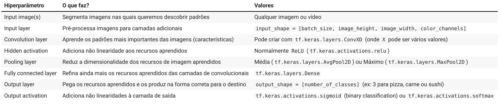

Juntando tudo isso, teríamos várias camadas empilhadas (stack) formando uma rede convolucional:

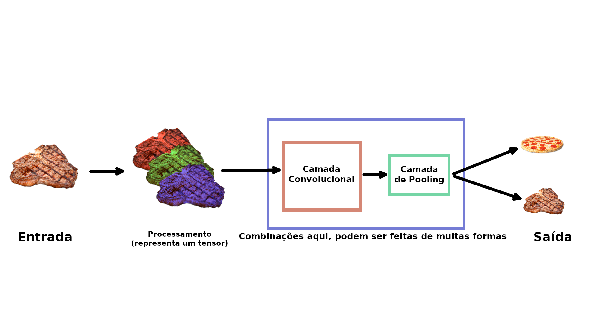

Vamos a um exemplo prático!

Como visto antes, verificamos os dados e descobrimos que temos 750 imagens para treinamento e 250 imagens para teste, sendo que todas elas têm formas diferentes. Os criadores deste conjunto de dados, [originalmente escreveram que eles utilizaram um modelo de `ML` Random Forest](https://williamkoehrsen.medium.com/random-forest-simple-explanation-377895a60d2d) obtendo uma precisão média de `50,76%` nas previsões. Para o nosso projeto esses 50,76% são a nossa linha base, ou seja a nossa métrica de avaliação que tentaremos superar.

O código que veremos agora, replica exatamente um modelo com uma rede neural convolucional (CNN) usando os componentes que foram mencionados acima. Muitos trechos de código você provavelmente ainda não viu (mas não se preocupe) leia os comentários para se familiarizar e tente descobrir o que cada trecho está fazendo. Este é um bom ponto de partida para avançarmos nos detalhes em cada uma das etapas ao longo deste capítulo.

```python
import tensorflow as tf
from tensorflow.keras.preprocessing.image import ImageDataGenerator

# Configurando o seed
tf.random.set_seed(13)

# Dados de pré-processamento (queremos os valores de pixel entre 0 e 1)
train_datagen = ImageDataGenerator(rescale=1./255)
valid_datagen = ImageDataGenerator(rescale=1./255)

# Configurando diretórios de treino e teste
train_dir = "pizza_steak/train/"
test_dir = "pizza_steak/test/"

# Importando os dados dos diretórios e transformando em lotes
train_data = train_datagen.flow_from_directory(train_dir,
                                               batch_size=32,
                                               target_size=(224, 224),
                                               class_mode="binary",
                                               seed=42)

valid_data = valid_datagen.flow_from_directory(test_dir,
                                               batch_size=32,
                                               target_size=(224, 224),
                                               class_mode="binary",
                                               seed=42)

# Criando um modelo CNN
model_1 = tf.keras.models.Sequential([
  tf.keras.layers.Conv2D(filters=10, 
                         kernel_size=3,
                         activation="relu",
                         # Primeira camada, especificando a forma de entrada
                         # altura, largura e rgb
                         input_shape=(224, 224, 3)),
  tf.keras.layers.Conv2D(10, 3, activation="relu"),
  tf.keras.layers.MaxPool2D(pool_size=2,
                            padding="valid"),
  tf.keras.layers.Conv2D(10, 3, activation="relu"),
  tf.keras.layers.Conv2D(10, 3, activation="relu"),
  tf.keras.layers.MaxPool2D(2),
  tf.keras.layers.Flatten(),
  tf.keras.layers.Dense(1, activation="sigmoid") # output activation
])

# Compila o modelo
model_1.compile(loss="binary_crossentropy",
              optimizer=tf.keras.optimizers.Adam(),
              metrics=["accuracy"])

# Treina o modelo
history_1 = model_1.fit(train_data,
                        epochs=5,
                        steps_per_epoch=len(train_data),
                        validation_data=valid_data,
                        validation_steps=len(valid_data))
```

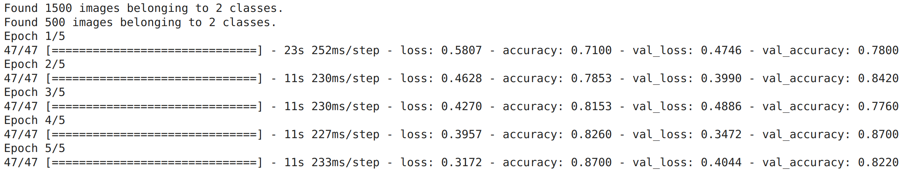

Depois de 5 `epochs`, o modelo superou a pontuação inicial de `50,76%` de precisão (tivemos aproximadamente pouco mais de 81% de precisão). Mas, vale lembrar que o nosso modelo passou apenas por um só problema de classificação binária em vez de todas as 101 classes do dataset `Food 101`. Dito isso, não podemos comparar diretamente essas métricas. Os resultados mostraram apenas que nosso modelo aprendeu alguma coisa. Vamos verificar a arquitetura que foi construída:

```
model_1.summary()

Model: "sequential"
_________________________________________________________________
 Layer (type)                Output Shape              Param #   
=================================================================
 conv2d (Conv2D)             (None, 222, 222, 10)      280       
                                                                 
 conv2d_1 (Conv2D)           (None, 220, 220, 10)      910       
                                                                 
 max_pooling2d (MaxPooling2D  (None, 110, 110, 10)     0  )                                                               
                                                                 
 conv2d_2 (Conv2D)           (None, 108, 108, 10)      910       
                                                                 
 conv2d_3 (Conv2D)           (None, 106, 106, 10)      910       
                                                                 
 max_pooling2d_1 (MaxPooling  (None, 53, 53, 10)       0         
 2D)                                                             
                                                                 
 flatten (Flatten)           (None, 28090)             0         
                                                                 
 dense (Dense)               (None, 1)                 28091     
                                                                 
=================================================================
Total params: 31,101
Trainable params: 31,101
Non-trainable params: 0
```

> O que fizemos aqui foi replicar a arquitetura exata que o [site CNN Explainer](https://poloclub.github.io/cnn-explainer/) utiliza para demonstrar modelos.

Existem algumas novidades aqui que ainda não foram mencionadas:

- ImageDataGenerator
- O método `flow_from_directory()`
- Os parâmetros `batch_size` e `target_size`
- As camadas `Conv2D` e os parâmetros
- Camadas `MaxPool2D`
- Parâmetros na função `fit()`: `steps_per_epoch` e `validation_steps`


Antes de nos aprofundarmos em cada um dos detalhes mencionados, vamos ver o que acontece quando fazemos alguns ajustes no modelo que utilizamos no capítulo passado.

Para exemplificar o poder que as redes neurais em serem adaptadas a muitos problemas diferentes, vamos utilizar um modelo de classificação binária que desenvolvemos anteriormente para funcionar com os dados atuais.

Utilizaremos todos os parâmetros do modelo anterior, exceto que vamos alterar duas coisas:

- Os **dados**, que agora são imagens em vez de pontos.
- A **forma de entrada**, agora precisamos dizer para a rede neural qual é a forma das imagens que queremos classificar.

É comum a prática de remodelar as imagens para um tamanho único. Nesse caso, vamos redimensionar as imagens para (*224, 224, 3*) ou seja, largura e altura de 224 pixels e uma profundidade de 3 (*para os canais de cores, RGB*).

```python
# Seed
tf.random.set_seed(42)

# Criando um modelo (réplica do TensorFlow Playground)
model_2 = tf.keras.Sequential([
  # dense layers esperam um vetor unidimensional como entrada
  tf.keras.layers.Flatten(input_shape=(224, 224, 3)),
  tf.keras.layers.Dense(4, activation='relu'),
  tf.keras.layers.Dense(4, activation='relu'),
  tf.keras.layers.Dense(1, activation='sigmoid')
])

# Compila
model_2.compile(loss='binary_crossentropy',
              optimizer=tf.keras.optimizers.Adam(),
              metrics=["accuracy"])

# Fit
history_2 = model_2.fit(train_data, # utilizando os nossos dados agora
                        epochs=5,
                        steps_per_epoch=len(train_data),
                        validation_data=valid_data,
                        validation_steps=len(valid_data))
```

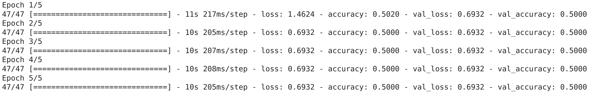

Este modelo funciona, mas parece que não aprendeu nada, pois está obtendo apenas 50% de precisão no nosso conjunto de dados. Vejamos a arquitetura:

```
model_2.summary()

Model: "sequential_1"
_________________________________________________________________
 Layer (type)                Output Shape              Param #   
=================================================================
 flatten_1 (Flatten)         (None, 150528)            0         
                                                                 
 dense_1 (Dense)             (None, 4)                 602116    
                                                                 
 dense_2 (Dense)             (None, 4)                 20        
                                                                 
 dense_3 (Dense)             (None, 1)                 5         
                                                                 
=================================================================
Total params: 602,141
Trainable params: 602,141
Non-trainable params: 0
```

A quantidade de parâmetros no `model_2` é muito maior, 602.141 vs 31.101. Apesar da diferença o primeiro modelo tem um resultado melhor. Vamos tentar melhorar esse resultado, aumentando a complexidade do modelo ou seja aumentando o número de camadas e a quantidade de neurônios em cada camada.

```python
# Seed
tf.random.set_seed(42)

# Criando um modelo (réplica do TensorFlow Playground)
model_3 = tf.keras.Sequential([
  tf.keras.layers.Flatten(input_shape=(224, 224, 3)),
  # aumenta o número de neurônios de 4 para 100 em cada camada
  tf.keras.layers.Dense(100, activation='relu'),
  tf.keras.layers.Dense(100, activation='relu'),
  tf.keras.layers.Dense(100, activation='relu'), # adiciona camada extra
  tf.keras.layers.Dense(1, activation='sigmoid')
])

# Compila
model_3.compile(loss='binary_crossentropy',
              optimizer=tf.keras.optimizers.Adam(),
              metrics=["accuracy"])

# Fit
history_3 = model_3.fit(train_data,
                        epochs=5,
                        steps_per_epoch=len(train_data),
                        validation_data=valid_data,
                        validation_steps=len(valid_data))
```

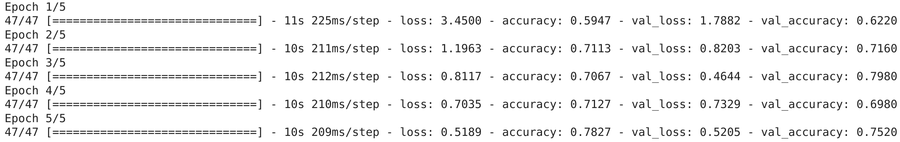

Tivemos uma melhora significativa com aproximadamente 70% de precisão!
Vamos olhar a arquitetura:

```
model_3.summary()

Model: "sequential_2"
_________________________________________________________________
 Layer (type)                Output Shape              Param #   
=================================================================
 flatten_2 (Flatten)         (None, 150528)            0         
                                                                 
 dense_4 (Dense)             (None, 100)               15052900  
                                                                 
 dense_5 (Dense)             (None, 100)               10100     
                                                                 
 dense_6 (Dense)             (None, 100)               10100     
                                                                 
 dense_7 (Dense)             (None, 1)                 101       
                                                                 
=================================================================
Total params: 15,073,201
Trainable params: 15,073,201
Non-trainable params: 0
```

O número de parâmetros treináveis aumentou ainda mais. E mesmo com 500x mais (*15.000.000 vs 31.000*), ainda não conseguimos nos aproximar do resultado de `model_1`. Isso revela o poder das redes neurais convolucionais e a capacidade de aprender padrões com menos parâmetros.

## Classificação binária em detalhes

Veremos em detalhes agora, cada uma das etapas que fizeram parte da construção do nosso modelo de classificação binária:

- Importe e familiarização com os dados
- Pré-processamento (*preparando os dados para um modelo*)
- Criando um modelo
- Ajuste e treino (*Fit*)
- Avaliando o modelo
- Ajuste de parâmetros para melhorar o modelo

### 1. Importe e familiarização com os dados

Independente do tipo de dados com os quais você vai trabalhar, é sempre uma boa ideia começar pela visualização. No nosso caso atual, visualizar as imagens de carne e pizza.

```python
plt.figure()
plt.subplot(1, 2, 1)
steak_img = view_random_image("pizza_steak/train/", "steak")
plt.subplot(1, 2, 2)
pizza_img = view_random_image("pizza_steak/train/", "pizza");

Image shape: (343, 512, 3)
Image shape: (384, 512, 3)
```

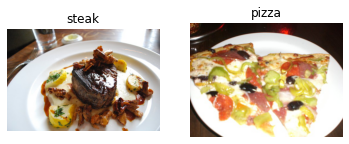

Podemos observar que as imagens dos pratos de carne apresentam cores mais escuras, enquanto as imagens de pizza tendem a ter uma forma circular no meio. Esses podem ser alguns padrões que a rede neural vai identificar.

### 2. Pré-processando os dados

Essa é uma das etapas mais importantes para um projeto de Machine Learning, criar um conjunto de dados para treinamento e teste. No nosso caso, os dados já estão separados nesses conjuntos. Em um projeto de classificação de imagens, é padrão ter os dados separados em diretórios de treino e teste com subdiretórios em cada para os tipos de classe (*imagens de pizza, imagens de pratos de carne*). Vamos começar definindo os caminhos dos diretórios de treino e teste:

```python
train_dir = "pizza_steak/train/"
test_dir = "pizza_steak/test/"
```

O próximo passo é transformar os dados em lotes (*batches*).
Cada lote é um pequeno subconjunto do conjunto de dados que o modelo vai analisar durante o treinamento. Por exemplo, em vez de observar 10.000 imagens de uma vez e tentar aprender os padrões, o modelo vai olhar apenas 32 imagens por vez. Os principais motivos para se usar lotes são: 10.000 imagens ou até mais que isso podem não caber na memória da `GPU`, tentar aprender padrões em 10.000 imagens de uma só vez pode fazer com que o modelo não aprenda muito bem. O tamanho 32 para o lote foi provado ser muito eficaz em muitos casos de uso diferentes.

Vamos transformar nossos dados em lotes, primeiro precisamos criar uma instância de `ImageDataGenerator` para cada um dos nossos conjuntos de dados:

```python
from tensorflow.keras.preprocessing.image import ImageDataGenerator
train_datagen = ImageDataGenerator(rescale=1/255.)
test_datagen = ImageDataGenerator(rescale=1/255.)
```

`ImageDataGenerator` nos ajuda a preparar as imagens em lotes, bem como realizar a transformação delas à medida que são carregadas no modelo. Note o parâmetro `rescale`, este é um exemplo das transformações que precisamos fazer. Esse parâmetro é responsável por dividir os valore de pixel por `255`, fazendo com que toda imagem importada tenha seus valores de pixel normalizados (*convertidos em uma escala entre 0 e 1*). Agora que temos a instâncias de `ImageDataGenerator`, podemos carregar as imagens dos respectivos diretórios usando o método `flow_from_directory`:

```python
train_data = train_datagen.flow_from_directory(directory=train_dir,
                                               target_size=(224, 224),
                                               class_mode='binary',
                                               batch_size=32)

test_data = test_datagen.flow_from_directory(directory=test_dir,
                                             target_size=(224, 224),
                                             class_mode='binary',
                                             batch_size=32)
```

Nosso conjunto de dados de treino tem 1.500 imagens separadas em 2 classes (*pizza e carne*) enquanto que o conjunto de teste tem 500 imagens também separadas em 2 classes. Devido o formato em como os diretórios são estruturados, as classes são inferidas pelos nomes dos subdiretórios `train_dir` e `test_dir`.

O parâmetro `target_size` ajusta o tamanho de entrada das nossas imagens, ou seja, o formato (*altura e largura*). Já `class_mode='binary'` define o nosso tipo de problema de classificação, nesse caso, classificação binária.

O parâmetro `batch_size` define quantas imagens serão inseridas em cada lote, por padrão 32.

### 3. Criando o modelo

Na hora de criar um modelo, qual deve ser a arquitetura padrão ? Por onde começar ? Bem, temos muitas possibilidades aqui, uma forma simples seria utilizar a arquitetura de modelo com melhor desempenho no [ImageNet](https://www.image-net.org/), no entanto, um bom ponto de partida é construir um modelo menor para obter um resultado básico para então você tentar melhorar.

> Um modelo menor refere-se a um modelo com menos camadas.

No nosso caso, vamos utilizar uma versão menor do modelo que pode ser visto no site [CNN Explainer](https://poloclub.github.io/cnn-explainer/) e construir uma rede neural convolucional de 3 camadas.

```python
# imports
from tensorflow.keras.optimizers import Adam
from tensorflow.keras.layers import Dense, Flatten, Conv2D, MaxPool2D, Activation
from tensorflow.keras import Sequential

# criando o modelo que será usado como linha de base
# gerando uma rede neural convolucional de 3 camadas
model_4 = Sequential([
  Conv2D(filters=10, 
         kernel_size=3, 
         strides=1,
         padding='valid',
         activation='relu', 
         input_shape=(224, 224, 3)), # input  layer
  Conv2D(10, 3, activation='relu'),
  Conv2D(10, 3, activation='relu'),
  Flatten(),
  Dense(1, activation='sigmoid') # output layer
])
```

Agora temos uma arquitetura de rede neural convolucional simples e pronta para uso. Vejamos alguns componentes da camada `Conv2D`:

- **2D** - significa que nossas entradas são bidimensionais, ou seja (*altura e largura*) das imagens, embora tenham 3 canais de cores (RGB), as convoluções são executadas em cada canal individualmente.

- **filters** - valor numérico de (*extratores de recurso*) que serão movidos sobre as imagens.
  
- **kernel_size** - o tamanho dos filtros, por exemplo `3`, significa que cada filtro terá o tamanho `3x3`, ou seja, será observado um espaço de `3x3` pixels por vez. Quanto menor o kernel, mais recursos refinados serão extraídos.

- **strides** - número de pixels que um filtro se move enquanto cobre a imagem. Um `stride` de 1 significa que o filtro se move de 1 em 1 pixel.

- **padding** - trabalha com dois valores `valid` ou `same`, onde `same` adiciona zeros fora da imagem para igualar a saída resultante da camada convolucional igual ao valor de entrada. Já `valid` (*usado por padrão*) corta pixels em excesso onde o filtro não se encaixa. Por exemplo (*224 pixels de largura divididos por um kernel de valor iguala a 3, 224/3 = 74,6*) isso significa que um único pixel será cortado no final.

> O termo `recurso` foi mencionado nas explicações várias vezes, é importante entender que um `recurso` pode ser considerado qualquer parte significativa de uma imagem. Por exemplo, uma característica como a forma circular de uma pizza ou as bordas ásperas de um bife. Lembre-se que esses `recursos` não são definidos por nós, são características que o modelo aprende à medida que aplica filtros nas imagens.

Agora que criamos o modelo, vamos compila-lo:

```python
# Compila o modelo
model_4.compile(loss='binary_crossentropy',
                optimizer=Adam(),
                metrics=['accuracy'])
```

Como o problema que estamos resolvendo é de classificação binária, a função de perda que estamos usando é `binary_crossentropy`, se fosse um problema multiclasse, utilizaríamos `categorical_crossentropy`. E o nosso otimizador é o `Adam` com todas as configurações padrão e para métricas de avaliação escolhemos `accuracy`.

### 4. Treinando o modelo

Com o modelo compilado, hora de treinar. Dessa vez teremos dois novos parâmetros:

- **steps_per_epoch** - número de lotes que um modelo passará por `epoch`, nesse caso queremos que o modelo passe por todos os lotes, então é igual ao comprimento de `train_data` (*1500 imagens em lotes de 32, ou seja 1500/32 = ~47*).

- **validation_steps** - o mesmo que acima, coma diferença para o parâmetro `validation_data` (*500 imagens de teste em lotes de 32, 500/32 = ~16*).

```python
# Fit
history_4 = model_4.fit(train_data,
                        epochs=5,
                        steps_per_epoch=len(train_data),
                        validation_data=test_data,
                        validation_steps=len(test_data))
```


### 5. Avaliando o modelo

Pelo output da função `fit()`, vemos que o modelo está aprendendo alguma coisa. Vamos verificar o desempenho do treino:

```python
import pandas as pd
pd.DataFrame(history_4.history).plot(figsize=(10, 7));
```

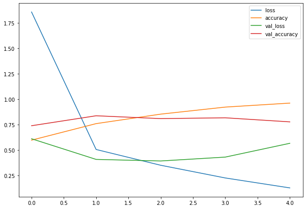

Observe as curvas de perda, parece que o modelo está superajustando (com `overfitting`) o conjunto de dados de treinamento. Quando a perda de validação de um modelo (`val_loss`) começa a aumentar, provavelmente que ele esteja superajustando os dados de treino. Isso significa que ele está aprendendo muito bem os padrões, por tanto sua capacidade de generalizar para os dados que não foram vistos será reduzida. Vamos inspecionar ainda mais o desempenho do modelo, separando as curvas de precisão e perda:

```python
# Função para plotar os dados de validação e treino separadamente
def plot_loss_curves(history):
  loss = history.history['loss']
  val_loss = history.history['val_loss']

  accuracy = history.history['accuracy']
  val_accuracy = history.history['val_accuracy']

  epochs = range(len(history.history['loss']))

  # Plot loss
  plt.plot(epochs, loss, label='training_loss')
  plt.plot(epochs, val_loss, label='val_loss')
  plt.title('Loss')
  plt.xlabel('Epochs')
  plt.legend()

  # Plot accuracy
  plt.figure()
  plt.plot(epochs, accuracy, label='training_accuracy')
  plt.plot(epochs, val_accuracy, label='val_accuracy')
  plt.title('Accuracy')
  plt.xlabel('Epochs')
  plt.legend();
```

```python
plot_loss_curves(history_4)
```

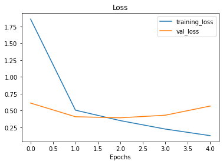

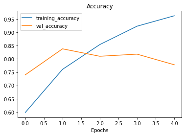

O ideal para essas curvas seria uma seguir a outra (*validação seguir treino*). Ou, a curva de validação deve estar ligeiramente abaixo da curva de treino, se houve um grande espaço entre elas, significa que o modelo provavelmente está com `overfitting`.

### 6. Ajustando os parâmetros do modelo

O ajuste um modelo de `ML` é composto de 3 etapas:

- Criar uma linha de base
- Alcançar a linha de base (*gerando `overfitting` em um modelo maior*)
- Reduzir o `overfitting`

Até agora já passamos pelas duas primeiras etapas, ainda há mais algumas coisas que poderíamos tentar para refinar o ajuste do nosso modelo:

- *Aumentar o número de camadas convolucionais.*
- *Aumentar o número defiltros convolucionais*
- *Adicionar outra camada densa de saída (dense layer)*
  
O que faremos agora é focar em alinhar as curvas de treinamento do modelo, em outras palavras, reduziremos o overfitting.

Quando um modelo apresenta um desempenho muito bom nos dados de treino e ruim nos dados não vistos, ele acaba se tornando inútil se quisermos usá-lo em um problema real. Nos próximos modelos que vamos construir, ajustaremos vários parâmetros a medida que inspecionamos as curvas de treino ao longo do caminho.

Para o primeiro ajuste, faremos um modelo com a mesma estrutura do anterior, mas com uma camada `MaxPool2D()` após cada camada convolucional (uma [ConvNet com max pooling](https://deeplizard.com/learn/video/ZjM_XQa5s6s)):

```python
# criando o modelo que será usado como linha de base
# gerando uma rede neural convolucional de 3 camadas
model_5 = Sequential([
  Conv2D(10, 3, activation='relu', input_shape=(224, 224, 3)),
  MaxPool2D(pool_size=2), # reduce number of features by half
  Conv2D(10, 3, activation='relu'),
  MaxPool2D(),
  Conv2D(10, 3, activation='relu'),
  MaxPool2D(),
  Flatten(),
  Dense(1, activation='sigmoid')
])
```

Se as camadas convolucionais aprendem os recursos de uma imagem, imagine a camada `Max Pooling` como a responsável por descobrir os mais importantes desses recursos.

```python
# Compila
model_5.compile(loss='binary_crossentropy',
                optimizer=Adam(),
                metrics=['accuracy'])
# Fit
history_5 = model_5.fit(train_data,
                        epochs=5,
                        steps_per_epoch=len(train_data),
                        validation_data=test_data,
                        validation_steps=len(test_data))
```

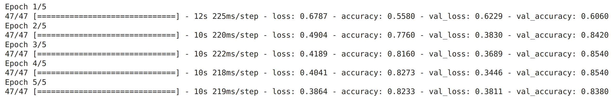

Parece que o modelo implementando `max pooling` está apresentando um desempenho pior nos dados de treino, mas ligeiramente melhor nos dados de validação.

```python
plot_loss_curves(history_5)
```

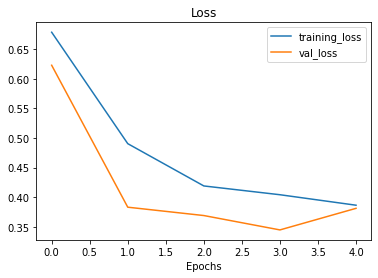

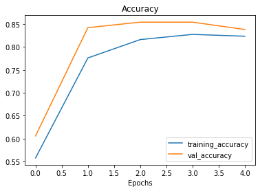

Observe nas curvas de treinamento que agora elas estão bem mais próximas umas das outras. No entanto, nossa perda de validação parece aumentar no final, potencialmente levando ao overfitting. Vamos tentar implementar agora mais um método na prevenção de overfitting (`data augmentation`).

Para implementar `data augmentation`, precisamos instanciar novamente os valores de `ImageDataGenerator`:

```python
# ImageDataGenerator com data augmentation
train_datagen_augmented = ImageDataGenerator(rescale=1/255.,
                                             # rotaciona ligeiramente a 20 graus
                                             rotation_range=20,
                                             # corta a imagem
                                             shear_range=0.2,
                                             # zoom na imagem
                                             zoom_range=0.2,
                                             # altera a largura da imagem
                                             width_shift_range=0.2,
                                             # muda a altura da imagem
                                             height_shift_range=0.2,
                                             # vira a imagem no eixo horizontal
                                             horizontal_flip=True)

# Instância de treino ImageDataGenerator sem data augmentation
train_datagen = ImageDataGenerator(rescale=1/255.) 

# Instância de teste ImageDataGenerator sem data augmentation
test_datagen = ImageDataGenerator(rescale=1/255.)
```

`Data augmentation` (aumento de dados) é o processo de alterar os dados de treinamento, criando várias versões para ter mais diversidade e, por sua vez, permitindo que os modelos aprendam padrões cada vez mais generalizáveis. Essas alterações representam uma rotação em uma imagem, invertê-la ou cortá-la ou aplicar um zoom, ou algo do tipo. Isso ajuda a simular dados que um modelo pode se deparar no mundo real.

> `Data augmentation` é aplicado geralmente apenas nos dados de treinamento. Usando os parâmetros em `ImageDataGenerator`, as imagens são mantidas como estão nos diretórios, são manipuladas aleatoriamente apenas quando carregadas no modelo (*em memória*).

```python
# Importa os dados e aumenta
print("Imagens de treino aumentadas:")
train_data_augmented = train_datagen_augmented.flow_from_directory(
    train_dir,
    target_size=(224, 224),
    batch_size=32,
    class_mode='binary',
    shuffle=False)

# Cria lotes de dados não aumentados
print("Imagens de treino não aumentadas:")
train_data = train_datagen.flow_from_directory(train_dir,
                                               target_size=(224, 224),
                                               batch_size=32,
                                               class_mode='binary',
                                               shuffle=False)

print("Imagens de teste inalteradas:")
test_data = test_datagen.flow_from_directory(test_dir,
                                             target_size=(224, 224),
                                             batch_size=32,
                                             class_mode='binary')
```

```
Imagens de treino aumentadas:
Found 1500 images belonging to 2 classes.
Imagens de treino não aumentadas:
Found 1500 images belonging to 2 classes.
Imagens de teste inalteradas:
Found 500 images belonging to 2 classes.
```

Vamos visualizar para ver o que está acontecendo aqui:

```python
# Pegando lote de dados de exemplo
images, labels = train_data.next()
augmented_images, augmented_labels = train_data_augmented.next()

# Plota imagem original e aumentada
random_number = random.randint(0, 32)
plt.imshow(images[random_number])
plt.title(f"Original image")
plt.axis(False)
plt.figure()
plt.imshow(augmented_images[random_number])
plt.title(f"Augmented image")
plt.axis(False);
```

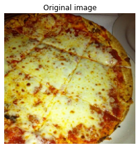

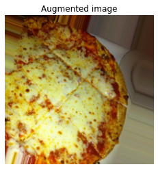

Perceba as transformações na segunda imagem. Observe como a imagem aumentada parece ligeiramente distorcida da original. Isso significa que o modelo será forçado a tentar aprender padrões em imagens não tão boas, o que pode acontecer com facilidade no mundo real.

Agora que temos dados aumentados, vamos tentar reajustar um modelo com eles e ver como isso afeta o desempenho.

```python
# Importa os dados e aumenta
print("Imagens de treino aumentadas:")
train_data_augmented_shuffled = train_datagen_augmented.flow_from_directory(
    train_dir,
    target_size=(224, 224),
    batch_size=32,
    class_mode='binary',
    shuffle=True) # ativando o shuffle para ter dados aleatórios

# Criando um modelo (mesmo que model_5)
model_6 = Sequential([
  Conv2D(10, 3, activation='relu', input_shape=(224, 224, 3)),
  MaxPool2D(pool_size=2),
  Conv2D(10, 3, activation='relu'),
  MaxPool2D(),
  Conv2D(10, 3, activation='relu'),
  MaxPool2D(),
  Flatten(),
  Dense(1, activation='sigmoid')
])

# Compila o modelo
model_6.compile(loss='binary_crossentropy',
                optimizer=Adam(),
                metrics=['accuracy'])

# Fit
# trocando para dados aumentados
history_6 = model_6.fit(train_data_augmented_shuffled,
                        epochs=5,
                        steps_per_epoch=len(train_data_augmented_shuffled),
                        validation_data=test_data,
                        validation_steps=len(test_data))
```

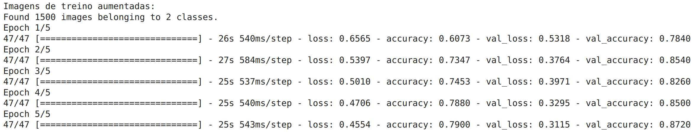

```python
plot_loss_curves(history_6)
```

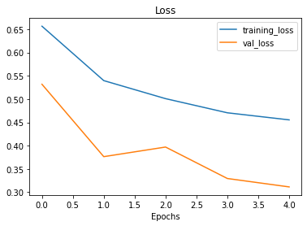

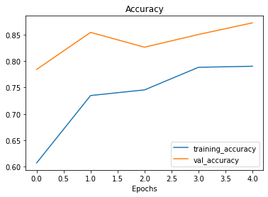

O modelo foi capaz de ver exemplos de imagens aumentadas de pizza e carne, e, por sua vez aplicar o que aprendeu nos dados de validação apresentando um resultado melhor. Além disso, nossas curvas de perda parecem bem mais suaves se compararmos com os modelos anteriores.

## Repetir os processos até obter um resultado satisfatório

Treinamos alguns modelos e até aqui eles estão apresentando um desempenho muito bom. Como já superamos a linha de base, existem algumas coisas que podemos tentar para continuar a melhorar o modelo:

- Aumentar o número de camadas de modelo (adicionando mais camadas convolucionais).
- Aumentar o número de filtros em cada camada convolucional.
- Treinar o modelo por mais tempo (`epoch` maior).
- Encontrar uma taxa de aprendizado ideal (`learning_rate`).
- Obter mais dados (quanto mais dados, mais oportunidade o modelo tem para aprender).

Ajustar cada uma dessas configurações durante o desenvolvimento do modelo é chamado de *ajuste de hiperparâmetro*. Vamos voltar ao ponto inicial e tentar a arquitetura `TinyVGG` do [CNN Explainer](https://poloclub.github.io/cnn-explainer/).

```python
# Cria um modelo CNN com arquitetura Tiny VGG para classificação binária
model_7 = Sequential([
  Conv2D(10, 3, activation='relu', input_shape=(224, 224, 3)),
  Conv2D(10, 3, activation='relu'),
  MaxPool2D(),
  Conv2D(10, 3, activation='relu'),
  Conv2D(10, 3, activation='relu'),
  MaxPool2D(),
  Flatten(),
  Dense(1, activation='sigmoid')
])

# Compila o modelo
model_7.compile(loss="binary_crossentropy",
                optimizer=tf.keras.optimizers.Adam(),
                metrics=["accuracy"])

# Fit
history_7 = model_7.fit(train_data_augmented_shuffled,
                        epochs=5,
                        steps_per_epoch=len(train_data_augmented_shuffled),
                        validation_data=test_data,
                        validation_steps=len(test_data))
```

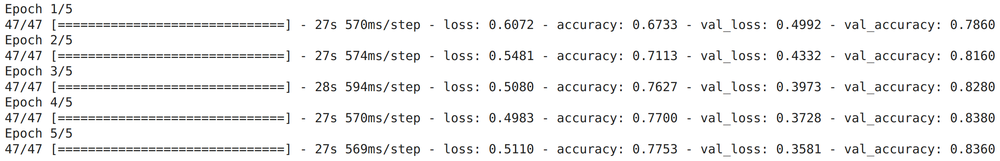

Perceba que utilizamos um código ligeiramente diferente, para construir o `model_8` em comparação com o `model_1`. Isso se deve as importações que fizemos antes, como de `Conv2D` que reduziu a quantidade de código que tivemos que escrever. Embora o código seja diferente, as arquiteturas são as mesmas:

```
model_1.summary()

Model: "sequential"
_________________________________________________________________
 Layer (type)                Output Shape              Param #   
=================================================================
 conv2d (Conv2D)             (None, 222, 222, 10)      280       
                                                                 
 conv2d_1 (Conv2D)           (None, 220, 220, 10)      910       
                                                                 
 max_pooling2d (MaxPooling2D  (None, 110, 110, 10)     0         
 )                                                               
                                                                 
 conv2d_2 (Conv2D)           (None, 108, 108, 10)      910       
                                                                 
 conv2d_3 (Conv2D)           (None, 106, 106, 10)      910       
                                                                 
 max_pooling2d_1 (MaxPooling  (None, 53, 53, 10)       0         
 2D)                                                             
                                                                 
 flatten (Flatten)           (None, 28090)             0         
                                                                 
 dense (Dense)               (None, 1)                 28091     
                                                                 
=================================================================
Total params: 31,101
Trainable params: 31,101
Non-trainable params: 0
```

```
model_7.summary()

Model: "sequential_7"
_________________________________________________________________
 Layer (type)                Output Shape              Param #   
=================================================================
 conv2d_19 (Conv2D)          (None, 222, 222, 10)      280       
                                                                 
 conv2d_20 (Conv2D)          (None, 220, 220, 10)      910       
                                                                 
 max_pooling2d_14 (MaxPoolin  (None, 110, 110, 10)     0         
 g2D)                                                            
                                                                 
 conv2d_21 (Conv2D)          (None, 108, 108, 10)      910       
                                                                 
 conv2d_22 (Conv2D)          (None, 106, 106, 10)      910       
                                                                 
 max_pooling2d_15 (MaxPoolin  (None, 53, 53, 10)       0         
 g2D)                                                            
                                                                 
 flatten_8 (Flatten)         (None, 28090)             0         
                                                                 
 dense_13 (Dense)            (None, 1)                 28091     
                                                                 
=================================================================
Total params: 31,101
Trainable params: 31,101
Non-trainable params: 0
```

Vamos comparar a performance, primeiro as curvas do último modelo:

```python
plot_loss_curves(history_7)
```

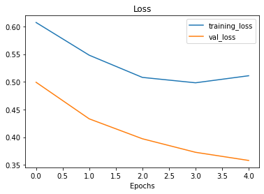

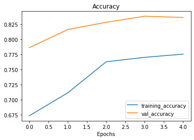

Agora do nosso primeiro modelo:

```python
plot_loss_curves(history_1)
```

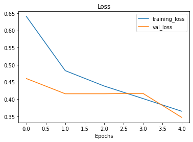

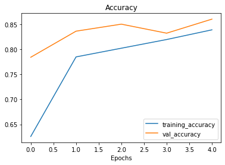

As curvas de treinamento parecem boas, mas o desempenho do modelo no conjunto de teste não melhorou muito em comparação com o modelo anterior. Observando as curvas, parece que o desempenho do modelo pode melhorar se treinarmos por um pouco mais de tempo (mais `epochs`).


---
WIP