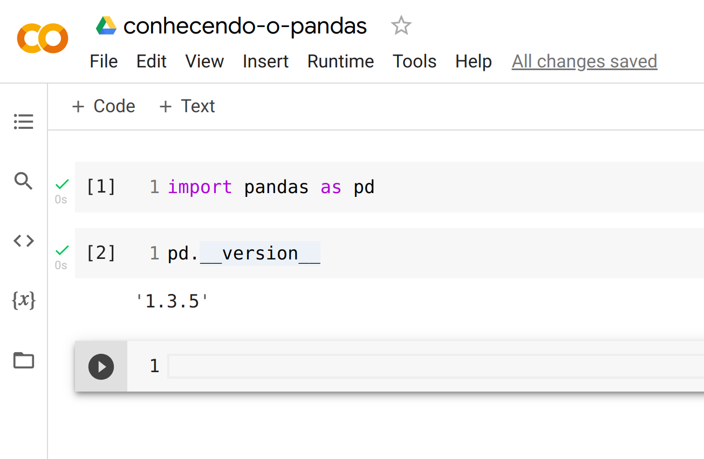

# 1.1.1 Conhecendo o Pandas

O Pandas fornece um conjunto de funções simples de usar. Essas funções são integradas a muitas outras ferramentas de Data Science e Machine Learning que utilizam Python como linguagem, logo, entender o Pandas é indispensável para o resto da sua jornada.

## Importando o Pandas

Para começar a usar o Pandas, o primeiro passo é importá-lo.
Com o notebook aberto, podemos inserir em uma célula a instrução para importar a biblioteca. A maneira mais comum é importar o Pandas com a abreviação `pd`:

```python
import pandas as pd
```

Depois de importar podemos executar a célula do notebook e em outra célula verificar a versão do Pandas instalada com o método `__version__`:

```python
import pandas as pd
pd.__version__
```

O seu notebook do Google Colab deve apresentar um resultado parecido com:


