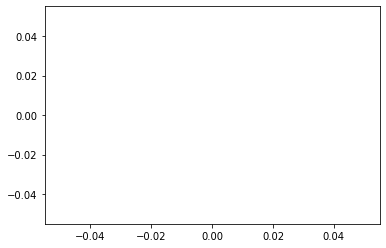
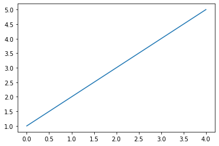
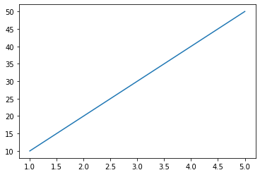
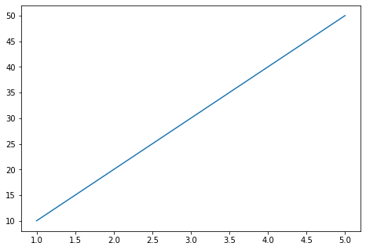

# Gráficos com Matplotlib

Saber plotar gráficos é uma importante tarefa na sua jornada com dados. Nesse capítulo faremos uma imersão na biblioteca mais utilizada para essa tarefa, chegou o momento de conhecer a `Matplotlib`.

Para importar, usaremos a maneira mais comum com a abreviação `plt`:

```python
import matplotlib.pyplot as plt

plt.plot()
```



### Plot

A função `plot()` é utilizada para renderizar uma imagem, no exemplo acima mostra a saída padrão da função. Vamos adicionar alguns dados para criar o nosso primeiro gráfico:

```python
plt.plot([1, 2, 3, 4, 5])
[<matplotlib.lines.Line2D at 0x7f4caa06a810>]
```



Geramos o nosso primeiro plot com dados em sequência de 1 a 5 que criou uma linha reta. Ao executar a instrução de plot no notebook recebemos como retorno uma mensagem não muito amigável `[<matplotlib.lines.Line2D at 0x7f4caa06a810>]`.
Essa informação retornada não é um erro, trata-se de uma mensagem padrão da Matplotlib informando que um objeto de plotagem foi criado. Essa mensagem pode ser escondida de duas formas, utilizando a função `plt.show()` ou adicionando um `;` no final da instrução de plot. Usaremos ambas no decorrer do livro para demonstrar.

Vamos criar 2 listas de dados, dessa vez armazenadas em variáveis:

```python
x = [1, 2, 3, 4, 5]
y = [10, 20, 30, 40, 50]

plt.plot(x, y);
```



Dessa vez inserimos dados em ambos os eixos, x e y, observe o eixo y com os valores de 10 à 50, se comparar com o gráfico anterior você vai notar o que mudou. Perceba também o `;` ao final da instrução, ocultou a mensagem padrão que recebemos da outra vez.

### Figure

Outra versão muito comum de plotagem é utilizando Orientação a Objetos em vez da interface Pyplot (que utilizamos no import). Vamos a um exemplo:

```python
fig = plt.figure()
ax = fig.add_subplot()
plt.show()
```


Diferente da interface Pyplot, onde só precisamos utilizar a função `plot()`, aqui é necessário definir o objeto `figure`, para então adicionarmos um `plot` à figura criada. Observe que dessa vez utilizamos `plt.show()` para ocultar a mensagem padrão.

Agora vamos adicionar alguns dados para essa outra forma de plotagem:

```python
fig = plt.figure()
ax = fig.add_axes([1, 1, 1, 1])
ax.plot(x, y)
plt.show()
```



Nossa plotagem ficou um pouco mais complexa, utilizamos os dados das variáveis que criamos anteriormente, já `axes` é uma camada da figura onde um gráfico será posicionado (veremos isso em detalhes no próximo capítulo).

### Subplots

Vejamos mais uma forma, dessa vez mais simples de plotar, utilizando `subplots()`:

```python
fig, ax = plt.subplots()
ax.plot(x, y);
```


Concordamos que essa opção não é tão simples como a primeira que vimos até agora, porém esse formato nos permite explorar muitas configurações da Matplotlib. Usaremos esse formato daqui pra frente.

---

WIP