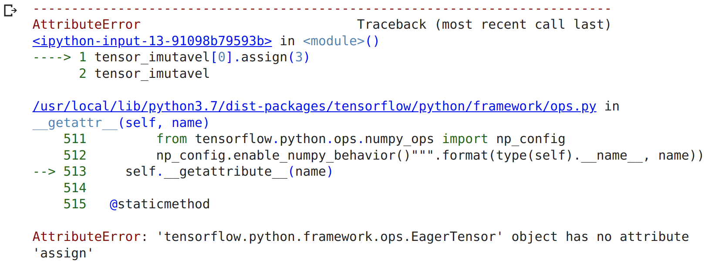
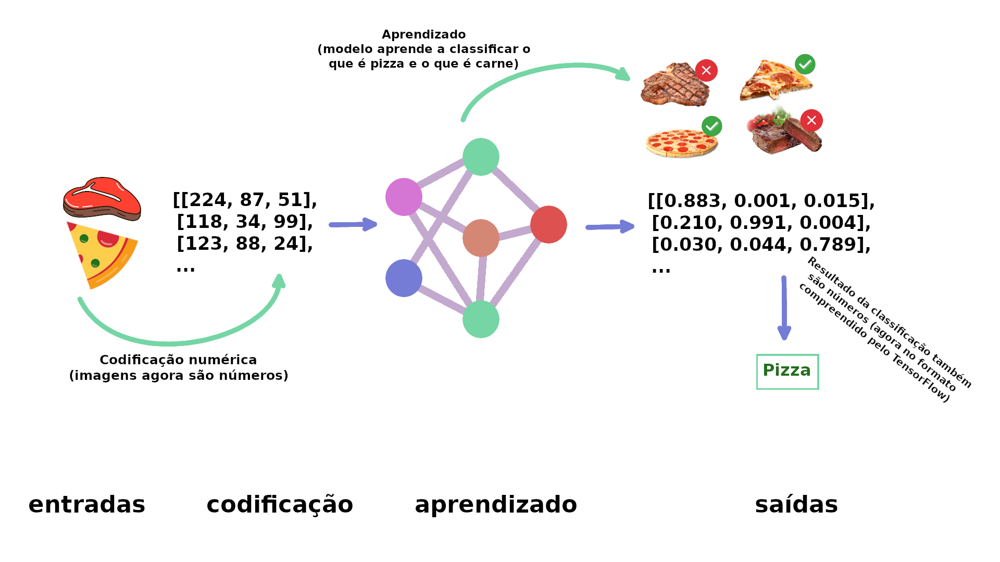

# TensorFlow

TensorFlow é uma biblioteca de Machine Learning *open-source* para pré-processamento de dados, modelagem de dados e criação de modelos. Em vez de criar modelos de `ML` do zero, podemos utilizar TensorFlow que contém muitas funções de `ML` (*principalmente as mais utilizadas*). Ok, TensorFlow é vasto, mas o foco principal é simples: transformar dados em números que são chamados de (`tensors`) e construir algoritmos de `ML` para encontrar padrões neles.

## Tensors

Os `tensors` são como matrizes NumPy. Daqui pra frente pense em um tensor como uma representação numérica multidimensional (n-dimensional, onde `n` pode ser qualquer número) de algo. Esse algo pode ser quase qualquer coisa que possamos imaginar:

- Pode ser os próprios números (tensors representando o preço de carros).
- Pode ser uma imagem (tensors representando os pixels de uma foto).
- Pode ser texto (tensors representando palavras).
- Ou pode ser alguma outra forma de informação (dados) que você deseja representar como números.

A principal diferença entre tensors e matrizes NumPy é que os tensors podem ser utilizados em `GPUs` (unidades de processamento gráfico, placas de vídeo) e `TPUs` (unidades de processamento de tensor). O benefício disso é poder executar tarefas computacionais mais rápidas, ou seja, para encontrar padrões em representações numéricas nos dados de forma mais rápida.

Vamos começar nossa jornada, a primeira coisa que faremos é importar o TensorFlow, o alias mais comum utilizado é o `tf`:

```python
import tensorflow as tf
print(tf.__version__)
```

> 2.8.0

## Criando Tensors com tf.constant()

No geral, normalmente não criaremos `tensors` por conta própria, pois o TensorFlow possui módulos integrados capazes de ler nossas fontes de dados e convertê-las automaticamente em tensors. Apenas para exemplificar nesse momento em que estamos nos familiarizando, criaremos tensors e veremos como manipulá-los. Começando por `tf.constant()`:

```python
scalar = tf.constant(5)
scalar

<tf.Tensor: shape=(), dtype=int32, numpy=5>
```

> Um `scalar` é conhecido como um tensor de `rank` 0 por não ter dimensões (é apenas um número). No momento não precisamos saber muito sobre os diferentes `ranks` de tensors, veremos mais detalhes sobre isso em outro momento. O importante agora é saber que os tensors podem ter um intervalo ilimitado de dimensões (a quantidade exata, vai depender dos dados que vamos representar).

```python
scalar.ndim

0
```

```python
vetor = tf.constant([10, 10])
vetor

<tf.Tensor: shape=(2,), dtype=int32, numpy=array([10, 10], dtype=int32)>

vetor.ndim

1
```

```python
matriz = tf.constant([[10, 5],
                      [5, 10]])
matriz

<tf.Tensor: shape=(2, 2), dtype=int32, numpy=
array([[10,  5],
       [ 5, 10]], dtype=int32)>

matriz.ndim

2
```

Por padrão o TensorFlow cria tensors utilizando `int32` como tipo de dados ou `float32`. Isso também é conhecido como precisão de `32 bits` (quanto maior o número, mais preciso ele é).

```python
tensor = tf.constant([[[1, 2, 3],
                       [4, 5, 6]],
                      [[7, 8, 9],
                       [10, 11, 12]],
                      [[13, 14, 15],
                       [16, 17, 18]]])
tensor


<tf.Tensor: shape=(3, 2, 3), dtype=int32, numpy=
array([[[ 1,  2,  3],
        [ 4,  5,  6]],

       [[ 7,  8,  9],
        [10, 11, 12]],

       [[13, 14, 15],
        [16, 17, 18]]], dtype=int32)>

tensor.ndim

3
```

Esse é um exemplo de um tensor `rank` 3 (possui 3 dimensões), como dito antes, um tensor pode ter uma quantidade ilimitada de dimensões. Imagine que você quer transformar uma série de imagens em tensors, no formato (223,223, 3, 32), onde:

**223, 223** são as primeiras 2 dimensões, altura e largura das imagens em pixels. **3** é o número de canais de cores da imagem (vermelho, verde e azul) e **32** é o tamanho do lote (número de imagens que uma rede neural vê). Todas as variáveis criadas acima, são na verdade tensors, na literatura podemos encontrar referências com nomes diferentes:

- **scalar**: um único número
- **vetor**: um número com direção (ex: velocidade de um carro)
- **matriz**: uma matriz bidimensional numérica
- **tensor**: uma matriz n-dimensional numérica (onde `n` pode ser qualquer número, logo um tensor com dimensão `0` é um scalar, um tensor com 1 dimensão é um vetor).

> MEMO: inserir uma imagem aqui com ex. de álgebra visual comparando as referências para um tensor, algo parecido com: https://www.mathsisfun.com/algebra/scalar-vector-matrix.html

## Criando Tensors com tf.Variable()

Outra opção para criar tensors é utilizando `tf.Variable()`. A diferença é que  `tf.constant()` cria tensors imutáveis (não podem ser alterados, só podem ser utilizados para criar um novo tensor) enquanto `tf.Variable()` cria tensors mutáveis (que podem ser alterados).

```python
tensor_mutavel = tf.Variable([10, 5])
tensor_imutavel = tf.constant([10, 5])

tensor_mutavel, tensor_imutavel
```

```
(<tf.Variable 'Variable:0' shape=(2,) dtype=int32, numpy=array([10,  5], dtype=int32)>,
 <tf.Tensor: shape=(2,), dtype=int32, numpy=array([10,  5], dtype=int32)>)
```

Por exemplo, podemos alterar os valores do tensor mutável por meio da função `assign()`:

```python
tensor_mutavel[0].assign(3)
tensor_mutavel
```

> <tf.Variable 'Variable:0' shape=(2,) dtype=int32, numpy=array([3, 5], dtype=int32)>

Os valores forma alterados de `[10, 5]` para `[3, 5]`. Se tentarmos a mesma alteração no tensor imutável, teremos uma mensagem de erro:

```python
tensor_imutavel[0].assign(3)
tensor_imutavel
```



A escolha de qual utilizar, `tf.Variable()` ou `tf.constant()` vai depender do tipo de solução que o seu problema exige. Na maioria das vezes, o TensorFlow escolherá automaticamente para você (ao carregar dados).

## Criando Tensors aleatórios

Tensors aleatórios possuem algum tamanho arbitrário com números aleatórios. Isso é bastante utilizado em redes neurais para inicializar as configurações (*pesos padrões*) que estão tentando aprender nos dados.
O processo de aprendizado de uma rede neural geralmente envolve o uso de uma matriz aleatória `n-dimensional`e refiná-los até que representem algum tipo de padrão (uma forma compacta de representar os dados originais).

### Como uma rede neural aprende ?



No exemplo acima, de forma simplificada a primeira etapa é converter as imagens em números, os números agora são tensors (no TensorFlow), então a rede neural busca por padrões que identifiquem as imagens, para no final classificar se é uma coisa ou  outra.Em detalhes o aprendizado começa com padrões aleatórios e depois passa para exemplos demonstrativos de dados, ao mesmo tempo em que tenta atualizar seus padrões aleatórios para representar os exemplos (pizza ou carne).

Podemos criar tensors, aleatórios utilizando a classe `tf.random.Generator`:

```python
random_1 = tf.random.Generator.from_seed(42)
random_1 = random_1.normal(shape=(3, 2))
random_1

<tf.Tensor: shape=(3, 2), dtype=float32, numpy=
array([[-0.7565803 , -0.06854702],
       [ 0.07595026, -1.2573844 ],
       [-0.23193763, -1.8107855 ]], dtype=float32)>
```

O tensor aleatório criado, na verdade é pseudoaleatório. Se criarmos outro tensor aleatório e definirmos o mesmo valor de `seed` teremos os mesmos números aleatórios (lembre do NumPy, é bem semelhante `np.random.seed(42)`):

```python
random_2 = tf.random.Generator.from_seed(42)
random_2 = random_2.normal(shape=(3, 2))
random_2

<tf.Tensor: shape=(3, 2), dtype=float32, numpy=
array([[-0.7565803 , -0.06854702],
       [ 0.07595026, -1.2573844 ],
       [-0.23193763, -1.8107855 ]], dtype=float32)>
```

Comparando:

```python
random_1 == random_2

<tf.Tensor: shape=(3, 2), dtype=bool, numpy=
array([[ True,  True],
       [ True,  True],
       [ True,  True]])>
```

E se trocarmos o valor do `seed` ?

```python
random_3 = tf.random.Generator.from_seed(11)
random_3 = random_3.normal(shape=(3, 2))
random_3

<tf.Tensor: shape=(3, 2), dtype=float32, numpy=
array([[ 0.27305737, -0.29925638],
       [-0.3652325 ,  0.61883307],
       [-1.0130816 ,  0.28291714]], dtype=float32)>
```

```python
random_1 == random_3

<tf.Tensor: shape=(3, 2), dtype=bool, numpy=
array([[False, False],
       [False, False],
       [False, False]])>
```

Ok, e se você quiser embaralhar a ordem de um tensor ? Digamos que você esteja em um projeto com 20.000 imagens de pizzas e carnes e as primeiras 15.000 imagens são de pizzas e as próximas 5.000 são de carnes. Essa distribuição pode afetar a forma como uma rede neural aprende ou seja, pode ser induzida a aprender pela ordem dos dados, em vez disso, pode ser uma boa estratégia embaralhar os dados.

```python
nao_embaralhado = tf.constant([[10, 7],
                            [3, 4],
                            [2, 5]])

tf.random.shuffle(nao_embaralhado)

<tf.Tensor: shape=(3, 2), dtype=int32, numpy=
array([[10,  7],
       [ 2,  5],
       [ 3,  4]], dtype=int32)>
```

Agora vamos embaralhar:

```python
tf.random.shuffle(nao_embaralhado, seed=42)

<tf.Tensor: shape=(3, 2), dtype=int32, numpy=
array([[ 2,  5],
       [ 3,  4],
       [10,  7]], dtype=int32)>
```

## Outras formas de criar Tensors

Assim como no NumPy, TensorFlow disponibiliza funções para gerar arrays de 1 e 0 (nesse caso tensors). Embora raramente você utilize isso:

```python
tf.ones(shape=(3, 2))

<tf.Tensor: shape=(3, 2), dtype=float32, numpy=
array([[1., 1.],
       [1., 1.],
       [1., 1.]], dtype=float32)>


tf.zeros(shape=(3, 2))

<tf.Tensor: shape=(3, 2), dtype=float32, numpy=
array([[0., 0.],
       [0., 0.],
       [0., 0.]], dtype=float32)>
```

Também podemos transformar matrizes NumPy em tensors, lembre-se que a principal diferença entre matrizes NumPy e tensors é que o segundo pode ser ser executado em GPUs.

```python
import numpy as np
numpy_A = np.arange(1, 25, dtype=np.int32)
A = tf.constant(numpy_A,  
                shape=[2, 4, 3])
A


<tf.Tensor: shape=(2, 4, 3), dtype=int32, numpy=
array([[[ 1,  2,  3],
        [ 4,  5,  6],
        [ 7,  8,  9],
        [10, 11, 12]],

       [[13, 14, 15],
        [16, 17, 18],
        [19, 20, 21],
        [22, 23, 24]]], dtype=int32)>
```

## Listando informações de Tensors


---

WIP
