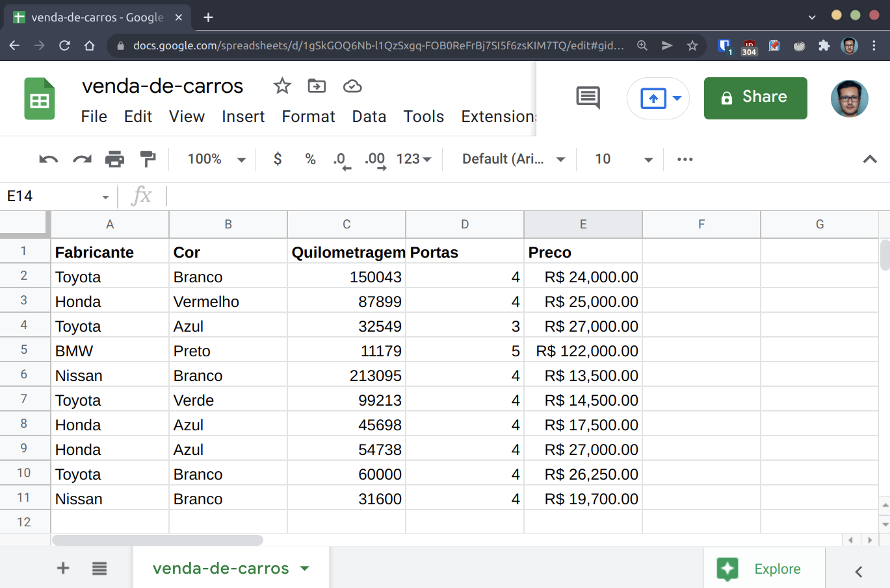
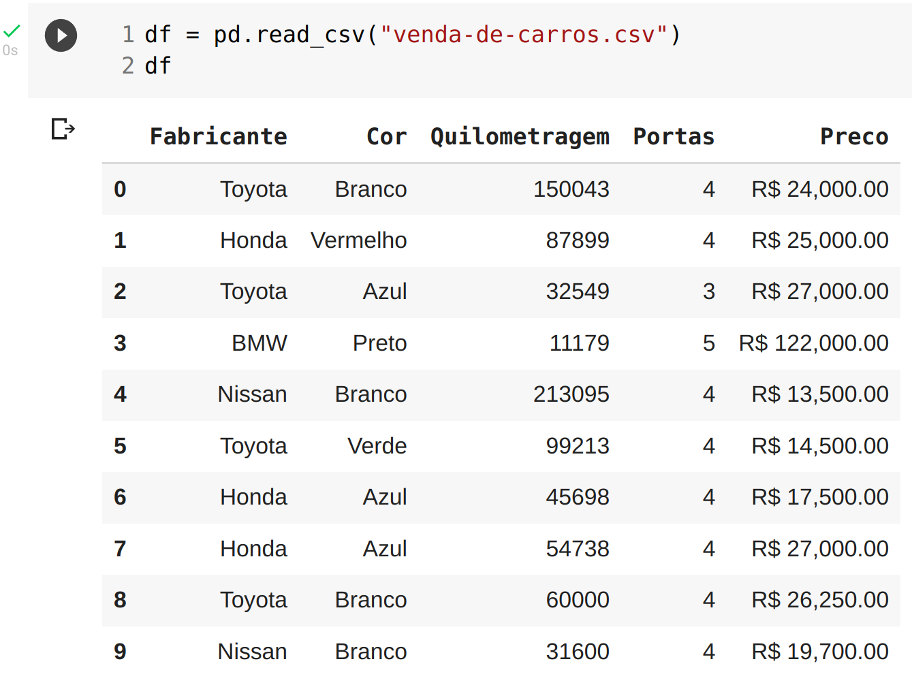
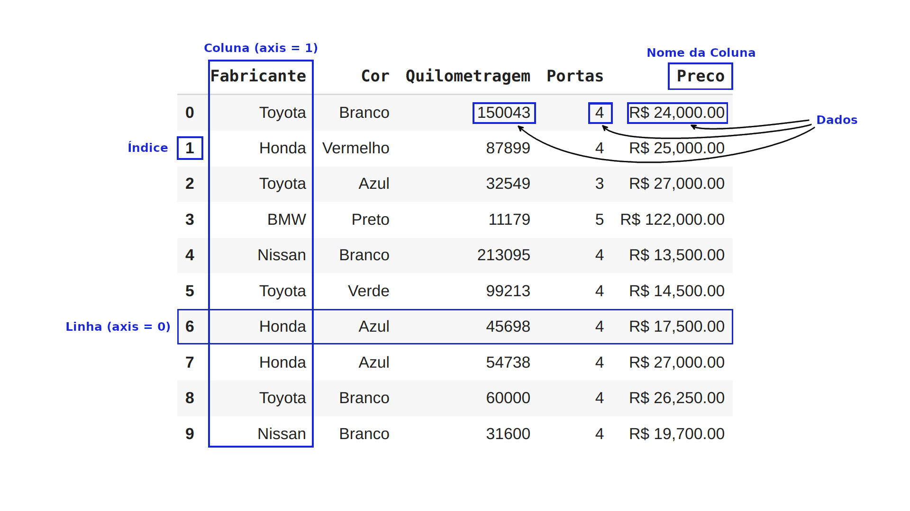
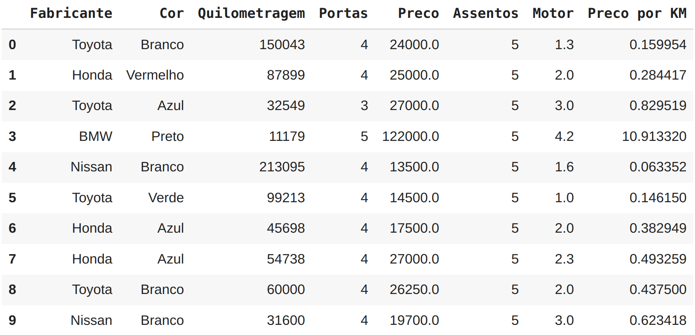
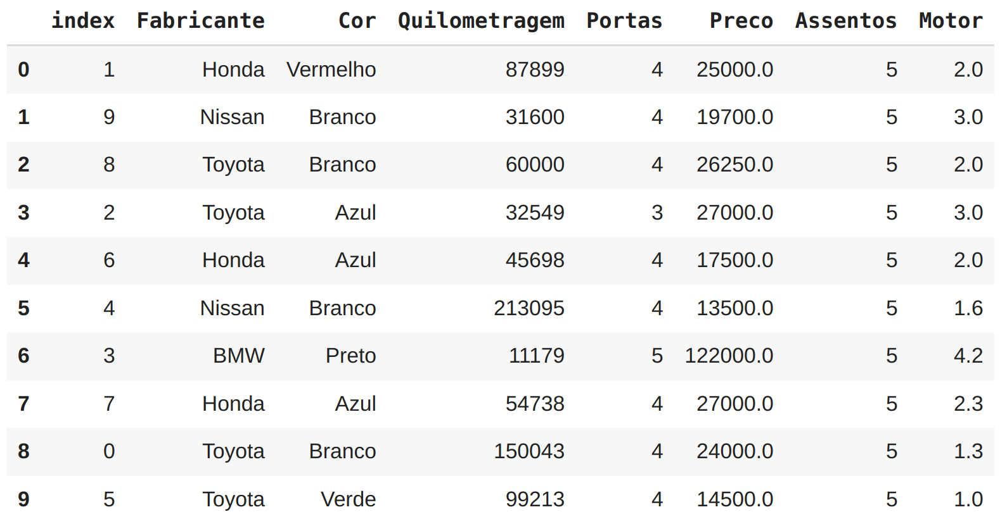

# Manipulando dados com Pandas

Como vimos anteriormente, criar Séries e DataFrame do zero é legal, mas normalmente faremos a importação dos dados no formato de um arquivo `.csv` ou planilha.

O Pandas permite a importação de dados de maneira fácil por meio de funções como `pd.read_csv()` e `pd.read_excel()`.

Por exemplo, vamos obter as informações deste documento do Google Sheet:



Depois de exportá-lo como um arquivo `.csv`, podemos agora importá-lo no Pandas com `pd.read_csv()` e criar o nosso DataFrame:



Agora temos os mesmos dados da planilha disponíveis em um DataFrame Pandas.
Isso permite que você aproveite todas as funcionalidades do Pandas para explorar os dados.

## Anatomia de um DataFrame

Abaixo vemos um resumo dos principais componentes de um DataFrame:



## Explorando os dados

Uma das primeiras tarefas que fazemos logo após importar os dados para um DataFrame Pandas é começar a explorá-lo. O Pandas possui muitas funções internas que nos permitem obter informações descritivas dos dados, `.dtypes` por exemplo nos mostra que tipo de dados cada coluna contém:

### Dtypes

```python
df.dtypes

Fabricante       object
Cor              object
Quilometragem     int64
Portas            int64
Preco            object
dtype: object
```

Note que a coluna `Preco` não é um número inteiro como `Quilometragem` e `Portas`. Não se preocupe isso é fácil de consertar e faremos isso em outro momento.

### Describe

A função `.describe()` nos mostra uma visão estatística de todas as colunas numéricas:

```python
df.describe()
```

|       | Quilometragem |  Portas   |
| :---: | :-----------: | :-------: |
| count |   10.000000   | 10.000000 |
| mean  | 78601.400000  | 4.000000  |
|  std  | 61983.471735  | 0.471405  |
|  min  | 11179.000000  | 3.000000  |
|  25%  | 35836.250000  | 4.000000  |
|  50%  | 57369.000000  | 4.000000  |
|  75%  | 96384.500000  | 4.000000  |
|  max  | 213095.000000 | 5.000000  |

### Info

Outra função muito utilizada é a `.info()`, que mostra quantas linhas existem, se há valores ausentes e os tipos de dados de cada coluna:

```
df.info()

<class 'pandas.core.frame.DataFrame'>
RangeIndex: 10 entries, 0 to 9
Data columns (total 5 columns):
 #   Column         Non-Null Count  Dtype 
---  ------         --------------  ----- 
 0   Fabricante     10 non-null     object
 1   Cor            10 non-null     object
 2   Quilometragem  10 non-null     int64 
 3   Portas         10 non-null     int64 
 4   Preco          10 non-null     object
dtypes: int64(2), object(3)
memory usage: 528.0+ bytes
```

### Mean e Sum

Pandas também disponibiliza várias funções estatísticas e matemáticas como `.mean()` e `.sum()` que podem ser aplicadas diretamente em um DataFrame ou Séries.

```python
valores = pd.Series([3000, 3500, 11250])
valores.mean()

5916.666666666667
```

```python
valores.sum()

17750
```

### Columns

Usar essas funções em um DataFrame inteiro pode não fazer muito sentido, nesse caso podemos direcionar a função individualmente para uma coluna.
O método `.columns` mostrará todas as colunas de um DataFrame:

```python
df.columns

Index(['Fabricante', 'Cor', 'Quilometragem', 'Portas', 'Preco'], dtype='object')
```

Selecionando uma coluna com dados numéricos podemos utilizar a função estatística `.mean()` novamente:

```python
df["Quilometragem"].mean()

78601.4
```

## Visualizando e selecionando dados

Na prática, realizar alterações nos dados e visualizá-los constantemente é uma tarefa de rotina. Nem sempre precisamos alterar todos os dados de um DataFrame, portanto veremos maneiras diferentes de selecionar.

### Head

Para visualizar as primeiras 5 linhas do seu DataFrame existe a função `.head()` que é muito utilizada:

```python
df.head()
```

|     | Fabricante |   Cor    | Quilometragem | Portas |     Preco     |
| :-: | :--------: | :------: | :-----------: | :----: | :-----------: |
|  0  |   Toyota   |  Branco  |    150043     |   4    | R$ 24,000.00  |
|  1  |   Honda    | Vermelho |     87899     |   4    | R$ 25,000.00  |
|  2  |   Toyota   |   Azul   |     32549     |   3    | R$ 27,000.00  |
|  3  |    BMW     |  Preto   |     11179     |   5    | R$ 122,000.00 |
|  4  |   Nissan   |  Branco  |    213095     |   4    | R$ 13,500.00  |

Para selecionar mais de 5, você pode passar o valor desejado como argumento na função, por exemplo: `.head(7)`.

### Tail

Outro método muito utilizado é o `.tail()` que seleciona as últimas 5 linhas do seu DataFrame:

```python
df.tail()
```

|     | Fabricante |  Cor   | Quilometragem | Portas |    Preco     |
| :-: | :--------: | :----: | :-----------: | :----: | :----------: |
|  5  |   Toyota   | Verde  |     99213     |   4    | R$ 14,500.00 |
|  6  |   Honda    |  Azul  |     45698     |   4    | R$ 17,500.00 |
|  7  |   Honda    |  Azul  |     54738     |   4    | R$ 27,000.00 |
|  8  |   Toyota   | Branco |     60000     |   4    | R$ 26,250.00 |
|  9  |   Nissan   | Branco |     31600     |   4    | R$ 19,700.00 |

### Loc e Iloc

Por meio das instruções `.loc[]` e `.iloc[]` podemos selecionar dados de Séries e DataFrames, essas opções são muito utilizadas. Para ilustrar o uso em uma Série, vamos criar uma:

```
animais = pd.Series(["gato", "ave", "cachorro", "cobra", "leão", "cavalo"], 
                   index=[0, 3, 8, 9, 6, 3])
animais

0        gato
3         ave
8    cachorro
9       cobra
6        leão
3      cavalo
dtype: object
```

Agora vamos utilizar o `.loc[]` informando como valor de entrada um número inteiro que corresponde ao índice da nossa Série:

```
animais.loc[3]

3       ave
3    cavalo
dtype: object
```

Temos como retorno os valores que tem como índice o número 3.

Já com o `.iloc[]`:

```
animais.iloc[3]

cobra
```

O valor retornado é bem diferente `cobra` que tem como índice o número 9. Isso acontece pois o `.iloc[]` faz uma seleção pela posição dos dados na Série ou DataFrame. Vamos testar esses recursos agora no nosso DataFrame:

```
df.loc[3]

Fabricante                 BMW
Cor                      Preto
Quilometragem            11179
Portas                       5
Preco            R$ 122,000.00
Name: 3, dtype: object

df.iloc[3]

Fabricante                 BMW
Cor                      Preto
Quilometragem            11179
Portas                       5
Preco            R$ 122,000.00
Name: 3, dtype: object
```

Ambos `.loc[]` e `.iloc[]` retornaram o mesmo valor pois as informações no DataFrame exibidas estão em ordem tanto na posição quanto no índice.

Ainda podemos utilizar o `slicing` com `.loc[]` e `.iloc[]`, selecionando dados em um range:

```
animais.iloc[:3]

0        gato
3         ave
8    cachorro
dtype: object
```

> Lembre-se, utilize `.loc[]` quando estiver selecionando dados pelo índice e `.iloc[]` quando estiver referindo-se a posições no DataFrame.

Se quiser selecionar uma coluna em particular use `['NOME_DA_COLUNA']`:

```
df["Fabricante"]

0    Toyota
1     Honda
2    Toyota
3       BMW
4    Nissan
5    Toyota
6     Honda
7     Honda
8    Toyota
9    Nissan
Name: Fabricante, dtype: object
```

Ao selecionar colunas podemos elaborar filtros condicionais entre colchetes, vejamos a sintaxe:

```python
df[df["Quilometragem"] > 100000]
```

|     | Fabricante |  Cor   | Quilometragem | Portas |    Preco     |
| :-: | :--------: | :----: | :-----------: | :----: | :----------: |
|  0  |   Toyota   | Branco |    150043     |   4    | R$ 24,000.00 |
|  4  |   Nissan   | Branco |    213095     |   4    | R$ 13,500.00 |

No exemplo estamos filtrando a coluna `Quilometragem` adicionando a condição para retornar apenas os carros que possuem uma quilometragem maior que `100.000`.

Que tal elaborar um filtro para listar apenas os carros da **Honda** ?

```python
df[df["Fabricante"] == "Honda"]
```

|     | Fabricante |   Cor    | Quilometragem | Portas |    Preco     |
| :-: | :--------: | :------: | :-----------: | :----: | :----------: |
|  1  |   Honda    | Vermelho |     87899     |   4    | R$ 25,000.00 |
|  6  |   Honda    |   Azul   |     45698     |   4    | R$ 17,500.00 |
|  7  |   Honda    |   Azul   |     54738     |   4    | R$ 27,000.00 |

### Groupby

Para comparar mais colunas no contexto de outra coluna, podemos usar o `.groupby()`, por exemplo, podemos agrupar os dados por *fabricante* e calcular a média das colunas numéricas:

```python
df.groupby(["Fabricante"]).mean()
```

| Fabricante | Quilometragem | Portas |
| :--------: | :-----------: | :----: |
|    BMW     | 11179.000000  |  5.00  |
|   Honda    | 62778.333333  |  4.00  |
|   Nissan   | 122347.500000 |  4.00  |
|   Toyota   | 85451.250000  |  3.75  |

### Replace

A coluna de *preço* no DataFrame ainda não foi convertida para um tipo numérico, vamos tratar isso. Primeiro precisamos elaborar uma expressão regular para eliminar os caracteres `R$` e `,`. O Pandas permite isso por meio do método `str.replace`, para persistir a mudança no DataFrame é comum atribuir a mudança ao próprio DataFrame:

```python
df["Preco"] = df["Preco"].str.replace('[/R$\,]', '', regex=True)
```

Agora vejamos como ficaram os dados:

```python
df.head(3)
```

|     | Fabricante |   Cor    | Quilometragem | Portas |  Preco   |
| :-: | :--------: | :------: | :-----------: | :----: | :------: |
|  0  |   Toyota   |  Branco  |    150043     |   4    | 24000.00 |
|  1  |   Honda    | Vermelho |     87899     |   4    | 25000.00 |
|  2  |   Toyota   |   Azul   |     32549     |   3    | 27000.00 |

A coluna de preço já exibe os novos valores formatados, porém os dados ainda não são numéricos:

```
df.info()

RangeIndex: 10 entries, 0 to 9
Data columns (total 5 columns):
 #   Column         Non-Null Count  Dtype 
---  ------         --------------  ----- 
 0   Fabricante     10 non-null     object
 1   Cor            10 non-null     object
 2   Quilometragem  10 non-null     int64 
 3   Portas         10 non-null     int64 
 4   Preco          10 non-null     object
dtypes: int64(2), object(3)
memory usage: 528.0+ bytes
```

### Numeric

Como podemos ver `Preco` continua sendo do tipo *object*. Podemos corrigir isso com a função `to_numeric` do Pandas:

```python
df["Preco"] = pd.to_numeric(df["Preco"])
df.head(3)
```

|     | Fabricante |   Cor    | Quilometragem | Portas |  Preco  |
| :-: | :--------: | :------: | :-----------: | :----: | :-----: |
|  0  |   Toyota   |  Branco  |    150043     |   4    | 24000.0 |
|  1  |   Honda    | Vermelho |     87899     |   4    | 25000.0 |
|  2  |   Toyota   |   Azul   |     32549     |   3    | 27000.0 |

Se verificarmos o tipo novamente veremos que agora a coluna `Preco` é do tipo `float64`:

```
df.info()

RangeIndex: 10 entries, 0 to 9
Data columns (total 5 columns):
 #   Column         Non-Null Count  Dtype  
---  ------         --------------  -----  
 0   Fabricante     10 non-null     object 
 1   Cor            10 non-null     object 
 2   Quilometragem  10 non-null     int64  
 3   Portas         10 non-null     int64  
 4   Preco          10 non-null     float64
dtypes: float64(1), int64(2), object(2)
memory usage: 528.0+ bytes
```

Um desafio muito comum em Data Science é preencher dados ausentes. É provável que em algum momento você trabalhe com um DataFrame incompleto e terá que decidir como preencher os dados ausentes ou remover linhas de dados ausentes. Vamos verificar como fazer isso em uma versão do nosso DataFrame com valores ausentes:

```python
df2 = pd.read_csv("venda-de-carros-dados-ausentes.csv")
df2
```

|     | Fabricante |   Cor    | Quilometragem | Portas |  Preco   |
| :-: | :--------: | :------: | :-----------: | :----: | :------: |
|  0  |   Toyota   |  Branco  |   150043.0    |  4.0   | 24000.0  |
|  1  |   Honda    | Vermelho |    87899.0    |  4.0   | 25000.0  |
|  2  |   Toyota   |   Azul   |      NaN      |  3.0   | 27000.0  |
|  3  |    BMW     |  Preto   |    11179.0    |  5.0   | 122000.0 |
|  4  |   Nissan   |  Branco  |   213095.0    |  4.0   | 13500.0  |
|  5  |   Toyota   |  Verde   |      NaN      |  4.0   | 14500.0  |
|  6  |   Honda    |   NaN    |      NaN      |  4.0   | 17500.0  |
|  7  |   Honda    |   Azul   |      NaN      |  4.0   |   NaN    |
|  8  |   Toyota   |  Branco  |    60000.0    |  NaN   |   NaN    |
|  9  |    NaN     |  Branco  |    31600.0    |  4.0   | 19700.0  |

### Fillna

Os valores ausentes são mostrados por `NaN` no Pandas, isso é considerado o equivalente ao `None` em Python. Vamos usar a função `.fillna()` para preencher a coluna `Quilometragem` com a média dos outros valores da mesma coluna, dessa vez não vamos reatribuir a coluna para persistir os dados no DataFrame, em vez disso, usaremos a opção `inplace=True`:

```python
df2["Quilometragem"].fillna(df2["Quilometragem"].mean(), inplace=True)
df2
```

|     | Fabricante |   Cor    | Quilometragem | Portas |  Preco   |
| :-: | :--------: | :------: | :-----------: | :----: | :------: |
|  0  |   Toyota   |  Branco  | 150043.000000 |  4.0   | 24000.0  |
|  1  |   Honda    | Vermelho | 87899.000000  |  4.0   | 25000.0  |
|  2  |   Toyota   |   Azul   | 92302.666667  |  3.0   | 27000.0  |
|  3  |    BMW     |  Preto   | 11179.000000  |  5.0   | 122000.0 |
|  4  |   Nissan   |  Branco  | 213095.000000 |  4.0   | 13500.0  |
|  5  |   Toyota   |  Verde   | 92302.666667  |  4.0   | 14500.0  |
|  6  |   Honda    |   NaN    | 92302.666667  |  4.0   | 17500.0  |
|  7  |   Honda    |   Azul   | 92302.666667  |  4.0   |   NaN    |
|  8  |   Toyota   |  Branco  | 60000.000000  |  NaN   |   NaN    |
|  9  |    NaN     |  Branco  | 31600.000000  |  4.0   | 19700.0  |

### Dropna

Perfeito! Os valores ausentes da coluna `Quilometragem` foram preenchidos com o valor médio da mesma coluna. Digamos que você queira apenas remover todas as linhas com dados ausentes e trabalhar apenas com as linhas que possuem todos os valores preenchidos, podemos fazer isso usando o `.dropna()`:

```python
df2.dropna(inplace=True)
df2
```

|     | Fabricante |   Cor    | Quilometragem | Portas |  Preco   |
| :-: | :--------: | :------: | :-----------: | :----: | :------: |
|  0  |   Toyota   |  Branco  | 150043.000000 |  4.0   | 24000.0  |
|  1  |   Honda    | Vermelho | 87899.000000  |  4.0   | 25000.0  |
|  2  |   Toyota   |   Azul   | 92302.666667  |  3.0   | 27000.0  |
|  3  |    BMW     |  Preto   | 11179.000000  |  5.0   | 122000.0 |
|  4  |   Nissan   |  Branco  | 213095.000000 |  4.0   | 13500.0  |
|  5  |   Toyota   |  Verde   | 92302.666667  |  4.0   | 14500.0  |

Mas e se você quisesse criar dados em vez de remover ou preencher ?
Por exemplo, adicionando uma coluna nova chamada *Assentos* para o número de lugares disponíveis no carro. Pandas permite a criação simples de colunas extras no DataFrame usando `Series`, `Lista` ou uma coluna existente:

```python
qtde_assentos = pd.Series([5, 5, 5, 5, 5, 5, 5, 5, 5, 5])
df["Assentos"] = qtde_assentos
df
```

|     | Fabricante |   Cor    | Quilometragem | Portas |  Preco   | Assentos |
| :-: | :--------: | :------: | :-----------: | :----: | :------: | :------: |
|  0  |   Toyota   |  Branco  |    150043     |   4    | 24000.0  |    5     |
|  1  |   Honda    | Vermelho |     87899     |   4    | 25000.0  |    5     |
|  2  |   Toyota   |   Azul   |     32549     |   3    | 27000.0  |    5     |
|  3  |    BMW     |  Preto   |     11179     |   5    | 122000.0 |    5     |
|  4  |   Nissan   |  Branco  |    213095     |   4    | 13500.0  |    5     |
|  5  |   Toyota   |  Verde   |     99213     |   4    | 14500.0  |    5     |
|  6  |   Honda    |   Azul   |     45698     |   4    | 17500.0  |    5     |
|  7  |   Honda    |   Azul   |     54738     |   4    | 27000.0  |    5     |
|  8  |   Toyota   |  Branco  |     60000     |   4    | 26250.0  |    5     |
|  9  |   Nissan   |  Branco  |     31600     |   4    | 19700.0  |    5     |

A coluna assentos foi criada por meio de uma `Series`, vamos criar outra coluna chamada `Motor`, dessa vez usando uma lista Python:

```python
motor_lista = [1.3, 2.0, 3.0, 4.2, 1.6, 1, 2.0, 2.3, 2.0, 3.0]
df["Motor"] = motor_lista
df
```

|     | Fabricante |   Cor    | Quilometragem | Portas |  Preco   | Assentos | Motor |
| :-: | :--------: | :------: | :-----------: | :----: | :------: | :------: | :---: |
|  0  |   Toyota   |  Branco  |    150043     |   4    | 24000.0  |    5     |  1.3  |
|  1  |   Honda    | Vermelho |     87899     |   4    | 25000.0  |    5     |  2.0  |
|  2  |   Toyota   |   Azul   |     32549     |   3    | 27000.0  |    5     |  3.0  |
|  3  |    BMW     |  Preto   |     11179     |   5    | 122000.0 |    5     |  4.2  |
|  4  |   Nissan   |  Branco  |    213095     |   4    | 13500.0  |    5     |  1.6  |
|  5  |   Toyota   |  Verde   |     99213     |   4    | 14500.0  |    5     |  1.0  |
|  6  |   Honda    |   Azul   |     45698     |   4    | 17500.0  |    5     |  2.0  |
|  7  |   Honda    |   Azul   |     54738     |   4    | 27000.0  |    5     |  2.3  |
|  8  |   Toyota   |  Branco  |     60000     |   4    | 26250.0  |    5     |  2.0  |
|  9  |   Nissan   |  Branco  |     31600     |   4    | 19700.0  |    5     |  3.0  |

Por fim, vamos criar mais uma coluna, dessa vez combinando diretamente os valores de outras colunas. Dividindo o preço do carro por sua quilometragem teremos o preço por quilômetro, esses serão os dados da nova coluna:

```python
df["Preco por KM"] = df["Preco"] / df["Quilometragem"]
df
```


### Drop

Esse tipo de criação de coluna é chamado de `Feature Engineering`. Se fabricante, cor e quantidade de portas são características dos dados, a criação de preço por quilômetro pode ser outra. Nesse exemplo não foi uma boa escolha, então vamos remover essa coluna. Para remover uma só coluna podemos usar o `.drop('NOME_DA_COLUNA', axis=1)`:

```python
df = df.drop("Preco por KM", axis=1)
df
```

|     | Fabricante |   Cor    | Quilometragem | Portas |  Preco   | Assentos | Motor |
| :-: | :--------: | :------: | :-----------: | :----: | :------: | :------: | :---: |
|  0  |   Toyota   |  Branco  |    150043     |   4    | 24000.0  |    5     |  1.3  |
|  1  |   Honda    | Vermelho |     87899     |   4    | 25000.0  |    5     |  2.0  |
|  2  |   Toyota   |   Azul   |     32549     |   3    | 27000.0  |    5     |  3.0  |
|  3  |    BMW     |  Preto   |     11179     |   5    | 122000.0 |    5     |  4.2  |
|  4  |   Nissan   |  Branco  |    213095     |   4    | 13500.0  |    5     |  1.6  |
|  5  |   Toyota   |  Verde   |     99213     |   4    | 14500.0  |    5     |  1.0  |
|  6  |   Honda    |   Azul   |     45698     |   4    | 17500.0  |    5     |  2.0  |
|  7  |   Honda    |   Azul   |     54738     |   4    | 27000.0  |    5     |  2.3  |
|  8  |   Toyota   |  Branco  |     60000     |   4    | 26250.0  |    5     |  2.0  |
|  9  |   Nissan   |  Branco  |     31600     |   4    | 19700.0  |    5     |  3.0  |

### Sample

Outro recurso interessante no Pandas é o de ordenação, digamos que você precise embaralhar a ordem do seu DataFrame para poder dividi-lo em conjuntos de treinamento, teste e validação para utilizar em um projeto de Machine Learning. Para isso temos o recurso `.sample(frac=1)`, essa função pega diferentes linhas de um DataFrame e embaralha. O parâmetro `frac` configura a fração que será utilizada para embaralhar, onde 1 equivale a 100% das linhas.

```python
df_sample = df.sample(frac=1)
df_sample
```

|     | Fabricante |   Cor    | Quilometragem | Portas |  Preco   | Assentos | Motor |
| :-: | :--------: | :------: | :-----------: | :----: | :------: | :------: | :---: |
|  3  |    BMW     |  Preto   |     11179     |   5    | 122000.0 |    5     |  4.2  |
|  8  |   Toyota   |  Branco  |     60000     |   4    | 26250.0  |    5     |  2.0  |
|  9  |   Nissan   |  Branco  |     31600     |   4    | 19700.0  |    5     |  3.0  |
|  6  |   Honda    |   Azul   |     45698     |   4    | 17500.0  |    5     |  2.0  |
|  5  |   Toyota   |  Verde   |     99213     |   4    | 14500.0  |    5     |  1.0  |
|  4  |   Nissan   |  Branco  |    213095     |   4    | 13500.0  |    5     |  1.6  |
|  1  |   Honda    | Vermelho |     87899     |   4    | 25000.0  |    5     |  2.0  |
|  0  |   Toyota   |  Branco  |    150043     |   4    | 24000.0  |    5     |  1.3  |
|  7  |   Honda    |   Azul   |     54738     |   4    | 27000.0  |    5     |  2.3  |
|  2  |   Toyota   |   Azul   |     32549     |   3    | 27000.0  |    5     |  3.0  |

### Reset index

Note como as linhas permanecem intactas, apenas a ordem é alterada e isso pode ser verificado pelos índices.
Agora, e se você quisesse colocar os índices de volta em ordem ?

Nesse caso podemos utilizar o `.reset_index()`:

```python
df_sample.reset_index()
```



Ao utilizar `.reset_index()` em um DataFrame, os números de índice retornam para o padrão, porém ele também cria uma nova coluna de índice contendo os valores anteriores.

---
WIP
