# Tipos de plots mais utilizados

As visualizações do Matplotlib são construídas a partir de matrizes NumPy, neste capítulo veremos alguns dos tipos de gráficos mais utilizados. Para solucionar maior parte do problema em descobrir que tipo de plotagem usar, primeiro é ter uma ideia geral dos dados para em seguida ver qual plotagem melhor se adapta. Faremos alguns experimentos!

Antes de continuar, vamos precisar do NumPy para gerar alguns dados para nossas plotagens:

```python
import numpy as np

x = np.linspace(0, 10, 100)
x[:10]

array([0.        , 0.1010101 , 0.2020202 , 0.3030303 , 0.4040404 ,
       0.50505051, 0.60606061, 0.70707071, 0.80808081, 0.90909091])
```

### Line

Gráfico de linha é o tipo padrão de visualização no Matplotlib, geralmente, a menos que seja configurado de outra forma, os gráficos começarão como linhas.

```python
fig, ax = plt.subplots()
ax.plot(x, x**2);
```

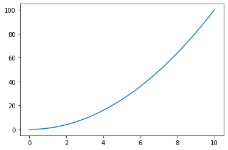

### Scatter

Outro tipo de gráfico bastante usado é o `scatter` ou gráfico de dispersão. Lembra um pouco o gráfico de linhas, mas é representado por pontos.

```python
fig, ax = plt.subplots()
ax.scatter(x, np.sin(x));
```

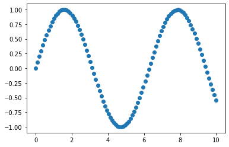

### Bar

Um gráfico de barras apresenta barras retangulares com comprimentos e alturas proporcionais aos valores que representam. Pode ser plotado horizontalmente ou verticalmente. Bastante utilizado em comparações entre dados.

```python
produtos = {"Pão": 10,
            "Leite": 8,
            "Sorvete": 12}

fig, ax = plt.subplots()
ax.bar(produtos.keys(), produtos.values())
ax.set(title="Lista de produtos", ylabel="Preço");
```

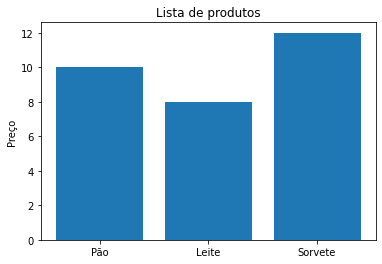

```python
fig, ax = plt.subplots()
ax.barh(list(produtos.keys()), list(produtos.values()));
```

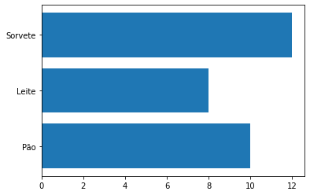

### Hist

Histograma pode ser um ótimo passo para entender um conjunto de dados.
A função `randn` do NumPy gera valores aleatórios com uma [distribuição normal](https://pt.wikipedia.org/wiki/Distribui%C3%A7%C3%A3o_normal). Vamos gerar dados com essa função e plotar em um gráfico de histograma:

```python
x = np.random.randn(1000)

fig, ax = plt.subplots()
ax.hist(x);
```

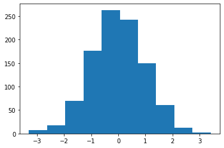

### Subplots

Já vimos uma breve apresentação de subplots, agora veremos um pouco mais de recursos dessa função. Vamos criar vários plots em uma só figura. Na primeira opção vamos plotar os dados em cada `axis` da figura:

```python
fig, ((ax1, ax2), (ax3, ax4)) = plt.subplots(nrows=2,
                                             ncols=2,
                                             figsize=(10, 5))
ax1.plot(x, x/2); #line
ax2.scatter(np.random.random(10), np.random.random(10)) #scatter
ax3.bar(produtos.keys(), produtos.values()) #bar
ax4.hist(np.random.randn(1000)); #hist
```

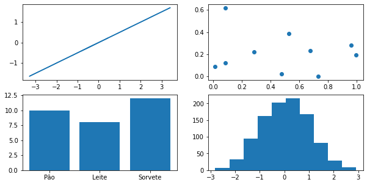

Na segunda opção usaremos um índice para plotar os dados, particularmente prefiro a primeira alternativa:

```python
fig, ax = plt.subplots(nrows=2, ncols=2, figsize=(10, 5))

ax[0, 0].plot(x, x/2) #line
ax[0, 1].scatter(np.random.random(10), np.random.random(10)) #scatter
ax[1, 0].bar(produtos.keys(), produtos.values()) #bar
ax[1, 1].hist(np.random.randn(1000)); #hist
```


## Plotando dados com Pandas

Veremos agora como utilizar o método `pd.plot()` em um DataFrame para plotar diretamente com Pandas. Primeiro vamos importar o Pandas e alguns dados para o nosso DataFrame:

```python
import pandas as pd
venda_de_carros = pd.read_csv("venda-de-carros-formatado.csv")
venda_de_carros.head()
```

|     | Fabricante |   Cor    | Quilometragem | Portas |  Preco   |
| :-: | :--------: | :------: | :-----------: | :----: | :------: |
|  0  |   Toyota   |  Branco  |    150043     |   4    | 24000.0  |
|  1  |   Honda    | Vermelho |     87899     |   4    | 25000.0  |
|  2  |   Toyota   |   Azul   |     32549     |   3    | 27000.0  |
|  3  |    BMW     |  Preto   |     11179     |   5    | 122000.0 |
|  4  |   Nissan   |  Branco  |    213095     |   4    | 13500.0  |

Uma boa ideia seria adicionar uma coluna nova no DataFrame com as datas das vendas dos carros. Vamos criar um range de datas com a função `date_range` do Pandas e adicionar uma data para cada linha do DataFrame:

```python
venda_de_carros["Data da venda"] = pd.date_range("1/1/2021", periods=len(venda_de_carros))
venda_de_carros.head()
```

|     | Fabricante |   Cor    | Quilometragem | Portas |  Preco   | Data da venda |
| :-: | :--------: | :------: | :-----------: | :----: | :------: | :-----------: |
|  0  |   Toyota   |  Branco  |    150043     |   4    | 24000.0  |  2021-01-01   |
|  1  |   Honda    | Vermelho |     87899     |   4    | 25000.0  |  2021-01-02   |
|  2  |   Toyota   |   Azul   |     32549     |   3    | 27000.0  |  2021-01-03   |
|  3  |    BMW     |  Preto   |     11179     |   5    | 122000.0 |  2021-01-04   |
|  4  |   Nissan   |  Branco  |    213095     |   4    | 13500.0  |  2021-01-05   |

Faremos mais um ajuste antes de plotar, vamos criar mais uma coluna, dessa vez com a soma cumulativa das vendas, para isso utilizaremos a função `cumsum()`:

```python
venda_de_carros["Total"] = venda_de_carros["Preco"].cumsum()
venda_de_carros.head()
```

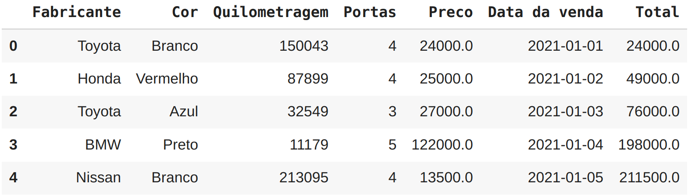

### Pandas plot line

Finalmente vamos gerar o nosso gráfico, a função plot do Pandas espera como parâmetro os valores para o eixo `x` e `y`, respectivamente vamos adicionar a data das vendas no eixo `x` e o total vendido no `y`:

```python
venda_de_carros.plot(x="Data da venda", y="Total");
```

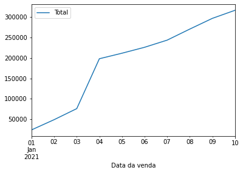

### Pandas plot scatter

A função plot do Pandas pode gerar vários tipos de gráfico, veremos agora a opção para Scatter como fizemos com Matplotlib. Um bom exemplo para nosso DataFrame seria plotar um gráfico de correlação entre preço e quilometragem percorrida. Na função plot precisamos informar no parâmetro `kind` o tipo de gráfico, que nesse exemplo é scatter:

```python
venda_de_carros.plot(x="Quilometragem", y="Preco", kind="scatter");
```

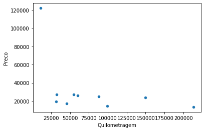

### Pandas plot bar

Temos também a opção para bar plot, da mesma forma que fizemos com scatter, podemos alterar o `kind` para bar. Vamos plotar uma pequena comparação entre fabricante e quilometragem:

```python
venda_de_carros.plot(x="Fabricante", y="Quilometragem", kind="bar");
```

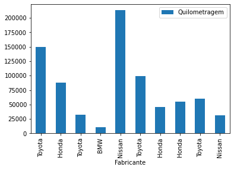

### Pandas plot hist

Não poderia deixar de mencionar a opção para histograma `kind="hist"`.
Uma boa maneira de plotar histograma com Pandas é selecionar uma coluna específica:

```python
venda_de_carros["Quilometragem"].plot(kind="hist");
```


Para gráficos mais complicados, usaremos o método OO demonstrado com Matplotlib. No restante do capítulo focaremos em gráficos mais complexos.

## Customizando os seus plots

Veremos agora como construir gráficos bem elaborados utilizando vários recursos da Matplotlib. Vamos utilizar outro dataset, um de [doenças cardíacas](https://www.kaggle.com/ronitf/heart-disease-uci/), com muitas colunas e dados.

```python
df = pd.read_csv("heart-disease.csv")
df.head()
```

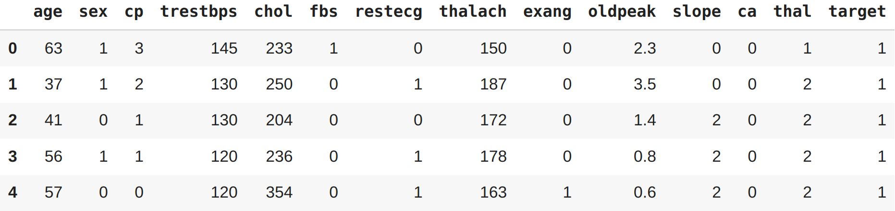

Vamos iniciar nosso plot por uma análise de dados em pacientes com mais de 50 anos. Criaremos um filtro para em seguida plotar utilizando as opções da Matplotlib ajustando o tamanho da figura combinando com o plot do Pandas:

```python
mais_de_50 = df[df["age"] > 50]

fig, ax = plt.subplots(figsize=(10, 6))
mais_de_50.plot(kind="scatter",
                x="age",
                y="chol",
                c="target",
                ax=ax)

ax.set_xlim([45, 100]);
```

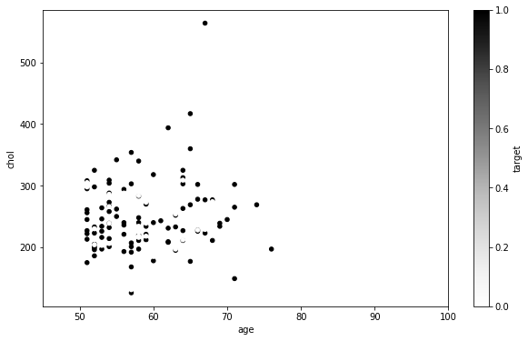

No eixo `y` temos o colesterol e no `x` a idade do paciente. Ao lado temos uma escala em cinza chamada `target`, esses valores são 0 ou 1 e são utilizados para classificar se o paciente é um alvo para a doença cardíaca ou não (1=sim, 0=não). Veremos esse dataset com mais detalhes nos capítulos de Machine Learning. A opção `set_xlim` foi adicionada para limitar a idade dos pacientes entre 45 e 100, já que o nosso filtro é para pacientes acima de 50 anos.

Faremos agora um plot um pouco mais complicado, dessa vez utilizando apenas parâmetros da Matplotlib. Utilizaremos o mesmo filtro de idade:

```python
fig, ax = plt.subplots(figsize=(10, 6))

scatter = ax.scatter(mais_de_50["age"],
                     mais_de_50["chol"],
                     c=mais_de_50["target"])

ax.set(title="Doença cardíaca e níveis de colesterol",
       xlabel="Idade",
       ylabel="Colesterol")

ax.legend(*scatter.legend_elements(), title="Alvo");
```

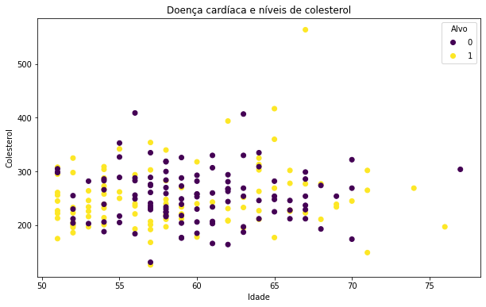

Analisando por partes para entender o que fizemos aqui: primeiro criamos um objeto do tipo `subplots` e definimos o tamanho final da nossa imagem, no caso (`10x6`). Na configuração dos `axes` ou `ax` (*consulte anatomia de um gráfico*) escolhemos o tipo de plot, no caso `scatter` e preenchemos os valores dos eixos, `x` e `y` inserindo respectivamente as colunas de idade e colesterol. O último parâmetro na configuração de `scatter` o `c` é um marcador de cores que recebe como argumento valores em escala ou sequência de números, que serão mapeados para cores, nesse caso inserimos a coluna `target` que possui apenas dois tipos de valores `0 ou 1` para exibir roxo nos casos onde o paciente não é um possível alvo de uma doença cardíaca e amarelo para os casos onde o paciente é um possível alvo.

A função `set()` permite configurar o título da nossa imagem e os labels dos eixos `x` e `y`, respectivamente *idade* e *colesterol*. E a última função inserida `legend()` foi utilizada para configurar a nossa legenda que aparece no canto superior direito com o título de `Alvo`.

Vamos customizar um pouco mais ? E se quiséssemos por uma linha horizontal determinando a média de colesterol dos casos avaliados ? Vamos ao plot:

```python
# Criando o plot
fig, ax = plt.subplots(figsize=(10, 6))

# Plotando os dados
scatter = ax.scatter(mais_de_50["age"],
                     mais_de_50["chol"],
                     c=mais_de_50["target"])

# Customizando o plot
ax.set(title="Doença cardíaca e níveis de colesterol",
       xlabel="Idade",
       ylabel="Colesterol")
ax.legend(*scatter.legend_elements(), title="Alvo")

# Adicionando a linha média horizontal para colesterol
ax.axhline(mais_de_50["chol"].mean(),
           linestyle="--");
```

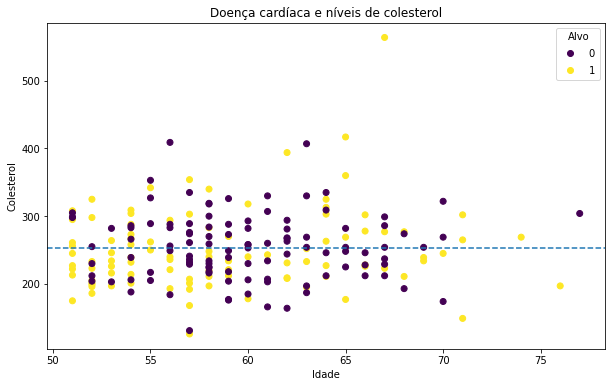

A novidade aqui foi a função `axhline()` para gerar uma linha horizontal, em seus parâmetros informamos apenas a coluna de onde a função deve capturar os dados (*no nosso caso a média desses dados*) e escolhemos o estilho da linha.

## Adicionando outro plot ao existente

Até o momento o nosso plot exibe a distribuição de casos de doenças cardíacas por níveis de colesterol. Vamos adicionar outro plot para exibir os níveis máximos de frequência cardíaca.

```python
# Criando o plot
fig, (ax0, ax1) = plt.subplots(nrows=2,
                               ncols=1,
                               sharex=True,
                               figsize=(10, 10))

# Adicionando os dados para ax0
scatter = ax0.scatter(mais_de_50["age"],
                      mais_de_50["chol"],
                      c=mais_de_50["target"])

# Customizando ax0
ax0.set(title="Doença cardíaca e níveis de colesterol",
       xlabel="Idade",
       ylabel="Colesterol")
ax0.legend(*scatter.legend_elements(), title="Alvo")

# Adicionando a linha média horizontal para colesterol em ax0
ax0.axhline(mais_de_50["chol"].mean(),
           linestyle="--")

# Adicionando os dados para ax1
scatter = ax1.scatter(mais_de_50["age"],
                      mais_de_50["thalach"],
                      c=mais_de_50["target"])

# Customizando ax1
ax1.set(title="Doença cardíaca e níveis máximos de frequência cardíaca",
        xlabel="Idade",
        ylabel="Frequência cardíaca máxima")
ax1.legend(*scatter.legend_elements(), title="Alvo")

# Adicionando a linha média para frequência cardíaca
ax1.axhline(mais_de_50["thalach"].mean(),
            linestyle="--")

# Título da figura
fig.suptitle("Análise de Doenças Cardíacas", fontsize=16, fontweight="bold");
```

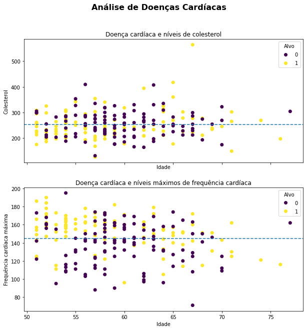

Aqui não fizemos nada muito especial, apenas utilizamos o recurso de subplots visto anteriormente para plotar mais de um gráfico na mesma figura. Adicionamos também algumas poucas configurações extras, como: a disposição dos plots na figura ocupando 2 linhas e 1 coluna (`nrows` e `ncols`), compartilhamos o eixo `x` entre os dois plots utilizando a opção `sharex`, já que o range de idade para ambos é o mesmo. E adicionamos um título mais destacado (*personalizando o tamanho e estilo da fonte*) para a figura como um todo.

Para finalizar vamos alterar um pouco o estilo do gráfico e mudar algumas cores. O estilo pode ser trocado por meio da função `style.use()` e para as cores, vamos explorar a opção `cmap` abreviação para color map:

```python
# Definindo um novo estilo com grid
plt.style.use("seaborn-whitegrid")

# Criando o plot
fig, (ax0, ax1) = plt.subplots(nrows=2,
                               ncols=1,
                               sharex=True,
                               figsize=(10, 10))

# Adicionando os dados para ax0
scatter = ax0.scatter(mais_de_50["age"],
                      mais_de_50["chol"],
                      c=mais_de_50["target"],
                      cmap='winter')

# Customizando ax0
ax0.set(title="Doenças cardíacas e níveis de colesterol",
        ylabel="Colesterol")
ax0.set_xlim([50, 80])
ax0.legend(*scatter.legend_elements(), title="Alvo")

# Adicionando a linha média horizontal para colesterol em ax0
ax0.axhline(mais_de_50["chol"].mean(),
            color="r",
            linestyle="--")

# Adicionando os dados para ax1
scatter = ax1.scatter(mais_de_50["age"],
                      mais_de_50["thalach"],
                      c=mais_de_50["target"],
                      cmap='winter')

# Customizando ax1
ax1.set(title="Doença cardíaca e níveis máximos de frequência cardíaca",
        ylabel="Frequência cardíaca máxima",
        xlabel="Idade",
        ylim=[60, 200])
ax1.legend(*scatter.legend_elements(), title="Alvo")

# Adicionando a linha média para frequência cardíaca
ax1.axhline(mais_de_50["thalach"].mean(),
            color="r",
            linestyle="--")

# Título da figura
fig.suptitle("Análise de Doenças Cardíacas", fontsize=16, fontweight="bold");
```

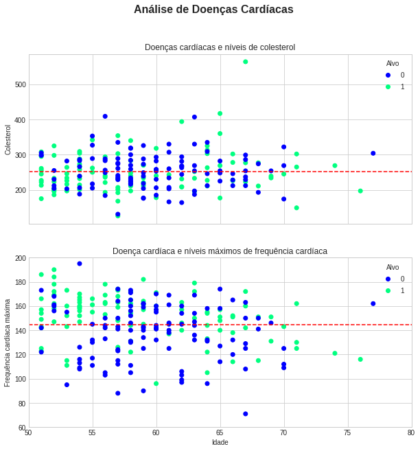

Temos agora um gráfico completamente diferente, um pouco mais amigável visualmente. Mais uma vez vamos entender por partes as pequenas diferenças:
primeiro escolhemos um novo estilo para o plot com a opção `style.use("seaborn-whitegrid")` esse estilo deixou o plot menos grosseiro, além de ter inserido um grid nos gráficos. Ao configurar os dados para os plots `ax0` e `ax1`, adicionamos a opção `cmap` ou *color map* para definir o esquema de cores dos dados relacionados ao `alvo`, ou seja `cmap` está alterando as cores da opção `c`. 

Já na customização dos plots adicionamos limites para o eixo `x` com `set_xlim` indo de `50` anos até `80` anos. No plot `ax1` fizemos o mesmo, mas para o eixo `y` utilizando `ylim` e limitamos os valores que representam a frequência cardíaca entre 60 e 200. Por fim mudamos também as cores das linhas horizontais que marcam as médias de colesterol e frequência cardíaca respectivamente, utilizando a opção `color="r"` trocamos para cor vermelha.

---

WIP
