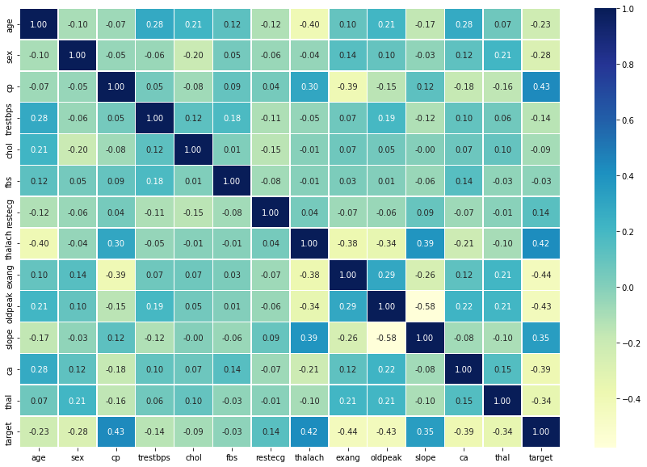
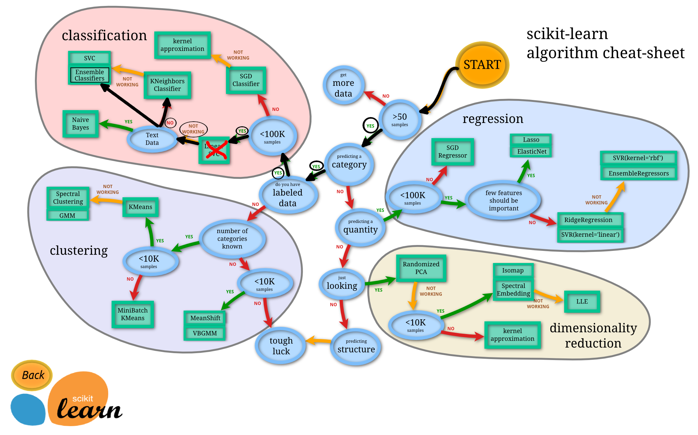

# Scikit-Learn

Scikit-Learn, também conhecido como `sklearn`, é uma biblioteca Python focada em resolver problemas de Machine Learning. Em seu background `sklearn` utiliza NumPy e Matplotlib.

Embora o campo de Machine Learning seja vasto, o objetivo principal é encontrar padrões nos dados e utilizar esses padrões para tentar fazer previsões. *Existem certas categorias nas quais a maioria dos problemas se enquadra*.

Digamos que você está tentando desenvolver um modelo de `ML` para conseguir prever se um email é spam ou não, nesse caso temos um problema de classificação. Agora suponha que você precise criar um modelo para prever o preço de apartamentos de acordo com suas características, agora você tem um problema de regressão (*prever um número*).

Tudo começa descobrindo primeiro que tipo de problema estamos trabalhando, dependendo do problema, existem etapas semelhantes que devemos seguir para cada caso. Por exemplo, separar os dados em diferentes conjuntos, uma parte para os modelos de Machine Learning aprenderem e outra parte para utilizarmos nos testes. Escolher e avaliar se um modelo de `ML`  aprendeu alguma coisa.

O Scikit-Learn fornece implementações em Python para realizar todas essas tarefas, evitando a necessidade de ter que construí-los do zero.

## Sklearn de ponta a ponta

Veremos agora na prática um fluxo de trabalho com `sklearn` de ponta a ponta e nos aprofundaremos um pouco mais em cada etapa no decorrer dos estudos.

Nesse capítulo vamos explorar um problema de classificação binária ou seja (*uma amostra só poder ser uma coisa ou outra*). O conjunto de dados que usaremos é o mesmo do capítulo de Matplotlib (*uma lista de pacientes anônimos e se eles possuem ou não doenças cardíacas*).

Vamos começar importando algumas bibliotecas e carregando os dados:

```python
import matplotlib.pyplot as plt
import pandas as pd
import numpy as np

df = pd.read_csv("heart-disease.csv")
df.head()
```


## EDA

Uma vez que importamos os dados, a próxima etapa é explorar. Não há uma maneira definitiva para fazer isso. O objetivo é se familiarizar cada vez mais com os dados. Podemos começar verificando quantas vezes cada um dos valores de uma coluna categórica aparece, no caso vamos inspecionar a coluna `target` utilizando a função `value_counts()` do Pandas:

```python
df["target"].value_counts()

1    165
0    138
Name: target, dtype: int64
```

Outra opção é visualizar esses valores em porcentagens, o `value_counts()` recebe um parâmetro chamado `normalize` que pode ser definido como `True`:

```python
df["target"].value_counts(normalize=True)

1    0.544554
0    0.455446
Name: target, dtype: float64
```

Podemos também plotar esses valores:

```python
df["target"].value_counts().plot(kind="bar", color=["salmon", "lightblue"]);
```


Vamos verificar os valores ausentes que podem existir e os tipos de dados com que vamos trabalhar:

```
df.info()

<class 'pandas.core.frame.DataFrame'>
RangeIndex: 303 entries, 0 to 302
Data columns (total 14 columns):
 #   Column    Non-Null Count  Dtype  
---  ------    --------------  -----  
 0   age       303 non-null    int64  
 1   sex       303 non-null    int64  
 2   cp        303 non-null    int64  
 3   trestbps  303 non-null    int64  
 4   chol      303 non-null    int64  
 5   fbs       303 non-null    int64  
 6   restecg   303 non-null    int64  
 7   thalach   303 non-null    int64  
 8   exang     303 non-null    int64  
 9   oldpeak   303 non-null    float64
 10  slope     303 non-null    int64  
 11  ca        303 non-null    int64  
 12  thal      303 non-null    int64  
 13  target    303 non-null    int64  
dtypes: float64(1), int64(13)
memory usage: 33.3 KB
```

> Felizmente nesse caso não temos valores ausentes e todas as colunas são de natureza numérica.

## Frequência de doenças cardíacas de acordo com o sexo

Mais uma análise interessante que podemos fazer é verificar a frequência das doenças cardíacas de acordo com o sexo. Para comparar duas colunas entre si, podemos utilizar a função `pd.crosstab(coluna_1, coluna_2)`. Vamos comparar a coluna `target` com a coluna `sex`:

```python
pd.crosstab(df["target"], df["sex"])
```

|  sex   |  0  |  1  |
| :----: | :-: | :-: |
| target |     |     |
|   0    | 24  | 114 |
|   1    | 72  | 93  |

Existem cerca de 100 mulheres e 72 delas têm um valor positivo de presença de alguma doença cardíaca, podemo inferi com base nessa variável, se a participante for mulher, há 75% de chance de ela ter uma doença cardíaca.

Quanto aos homens, há cerca de 200 no total, com quase metade indicando a presença de doenças cardíacas. Assim podemos prever que, se o participante for do sexo masculino, 50% das vezes ele terá uma doença cardíaca.

Aplicando a média desses dois valores, podemos supor, com base em nenhum outro parâmetro, caso haja uma pessoa, há 62,5% de chance de que ela tenha uma doença cardíaca.

> Esse pode ser nosso baseline, tentaremos vencê-lo com Machine Learning.

O exemplo utilizando `crosstab` poderia ficar melhor em um gráfico, vamos plotar utilizando alguns parâmetros na função `plot()` e adicionar alguns atributos explicativos:

```python
# Criando o plot
pd.crosstab(df.target, df.sex).plot(kind="bar",
                                    figsize=(10,6),
                                    color=["salmon", "lightblue"])

# Adicionando atributos
plt.title("Frequência de doenças cardíacas por sexo")
plt.xlabel("0 = Não tem doença, 1 = Doença detectada")
plt.ylabel("Montante")
plt.legend(["Mulher", "Homen"])
plt.xticks(rotation=0); # configura os eixos dos labels para vertical
```


## Idade vs Frequência cardíaca máxima para doenças cardíacas

Vamos tentar combinar outras duas variáveis, como idade e `thalach` (*frequência cardíaca máxima*) e depois compará-las com a variável `target`. Como temos muitos valores para as duas variáveis, vamos plotar usando um gráfico do tipo `scatter`.

```python
plt.figure(figsize=(10,6))

# Plot para valores positivos
plt.scatter(df["age"][df["target"] ==1 ], 
            df["thalach"][df["target"] == 1], 
            c="salmon")

# Plot para valores negativos
# queremos plotar no mesmo gráfico então não vamos configurar axes diferentes
plt.scatter(df["age"][df["target"] == 0], 
            df["thalach"][df["target"] == 0], 
            c="lightblue")

# Atributos
plt.title("Doença cardíaca em função da idade e da frequência cardíaca máxima")
plt.xlabel("Idade")
plt.legend(["Doença detectada", "Não tem doença"])
plt.ylabel("Frequência cardíaca máxima");
```


Parece que quanto mais jovem alguém é, maior sua frequência cardíaca máxima (*são os pontos mais altos à esquerda do gráfico*) e quanto mais velho alguém é, mais pontos azuis existem. Mas isso pode ser porque há mais pontos juntos no lado direito do gráfico (*indica participantes mais velhos*).

## Frequência de Doenças Cardíacas por Tipo de Dor Torácica

Vamos tentar analisar outra variável. Desta vez `cp` (*dor no peito*), utilizaremos o mesmo processo de antes:

```python
pd.crosstab(df["cp"], df["target"]).plot(kind="bar", 
                                   figsize=(10,6), 
                                   color=["lightblue", "salmon"])

# Adicionando atributos ao gráfico
plt.title("Frequência de Doença Cardíaca por Tipo de Dor Torácica")
plt.xlabel("Tipo de dor no peito")
plt.ylabel("Frequência")
plt.legend(["Não tem doença", "Doença detectada"])
plt.xticks(rotation = 0);
```


Antes de prosseguir, precisamos de um pequeno dicionário:

- **cp**  (*dor no peito*)
- **0**   (*típica dor no peito*)
- **1**   (*dor no peito, não relacionada ao coração*)
- **2**   (*espasmos, não relacionados ao coração*)
- **3**   (*dor torácica, sem sinais de doença*)

É interessante notar que o valor `1` afirma que a dor não está relacionada ao coração, mas parece ter uma proporção maior de participantes com doenças cardíacas.

> De acordo com o PubMed, [parece que até alguns profissionais médicos estão confusos com o termo](https://www.ncbi.nlm.nih.gov/pmc/articles/PMC2763472/).

Embora não conclusivo, o gráfico acima é uma alerta que revela a confusão das definições apresentadas nos dados.

## Correlação entre variáveis independentes

Por fim, vamos comparar todas as variáveis independentes, plotando em um único resultado. Isso pode nos dar uma ideia de quais variáveis independentes podem ou não ter impacto na nossa variável `target`.

Para fazer isso podemos usar `df.corr()` que cria uma matriz de correlação, uma grande tabela de números informando o quanto cada variável está relacionada à outra.

```python
import seaborn as sns

corr_matrix = df.corr()
plt.figure(figsize=(15, 10))
sns.heatmap(corr_matrix, 
            annot=True, 
            linewidths=0.5, 
            fmt= ".2f", 
            cmap="YlGnBu");
```



> Não se preocupe com a biblioteca `seaborn` utilizada neste exemplo, falaremos mais sobre ela *Apêndice A*.

Um valor positivo mais alto significa um potencial para uma correlação positiva e um valor negativo mais alto, significa um potencial para uma correlação negativa.

## Modelagem dos dados

Exploramos os dados e agora tentaremos utilizar `ML` para prever nossa variável `target` com base nas outras 13 variáveis independentes. Antes de construir um modelo é preciso preparar os dados.

Relembrando, cada linha do DataFrame é um paciente diferente, todas as colunas, exceto `target` são características dos pacientes. O `target` indica se o paciente tem doença cardíaca (`target=1`) ou não (`target=0`). Em outras palavras, estamos tentando prever o valor da nossa variável `target` usando todas as outras variáveis. Para fazer isso com `sklearn` precisamos separar a variável `target` de todo o resto:

```python
X = df.drop("target", axis=1)
y = df["target"]

X.head()
```


```
y.head()

0    1
1    1
2    1
3    1
4    1
Name: target, dtype: int64
```

O que fizemos aqui foi isolar a coluna `target` na variável `y` e manter todas as outras colunas na variável `X`. A utilização de `X` e `y` como variáveis são um padrão adotado pelos desenvolvedores (*bastante comum nos exemplos que você vai encontrar em outros livros, cursos e repositórios*).

## Treino e Teste

Chegou o momento de dividir os dados em um conjunto para treino e um conjunto para teste. Esse é um dos conceitos mais importantes em `ML`.

Utilizaremos o conjunto de treino para treinar o nosso modelo (*são os dados que o modelo utiliza para aprender*) e o conjunto de testes para testá-lo (*são os dados utilizados para validar o modelo*).

> O conjunto de testes sempre deve permanecer separado do conjunto de treinamento!

E por que não usar todos os dados para treinar um modelo ? Digamos que você queira usar o seu modelo em uma aplicação real de hospital, classificando os pacientes. Como você saberia o desempenho do seu modelo em um novo paciente não incluído no conjunto de dados inicial que você tinha ? E é aqui que entra o conjunto de teste. Ele é usado para simular o máximo possível a utilização do modelo em um ambiente real.

Para dividir nossos dados em dois conjuntos, um de treinamento e outro de teste, podemos usar o `train_test_split()` do `sklearn` e alimentá-lo com nossas variáveis (`X` e `y`):

```python
from sklearn.model_selection import train_test_split

np.random.seed(42)

X_train, X_test, y_train, y_test = train_test_split(X, y, test_size=0.2)

X_train.head()
```


> Note o `seed` do NumPy em ação, essa configuração serve para preservar o estado do que faremos aqui, em outras palavras os resultados que você vai ver nos exemplos serão os mesmos no seu ambiente na hora de reproduzir.

O parâmetro `test_size` é utilizado para informar à função `train_test_split()` quanto de nossos dados queremos no conjunto de teste. Nesse caso, `0.2` que representa `20%`. Uma regra prática é utilizar `80%` dos seus dados para treino e os outros `20%` para teste.

Para o nosso exemplo, um conjunto de treino e teste são suficientes. Mas para outros problemas, você também pode precisar de um conjunto de validação (*treinar, validar e testar*).

### Escolha de modelos

Agora que os dados estão preparados, podemos começar a treinar os modelos. Vamos utilizar e comparar os resultados dos respectivos modelos:

- **Logistic Regression** - `LogisticRegression()`
- **K-Nearest Neighbors** - `KNeighboursClassifier()`
- **RandomForest** - `RandomForestClassifier()`

Ok, mas por que esses ? O `Scikit-Learn` disponibiliza um [mapa que podemos seguir](https://scikit-learn.org/stable/tutorial/machine_learning_map/index.html) para fazer as escolhas do que utilizar como solução para o nosso problema.

Vejamos como fica o nosso problema:



> Eu não sei porque `Logistic Regression` não é listado no mapa, pois ao ler a documentação do `Scikit-Learn` sobre esse tipo de modelo, consta que é um modelo para classificação.

`LinearSVC`, vamos ignorar, fingir que tentamos e não funcionou, então estamos seguindo para as outras opções no mapa. No momento, conhecer cada um desses algoritmos a fundo não é essencial. Machine Learning e Data Science são uma prática iterativa, esses algoritmos são ferramentas para o seu arsenal. Nesse momento, para se tornar um bom praticante, é mais importante entender o problema que queremos resolver (*classificação* vs *regressão*) e depois avaliar quais ferramentas utilizar para resolver os problemas.

Como o nosso conjunto de dados é relativamente pequeno (*303 amostras*), podemos experimentar para encontrar o algoritmo que oferece o melhor desempenho.

Todos os algoritmos disponíveis na `sklearn` usam as mesmas funções para treinar um modelo `model.fit(X_train, y_train)` e para saber se um modelo é efetivo ou não usa a função `model.score(X_test, y_test)` que retorna a proporção de previsões corretas (*1.0 = 100%*).

Como os algoritmos que escolhemos implementam os mesmos métodos para treinar e avaliar, vamos colocá-los em um dicionário e desenvolver um modelo que treine com cada um deles e classifique os dados.

```python
# imports
from sklearn.linear_model import LogisticRegression
from sklearn.neighbors import KNeighborsClassifier
from sklearn.ensemble import RandomForestClassifier
```

```python
# inserindo os algoritmos em um dicionário
models = {"KNN": KNeighborsClassifier(),
           "Logistc Regression": LogisticRegression(),
           "Random Forest": RandomForestClassifier()}

# criando uma função para treinar e avaliar os modelos
def fit_and_score(models, X_train, X_test, y_train, y_test):

  # seed para ter resultados reproduzíveis
  np.random.seed(42)

  # criando uma lista para armazenar o score dos modelos
  model_scores = {}

  # loop para executar todos os modelos
  for name, model in models.items():

    # treina o modelo com os dados
    model.fit(X_train, y_train)

    # Avalia o modelo e adiciona seu score na lista
    model_scores[name] = model.score(X_test, y_test)

  return model_scores
```

```python
# executando a função
model_scores = fit_and_score(models=models,
                             X_train=X_train,
                             X_test=X_test,
                             y_train=y_train,
                             y_test=y_test)
model_scores

{'KNN': 0.6885245901639344,
 'Logistc Regression': 0.8524590163934426,
 'Random Forest': 0.8360655737704918}
```

Olhando para os valores, parece que o modelo `LogisticRegression()` tem o melhor desempenho. O próximo passo é ajustar os hiperparâmetros dos modelos (*configurações refinadas*) e avaliar novamente para ver se o ajuste influencia no `score`.

## Ajuste de hiperparâmetros e validação cruzada

Imagine que para fazer uma pizza você ajusta o forno para 180 graus. Mas quando um amigo vai utilizar o mesmo forno para preparar uma pizza, ele utiliza em 200 graus. Temos o mesmo forno, com configurações diferentes, logo teremos resultados diferentes.

O mesmo pensamento pode ser aplicado em `ML`, podemos utilizar os mesmos algoritmos, aplicando pequenas configurações (*hiperparâmetros*) e obter resultados diferentes. Assim como ajustar o forno para aquecer mais pode queimar a comida, o mesmo ocorre com os algoritmos de `ML`. Podemos ajustar as configurações para funcionar tão bem que *superajusta* os dados.

Queremos encontrar um meio termo, um modelo que se saia bem com o nosso conjunto de dados, mas também que entregue bons resultados em exemplos nunca vistos.

Para testar diferentes hiperparâmetros, podemos utilizar um conjunto de dados de validação, o problema é que não temos muitos dados, então usaremos validação cruzada. O tipo mais utilizado de validação cruzada é o `K-fold`, basicamente funciona dividindo os dados em grupos menores e, em seguida, testa um modelo em cada um dos grupos. Por exemplo, se tivéssemos 5 `folds` (k=5):


Vamos utilizar essa configuração para ajustar os hiperparâmetros de alguns dos modelos que treinamos e depois vamos avaliá-los.

## Ajustando KNeighborsClassifier (KNN)

Existe um hiperparâmetro principal que podemos ajustar para o algoritmo `KNN`, trata-se do número de vizinhos. Por padrão esse valor é 5 (`n_neigbors=5`).

Ok, mas o que são esses "vizinhos" ? Imagine todos os dados que plotamos anteriormente em um gráfico do tipo `scatter`. O algoritmos `KNN` analisa se os pontos mais próximos pertencem à mesma classe. Ou seja se `n_neigbors=5` então `KNN` assume que os 5 pontos mais próximos ao seu redor estão na mesma classe. O nosso plano no momento é tentar alguns valores diferentes para `n_neigbors`.

```python
# Lista para armazenar o score de treino
train_scores = []

# Lista para armazenar o score de teste
test_scores = []

# Lista com diferentes valores para "n_neighbors"
# vamos começar com 1 e subir até 20
neighbors = range(1, 21)

# Instanciando o KNN
knn = KNeighborsClassifier()

# Loop para aplicar os diferentes valores em "n_neighbors"
for i in neighbors:
    knn.set_params(n_neighbors = i)
    
    # Treina o modelo
    knn.fit(X_train, y_train)
    
    # Guarda o score de treino
    train_scores.append(knn.score(X_train, y_train))
    
    # Armazena o score de teste
    test_scores.append(knn.score(X_test, y_test))
```

Agora vamos dar uma olhada nos scores de treino para ver qual ajuste tem melhor performance:

```python
train_scores

[1.0,
 0.8099173553719008,
 0.7727272727272727,
 0.743801652892562,
 0.7603305785123967,
 0.7520661157024794,
 0.743801652892562,
 0.7231404958677686,
 0.71900826446281,
 0.6942148760330579,
 0.7272727272727273,
 0.6983471074380165,
 0.6900826446280992,
 0.6942148760330579,
 0.6859504132231405,
 0.6735537190082644,
 0.6859504132231405,
 0.6652892561983471,
 0.6818181818181818,
 0.6694214876033058]
 ```

Péssima ideia tentar entender esses valores, melhor criarmos um gráfico, vamos ao plot:

```python
plt.plot(neighbors, train_scores, label="Score de Treino")
plt.plot(neighbors, test_scores, label="Score de Teste")
plt.xticks(np.arange(1, 21, 1))
plt.xlabel("Valor ajustado para n_neighbors")
plt.ylabel("Desempenho do modelo")
plt.legend()

print(f"Desempenho máximo de KNN nos dados de teste: {max(test_scores)*100:.2f}%")
```

**Desempenho máximo de KNN nos dados de teste: 75.41%**


No gráfico, a configuração `n_neighbors=11` apresenta o melhor resultado. Mesmo ajustando esse hiperparâmetro o desempenho do modelo `KNN` não chegou nem perto do resultado de `LogisticRegression` ou de `RandomForestClassifier`. Por esse motivo, vamos descartar o `KNN` e focar nos outros dois que tiveram melhor resultado.

No exemplo de `KNN` ajustamos o hiperparâmetro manualmente, em vez de fazer isso com `LogisticRegression` e `RandomForest`, veremos como automatizar utilizando `RandomizedSearchCV`, basicamente esse recurso tenta várias combinações diferentes, avalia todas e salva a melhor.

## Ajustando modelos com RandomizedSearchCV

---

WIP
