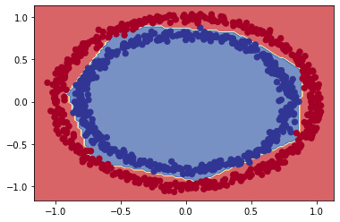

# Redes neurais com TensorFlow

Para entender como funciona uma rede neural, vamos resolver alguns problemas de classificação. Pegaremos alguns conjuntos de dados para tentar prever a que classe os dados de entrada pertencem.

A arquitetura de uma rede neural de classificação pode variar bastante, dependendo do problema que você estiver trabalhando. Porém, existem alguns fundamentos que todas as redes neurais utilizam:

- Camada de entrada de dados
- Camadas ocultas (pré-processamento de dados)
- Camada de saída

Abaixo temos alguns padrões que veremos com frequência nas redes neurais de classificação.


Não se preocupe se nada do que foi visto acima fizer sentido, faremos muitos experimentos no decorrer do capítulo para entender. Vamos começar importando o TensorFlow com o alias `tf` como visto antes.

```python
import tensorflow as tf
```

## Criando os dados

Vamos começar criando um conjunto de dados simples para utilizar em nossos experimentos. Como o problema de classificação está tentando prever se algo é uma coisa ou outra, criaremos alguns dados para refletir isso. Usaremos a função `make_circles()` do `Scikit-Learn`.

```python
from sklearn.datasets import make_circles

# Cria 1000 exemplos
n_samples = 1000

# Criando os círculos
X, y = make_circles(n_samples, 
                    noise=0.03, 
                    random_state=42)
```

Vamos olhar os valores de `X` e `y`:

```
X
array([[ 0.75424625,  0.23148074],
       [-0.75615888,  0.15325888],
       [-0.81539193,  0.17328203],
       ...,
       [-0.13690036, -0.81001183],
       [ 0.67036156, -0.76750154],
       [ 0.28105665,  0.96382443]])
```

```
y[:10]

array([1, 1, 1, 1, 0, 1, 1, 1, 1, 0])
```

Já temos nossos dados e rótulos, hora de avançarmos para as visualizações.
Começando com um DataFrame:

```python
import pandas as pd
circles = pd.DataFrame({"X0":X[:, 0], "X1":X[:, 1], "label":y})
circles.head()
```

|     |        X0 |        X1 | label |
| --: | --------: | --------: | ----: |
|   0 |  0.754246 |  0.231481 |     1 |
|   1 | -0.756159 |  0.153259 |     1 |
|   2 | -0.815392 |  0.173282 |     1 |
|   3 | -0.393731 |  0.692883 |     1 |
|   4 |  0.442208 | -0.896723 |     0 |

O conjunto de dados criado representa um problema de classificação binária. É binário porque possui apenas dois rótulos (0 e 1). Podemos contabilizar o total criado para cada rótulo com `value_counts()`:

```python
circles.label.value_counts()

1    500
0    500
Name: label, dtype: int64
```

Ok, agora vamos adiante e dar mai um passo nas visualizações, hora de plotar os dados:

```python
import matplotlib.pyplot as plt
plt.scatter(X[:, 0], X[:, 1], c=y, cmap=plt.cm.RdYlBu);
```


> Com base nos dados, vamos desenvolver um modelo para classificar o pontos azuis ou vermelhos.

## Formas de entrada e saída

Um dos principais problemas ao construir redes neurais são as incompatibilidades de forma. Ou seja a forma dos dados de entrada e a forma dos dados de saída. No nosso exemplo, queremos inserir `X` e fazer com que o modelo consiga prever `y`. Precisamos verificar as formas de `X` e `y`:

```python
X.shape, y.shape

((1000, 2), (1000,))

X[0], y[0]

(array([0.75424625, 0.23148074]), 1)
```

Aparentemente `X` disponibiliza de 2 recursos que combinados levam a um valor `y`. Isso quer dizer que a forma de entrada da rede neural precisa aceitar um `tensor` com pelo menos uma dimensão com dois valores e outro de saída com pelo menos uma dimensão e um valor.

Agora que sabemos quais dados temos, bem como as formas de entrada e saída, vamos iniciar a etapa de modelagem para desenvolver uma rede neural. Utilizando o TensorFlow, geralmente temos 3 etapas fundamentais para criar e treinar um modelo: criar o modelo, compilar o modelo e ajustar o modelo. Veremos isso em ação utilizando a [API Sequential](https://www.tensorflow.org/api_docs/python/tf/keras/Sequential):

```python
# Seed aleatório
tf.random.set_seed(42)

# 1. Cria o modelo usando a API Sequential
model_1 = tf.keras.Sequential([
  tf.keras.layers.Dense(1)
])

# 2. Compila o modelo
# escolhemos BinaryCrossentropy(), já que o problema envolve 2 classes (0 e 1)
model_1.compile(loss=tf.keras.losses.BinaryCrossentropy(),
                optimizer=tf.keras.optimizers.SGD(),
                metrics=['accuracy'])

# 3. Treina o modelo
model_1.fit(X, y, epochs=5)
```

```
Epoch 1/5
32/32 [==============================] - 1s 1ms/step - loss: 2.8544 - accuracy: 0.4600
Epoch 2/5
32/32 [==============================] - 0s 2ms/step - loss: 0.7131 - accuracy: 0.5430
Epoch 3/5
32/32 [==============================] - 0s 1ms/step - loss: 0.6973 - accuracy: 0.5090
Epoch 4/5
32/32 [==============================] - 0s 1ms/step - loss: 0.6950 - accuracy: 0.5010
Epoch 5/5
32/32 [==============================] - 0s 2ms/step - loss: 0.6942 - accuracy: 0.4830
<keras.callbacks.History at 0x7f57aeb03350>
```

Observando a métrica de precisão (`accuracy`), o modelo tem um péssimo desempenho (*50% de precisão em um problema de classificação é o mesmo que adivinhar*). Podemos dar mais tempo para o modelo treinar:

```python
# Treinando o modelo por mais tempo
# (resulta em mais chances de analisar os dados)
model_1.fit(X, y, epochs=200, verbose=0)
model_1.evaluate(X, y)
```

```
32/32 [==============================] - 0s 2ms/step - loss: 0.6935 - accuracy: 0.5000
[0.6934831142425537, 0.5]
```

Bem, o modelo funciona como se estivesse adivinhando, mesmo com 200 passes (`epochs`). Vamos tentar melhorar isso adicionando uma camada extra e treinar por um pouco mais de tempo (superior ao total da primeira tentativa):

```python
# Seed aleatório
tf.random.set_seed(42)

# 1. Mesmo modelo que model_1, dessa vez com uma camada extra
model_2 = tf.keras.Sequential([
  tf.keras.layers.Dense(1), # camada extra
  tf.keras.layers.Dense(1) 
])

# 2. Compila o modelo
model_2.compile(loss=tf.keras.losses.BinaryCrossentropy(),
                optimizer=tf.keras.optimizers.SGD(),
                metrics=['accuracy'])

# 3. Treina o modelo
model_2.fit(X, y, epochs=100, verbose=0)
```

Com o modelo treinado, vamos avaliar o desempenho:

```
model_2.evaluate(X, y)

32/32 [==============================] - 0s 3ms/step - loss: 0.6933 - accuracy: 0.5000
[0.6933314800262451, 0.5]
```

Não melhorou muito, continua em 50% de precisão. A seguir veremos como melhorar um modelo.

## Melhorando um modelo

Para melhorar um modelo, podemos alterar quase todas as partes das etapas que passamos anteriormente.

1. Criando o modelo - é onde podemos adicionar as camadas, aumentando o número de unidades ocultas (*neurônios*) em cada camada, alterando as funções de ativação de cada camada.

2. Compilando o modelo - onde podemos escolher funções de otimização diferentes (*Ex: Adam*) ou talvez alterar a taxa de aprendizado na função de otimização.

3. Treinando o modelo - podemos fazer ajustes em um modelo para ajustar os (*epochs*), deixando o modelo treinar por mais tempo.


Temos muitas formas diferentes de melhorar o desempenho de uma rede neural. Algumas das formas mais comuns incluem: aumentar o número de camadas (*o que torna a rede mais profunda*) e alterando a taxa de aprendizado. Como podemos ajustar esses valores manualmente, são chamados de hiperparâmetros. Vamos ao teste:

```python
# Seed aleatório
tf.random.set_seed(42)

# 1. Criação do modelo (dessa vez com 3 camadas)
model_3 = tf.keras.Sequential([
  # 1 camada com 100 neuronios
  tf.keras.layers.Dense(100, input_shape=(None, 1)),
  tf.keras.layers.Dense(10), # outra camada com 10 neuronios
  tf.keras.layers.Dense(1)
])

# 2. Compila o modelo
model_3.compile(loss=tf.keras.losses.BinaryCrossentropy(),
                optimizer=tf.keras.optimizers.Adam(), # Adam em vez de SGD
                metrics=['accuracy'])

# 3. Treina o modelo
model_3.fit(X, y, epochs=100, verbose=0)
```

```
model_3.evaluate(X, y)

32/32 [==============================] - 0s 3ms/step - loss: 0.6939 - accuracy: 0.5000
[0.6939496994018555, 0.5]
```

Mesmo com as alterações feitas, inserindo novos truques, o nosso modelo não está conseguindo melhorar. Quando isso acontece a melhor alternativa para investigar é `visualizar`. Vamos fazer agora algumas visualizações para identificar o que está acontecendo.

Para visualizar as previsões do modelo, vamos implementar uma função `plot_decision()` que recebe um modelo treinado (recursos `X` e rótulos `y`), cria uma tabela dos diferentes valores de `X`, realiza as previsões em toda a "tabela" e marca as previsões traçando uma linha entre as diferentes zonas (onde cada classe única aparece). Sei que parece confuso, então veremos o código e em seguida o resultado do plot.

```python
import numpy as np

def plot_decision(model, X, y):
  
  # Define os limites dos eixos do gráfico
  # e cria uma "tabela", grade de malha
  x_min, x_max = X[:, 0].min() - 0.1, X[:, 0].max() + 0.1
  y_min, y_max = X[:, 1].min() - 0.1, X[:, 1].max() + 0.1
  xx, yy = np.meshgrid(np.linspace(x_min, x_max, 100),
                       np.linspace(y_min, y_max, 100))
  
  # Adiciona os valores de X (que vamos prever)
  x_in = np.c_[xx.ravel(), yy.ravel()]
  
  # Faz previsões utilizando o modelo treinado
  y_pred = model.predict(x_in)

  # Verifica se o problema é multiclasse
  if len(y_pred[0]) > 1:
    print("aplicando classificação multiclasse...")
    # Faz um "reshape" nas previsões para a plotagem
    y_pred = np.argmax(y_pred, axis=1).reshape(xx.shape)
  else:
    print("aplicando classificação binária...")
    y_pred = np.round(y_pred).reshape(xx.shape)
  
  # Limite de decisão de plotagem
  plt.contourf(xx, yy, y_pred, cmap=plt.cm.RdYlBu, alpha=0.7)
  plt.scatter(X[:, 0], X[:, 1], c=y, s=40, cmap=plt.cm.RdYlBu)
  plt.xlim(xx.min(), xx.max())
  plt.ylim(yy.min(), yy.max())
  ```

Agora, com a função para traçar o limite de decisão do modelo, ou seja, identificar o ponto de corte entre os pontos vermelhos e azuis, vamos testar:

```python
plot_decision(model_3, X, y)

aplicando classificação multiclasse...
```


O gráfico revela que o modelo está tentando traçar uma linha reta através dos dados. E o problema é que esses dados não são separáveis por uma linha reta. A arquitetura do nosso modelo pode funcionar melhor em um problema de regressão.

## Não linearidade

Como vimos o modelo esta separando os círculos azuis e vermelhos de maneira linear, para resolver o nosso problema de classificação precisamos de linhas não lineares. Antes de continuar, vamos explorar um pouco o [TensorFlow PLayground](https://playground.tensorflow.org/#activation=linear&batchSize=1&dataset=circle&regDataset=reg-plane&learningRate=0.01&regularizationRate=0&noise=0&networkShape=1&seed=0.09561&showTestData=false&discretize=false&percTrainData=70&x=true&y=true&xTimesY=false&xSquared=false&ySquared=false&cosX=false&sinX=false&cosY=false&sinY=false&collectStats=false&problem=classification&initZero=false&hideText=false&regularizationRate_hide=true&discretize_hide=true&regularization_hide=true&dataset_hide=true&noise_hide=true&batchSize_hide=true) note como os dados se parecem com os do nosso problema de classificação.


A mudança principal que adicionaremos ao modelo é o uso da palavra-chave de ativação (*explore o campo `activation` no playground*).

```python
# Seed aleatório
tf.random.set_seed(42)

# Cria o modelo
model_4 = tf.keras.Sequential([
  # camada oculta com ativação "linear"
  tf.keras.layers.Dense(1, activation=tf.keras.activations.linear),
  tf.keras.layers.Dense(1) # camada de saída
])

# Compila o modelo
model_4.compile(loss=tf.keras.losses.binary_crossentropy,
                optimizer=tf.keras.optimizers.Adam(learning_rate=0.001),
                metrics=["accuracy"])

# Treina
history = model_4.fit(X, y, epochs=100, verbose=0)
```

```
model_4.evaluate(X, y)

32/32 [==============================] - 0s 3ms/step - loss: 0.7178 - accuracy: 0.4860
[0.7177660465240479, 0.4860000014305115]
```

A situação ficou pior, vamos visualizar:

```python
plot_decision(model_4, X, y)
```


O modelo continua fazendo previsões lineares (traçando uma linha reta para separar os dados). Como já sabemos, nossos dados não são lineares, o que vamos fazer agora é adicionar uma `não-linearidade` ao modelo. Para fazer isso, ajustaremos o parâmetro de ativação em uma das camadas:

```python
# Seed
tf.random.set_seed(42)

# Criando modelo com ativação não linear
model_5 = tf.keras.Sequential([
  tf.keras.layers.Dense(1, activation=tf.keras.activations.relu),
  tf.keras.layers.Dense(1) # saída
])

# Compilando
model_5.compile(loss=tf.keras.losses.binary_crossentropy,
              optimizer=tf.keras.optimizers.Adam(),
              metrics=["accuracy"])

# Fit
history = model_5.fit(X, y, epochs=100, verbose=0)
```

```
model_5.evaluate(X, y)

32/32 [==============================] - 0s 3ms/step - loss: 0.6932 - accuracy: 0.5000
[0.6931846141815186, 0.5]
```

O resultado não mudou muito, talvez se adicionarmos um número maior de camadas as coisas melhorem. Por exemplo, 2 camadas ocultas com [ReLU](https://www.tensorflow.org/api_docs/python/tf/keras/activations/relu) (*unidade linear retificada*). Vamos explorar essa ideia no [TensorFlow Playground](https://playground.tensorflow.org/#activation=relu&batchSize=10&dataset=circle&regDataset=reg-plane&learningRate=0.001&regularizationRate=0&noise=0&networkShape=4,4&seed=0.93799&showTestData=false&discretize=false&percTrainData=50&x=true&y=true&xTimesY=false&xSquared=false&ySquared=false&cosX=false&sinX=false&cosY=false&sinY=false&collectStats=false&problem=classification&initZero=false&hideText=false&regularization_hide=true&regularizationRate_hide=true&batchSize_hide=true&dataset_hide=true):


Acima temos 2 camadas ocultas com `ReLU`, e 4 neurônios em cada, vamos implementar isso:

```python
# Seed
tf.random.set_seed(42)

# Criando o modelo
model_6 = tf.keras.Sequential([
  # camada 1, 4 neurônios, ReLU activation
  tf.keras.layers.Dense(4, activation=tf.keras.activations.relu),
  # camada 2, 4 neurônios, ReLU activation
  tf.keras.layers.Dense(4, activation=tf.keras.activations.relu),
  tf.keras.layers.Dense(1) # camada de saída
])

# Compila
model_6.compile(loss=tf.keras.losses.binary_crossentropy,
                optimizer=tf.keras.optimizers.Adam(learning_rate=0.001),
                metrics=['accuracy'])

# Fit
history = model_6.fit(X, y, epochs=100, verbose=0)
```

```
model_6.evaluate(X, y)

32/32 [==============================] - 0s 2ms/step - loss: 7.7125 - accuracy: 0.5000
[7.712474346160889, 0.5]
```

O modelo ainda está atingindo apenas 50% de precisão (o mesmo que adivinhar).
Vamos visualizar outra vez:

```python
plot_decision(model_6, X, y)
```


Implementamos o mesmo modelo projetado no TensorFlow Playground, mas o modelo ainda está desenhando retas. Vamos alterar agora a camada de saída também!

> Para problemas de classificação binária, a camada de saída geralmente utiliza a função de ativação [Sigmoid](https://www.tensorflow.org/api_docs/python/tf/math/sigmoid).

```python
# Seed
tf.random.set_seed(42)

# Criando o modelo
model_7 = tf.keras.Sequential([
  # camada 1, 4 neurônios, ReLU activation
  tf.keras.layers.Dense(4, activation=tf.keras.activations.relu),
  # camada 2, 4 neurônios, ReLU activation
  tf.keras.layers.Dense(4, activation=tf.keras.activations.relu),
  # camada de saída, sigmoid activation
  tf.keras.layers.Dense(1, activation=tf.keras.activations.sigmoid)
])

# Compila
model_7.compile(loss=tf.keras.losses.binary_crossentropy,
                optimizer=tf.keras.optimizers.Adam(),
                metrics=['accuracy'])

# Fit
history = model_7.fit(X, y, epochs=100, verbose=0)
```

```
model_7.evaluate(X, y)

32/32 [==============================] - 0s 2ms/step - loss: 0.2948 - accuracy: 0.9910
[0.2948004901409149, 0.9909999966621399]
```

Finalmente um resultado satisfatório! Vamos verificar a visualização:

```python
plot_decision(model_7, X, y)
```



O modelo está treinando quase que perfeitamente agora, com exceção de poucos círculos que estão dividindo os dois conjuntos. Além da função `sigmoid` na camada de saída, o que mais fizemos de errado ?

> Lembrete: *a combinação de funções lineares e não lineares é um dos principais fundamentos das redes neurais.*

## Avaliando e melhorando o modelo

Estamos avaliando o modelo com os mesmos dados em que ele foi treinado (*utilizando dados de treino para teste*). O ideal seria dividir nossos dados em grupos de treino e teste. Faremos isso agora, então treinaremos o modelo no conjunto de dados de treino e em seguida, veremos como ele aprendeu utilizando-o para fazer previsões no conjunto de dados de teste.

Como temos 1000 exemplos no dataset criado, vamos separar 80% para treino e reservar os outros 20% para teste:

```python
# Separando os dados em conjuntos de treino e teste
X_train, y_train = X[:800], y[:800] # 80% para treino
X_test, y_test = X[800:], y[800:] # 20% para teste

# Agora temos 800 exemplos de treino e 200 de teste
X_train.shape, X_test.shape

((800, 2), (200, 2))
```

```python
# Seed
tf.random.set_seed(42)

# Criando o modelo
model_8 = tf.keras.Sequential([
  tf.keras.layers.Dense(4, activation="relu"),
  tf.keras.layers.Dense(4, activation="relu"),
  tf.keras.layers.Dense(1, activation="sigmoid")
])

# Compila
model_8.compile(loss=tf.keras.losses.binary_crossentropy,
                # aumentando a taxa de aprendizado de 0.001 para 0.01
                # isso faz o modelo aprender mais rápido
                optimizer=tf.keras.optimizers.Adam(learning_rate=0.01),
                metrics=['accuracy'])

# Fit
history = model_8.fit(X_train, y_train, epochs=25, verbose=0)
```

Chegou o momento de avaliar o modelo novamente, dessa vez com uma base de testes:

```python
loss, accuracy = model_8.evaluate(X_test, y_test)
print(f"Perda no conjunto de teste: {loss}")
print(f"Precisão no conjunto de teste: {100*accuracy:.2f}%")
```

```
7/7 [==============================] - 0s 4ms/step - loss: 0.1247 - accuracy: 1.0000
Perda no conjunto de teste: 0.12468849867582321
Precisão no conjunto de teste: 100.00%
```

Criamos nosso último modelo `model_8` quase da mesma forma que o anterior `model_7`, adicionando algumas pequenas alterações:

- **Parâmetro de ativação** - utilizamos `relu` e `sigmoid` na forma abreviada em vez de inserir todo o caminho da biblioteca `tf.keras.activations.relu`.
- **Parâmetro `learning_rate`** - ajustamos a taxa de aprendizado no otimizador `Adam` de 0.001 para 0.01 (*isso equivale a um aumento de 10x*) Esse parâmetro determina a rapidez com que um modelo aprende, quanto maior a taxa de aprendizado, mais rápida é a capacidade do modelo aprender, mas, se aumentamos esse valor sem encontrar um ajuste ideal o modelo pode não aprender nada.
- **Número de epochs** - esse valor foi reduzido de 100 para 25, mesmo assim o modelo obteve um bom resultado em ambos os conjuntos, treino e teste.

Falta analisar o desempenho do modelo visualmente!

```python
plt.figure(figsize=(12, 6))
plt.subplot(1, 2, 1)
plt.title("Treino")
plot_decision(model_8, X=X_train, y=y_train)
plt.subplot(1, 2, 2)
plt.title("Teste")
plot_decision(model_8, X=X_test, y=y_test)
plt.show()

'aplicando classificação binária...'
'aplicando classificação binária...'
```


Depois de alguns ajustes, finalmente nosso modelo agora está prevendo os círculos azuis e vermelhos "quase que perfeitamente".

## Loss curves (curvas de perda)

Tivemos um bom resultado com o modelo, mas como ele se saiu enquanto estava aprendendo ? Como o desempenho mudou a cada vez que o modelo olhava para os dados a cada `epoch` ?

Para descobrir, podemos verificar as curvas de perda (*também são chamadas de curvas de aprendizado*). Você provavelmente percebeu que a cada modelo construído estamos utilizando a variável `history` para armazenar o retorno da função `fit()`. É justamente aqui que estão armazenadas as informações sobre o desempenho do modelo. Veremos agora como utilizar:

```python
pd.DataFrame(history.history).head()
```

|     |     loss | accuracy |
| --: | -------: | -------: |
|   0 | 0.684651 |  0.54250 |
|   1 | 0.677721 |  0.55250 |
|   2 | 0.673595 |  0.55125 |
|   3 | 0.668149 |  0.57750 |
|   4 | 0.663269 |  0.58500 |

Visualizar por DataFrame não é uma boa opção, mas podemos perceber que os valores de perda estão diminuindo enquanto a precisão aumenta. Plotar um gráfico para visualizar vai ser melhor:

```python
pd.DataFrame(history.history).plot()
plt.title("Model_8 curvas de aprendizado");
```


> Este é o gráfico ideal! A perda diminui enquanto a precisão aumenta.

## Encontrando a melhor taxa de aprendizado (learning_rate)

Um dos hiperparâmetros mais importantes que podemos ajustar para os modelos de rede neural é a taxa de aprendizado. No `model_8`, reduzimos a taxa de aprendizado do otimizador `Adam` de 0.001 para 0.01. Isso foi um palpite de sorte, apenas tentamos uma taxa mais baixa para ver como o modelo iria se comportar. Lembre-se que `ML` é um campo de experimentos.

Ok, ajustamos esse parâmetro com base em um chute e tivemos sorte de ter um bom resultado. Veremos agora uma forma de como encontrar a taxa de aprendizado ideal. Criaremos uma função de taxa de aprendizado como `callback` que será utilizada no modelo durante o treino (alterando o valor da taxa). Vamos ao experimento para entender melhor:

```python
# Seed
tf.random.set_seed(42)

# Criando o modelo (igual ao último model_8)
model_9 = tf.keras.Sequential([
  tf.keras.layers.Dense(4, activation="relu"),
  tf.keras.layers.Dense(4, activation="relu"),
  tf.keras.layers.Dense(1, activation="sigmoid")
])

# Compilando
model_9.compile(loss="binary_crossentropy",
              optimizer="Adam",
              metrics=["accuracy"]) 

# Criando um callback para "learning_rate"
# o objetivo aqui é percorrer um conjunto de valores de taxa de aprendizado
# começando em 1e-4 e aumentando para 10**(epoch/20) "para cada epoch"
lr_scheduler = tf.keras.callbacks.LearningRateScheduler(lambda epoch: 1e-4 * 10**(epoch/20))

# Fit (agora passando o callback que foi criado)
history = model_9.fit(X_train, 
                      y_train, 
                      epochs=100,
                      verbose=0,
                      callbacks=[lr_scheduler])
```

Agora só precisamos olhar o histórico de treino em um gráfico:

```python
pd.DataFrame(history.history).plot(figsize=(10,7), xlabel="epochs");
```


Como podemos ver, a taxa de aprendizado aumenta de forma exponencial à medida que o número de `epochs` aumenta. Observe que a precisão do modelo aumenta e a perda diminui apenas em um ponto específico, quando a taxa de aprendizado aumenta lentamente. Para descobrir onde está esse ponto ideal, podemos plotar a perda vs taxa de aprendizado em escala logarítmica.

```python
lrs = 1e-4 * (10 ** (np.arange(100)/20))
plt.figure(figsize=(10, 7))
plt.semilogx(lrs, history.history["loss"])
plt.xlabel("Taxa de aprendizado")
plt.ylabel("Perda")
plt.title("Aprendizado vs Perda");
```


Para descobrir o valor ideal da taxa de aprendizado, a regra geral é pegar o valor da taxa de aprendizado onde a perda ainda está diminuindo (*geralmente é 10x menor que a parte inferior da curva*), nesse caso, nossa taxa ideal fica entre 0.01 $(10^{-2})$ e 0.02.

Agora que verificamos a taxa de aprendizado ideal, usaremos (0.02) para o modelo, vamos ao teste:

```python
# Sed
tf.random.set_seed(42)

# Criando o modelo
model_10 = tf.keras.Sequential([
  tf.keras.layers.Dense(4, activation="relu"),
  tf.keras.layers.Dense(4, activation="relu"),
  tf.keras.layers.Dense(1, activation="sigmoid")
])

# Compilando o modelo, dessa vez com a taxa ideal
model_10.compile(loss="binary_crossentropy",
                optimizer=tf.keras.optimizers.Adam(learning_rate=0.02),
                metrics=["accuracy"])

# Fit
history = model_10.fit(X_train, y_train, epochs=20, verbose=0)
```

```
model_10.evaluate(X_test, y_test)

7/7 [==============================] - 0s 3ms/step - loss: 0.0574 - accuracy: 0.9900
[0.05740184709429741, 0.9900000095367432]
```

Com uma taxa de aprendizado um pouco mais alta (0.02 em vez de 0.01), tivemos uma precisão maior que a do último modelo (`model_8`), dessa vez utilizando menos `epochs`, 20 em vez de 25. Vamos visualizar:

```python
plt.figure(figsize=(12, 6))
plt.subplot(1, 2, 1)
plt.title("Treino")
plot_decision(model_10, X=X_train, y=y_train)
plt.subplot(1, 2, 2)
plt.title("Teste")
plot_decision(model_10, X=X_test, y=y_test)
plt.show();
```


Outra vez, quase perfeito! Esses são os experimentos que vamos executar com frequência quando estivermos construindo modelos de `ML` para resolver problemas. Lembre-se de começar com as configurações padrão, observar como elas funcionam nos dados e só ajustar os parâmetros se as configurações não apresentarem um resultado satisfatório.

---

## WIP

  - revisar
  - talvez adicionar um exemplo com dataset grande
  - adicionar mais métodos de avaliação de modelos