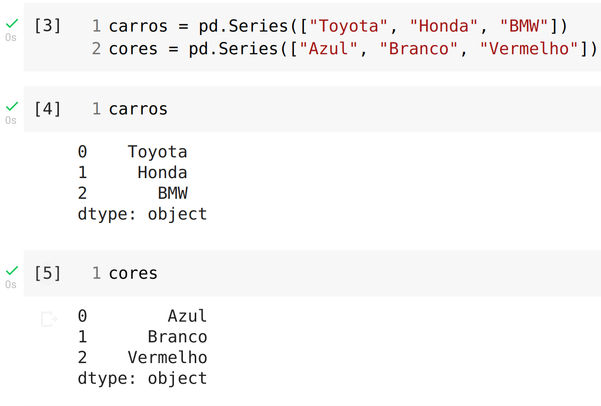
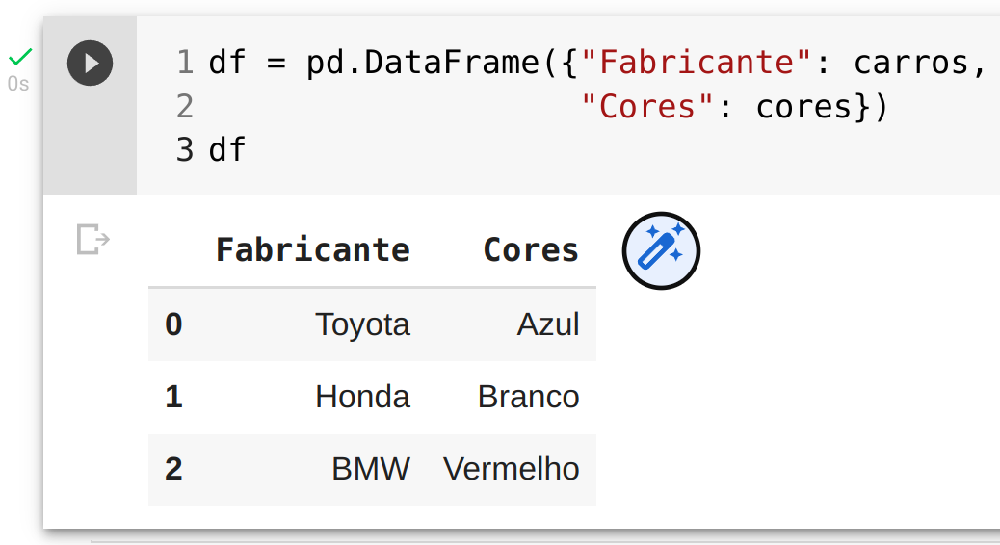

# Tipos de dados

O Pandas possui dois tipos de dados principais, `Series` e `DataFrame`.
Séries são dados em uma única dimensão (coluna), já os DataFrames representam uma tabela de dados e possuem duas dimensões (linhas e colunas).

### Series

Você pode criar uma Séries usando `pd.Series()` e passando uma lista Python:

```python
carros = pd.Series(["Toyota", "Honda", "BMW"])
cores = pd.Series(["Azul", "Branco", "Vermelho"])
```

O notebook terá a seguinte saída:



### DataFrame

Para criar um DataFrame utilizamos `pd.DataFrame()` passando um dicionário Python como parâmetro:

```python
df = pd.DataFrame({"Fabricante": carros,
                   "Cores": cores})
```

No exemplo acima estamos criando um DataFrame a partir de duas Séries.
A saída no notebook será:



Como podemos observar ao criar o DataFrame informamos um dicionário Python e geramos uma tabela de linhas e colunas onde as chaves do dicionário se tornaram os títulos das colunas e os valores das duas Séries se tornaram os dados no DataFrame.

WIP
