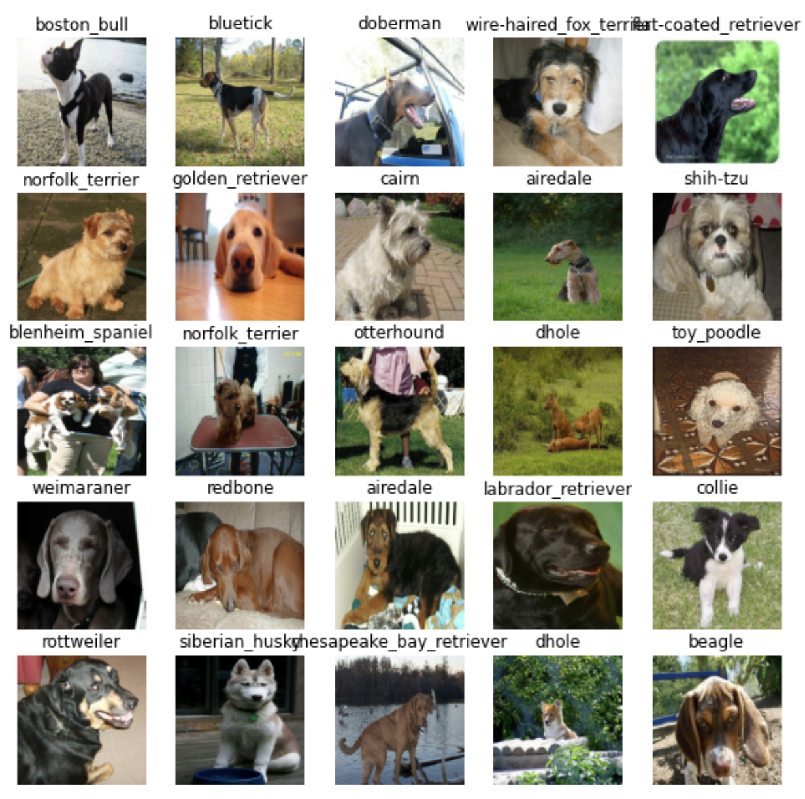
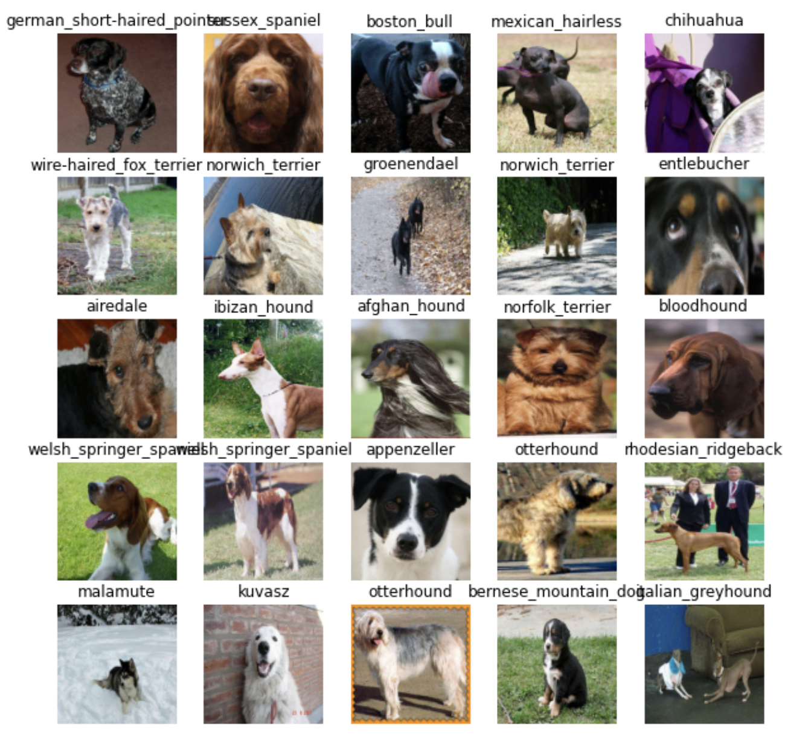
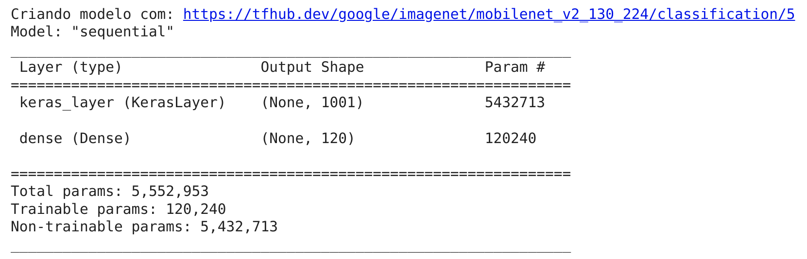
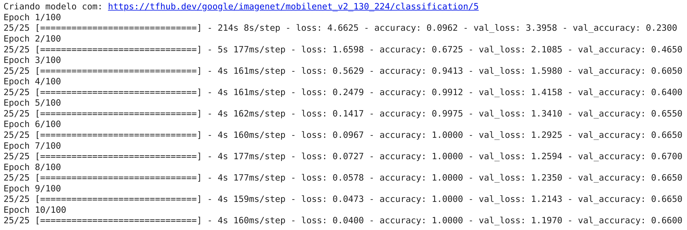
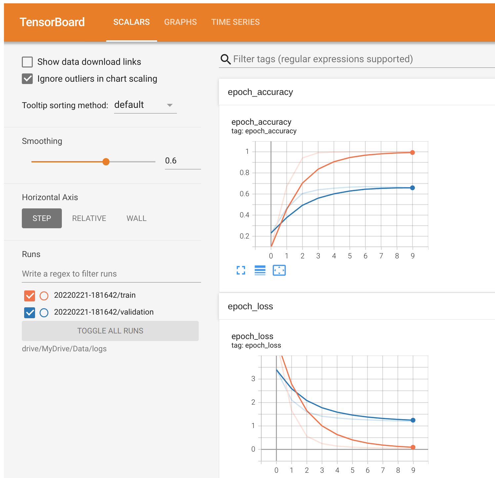
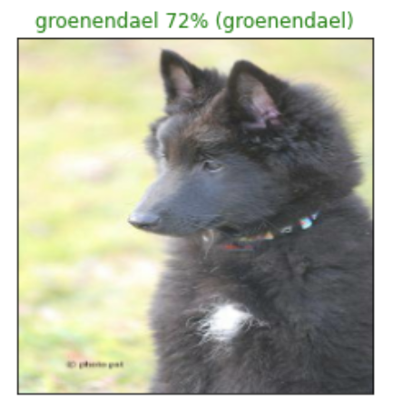
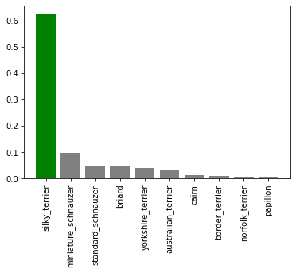
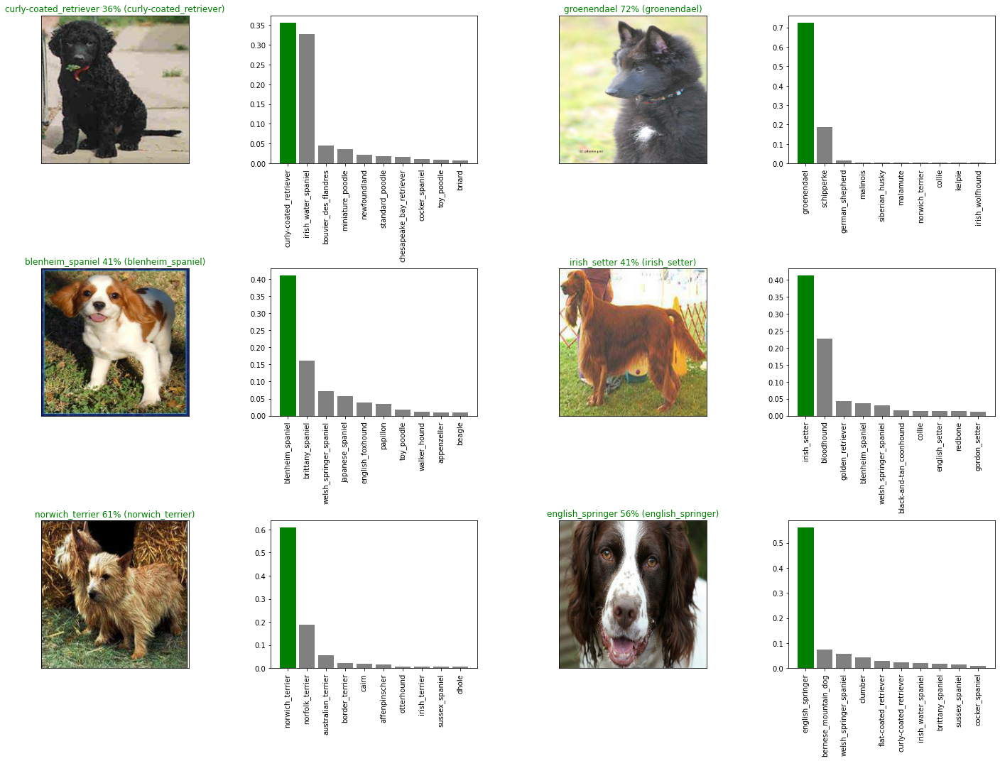
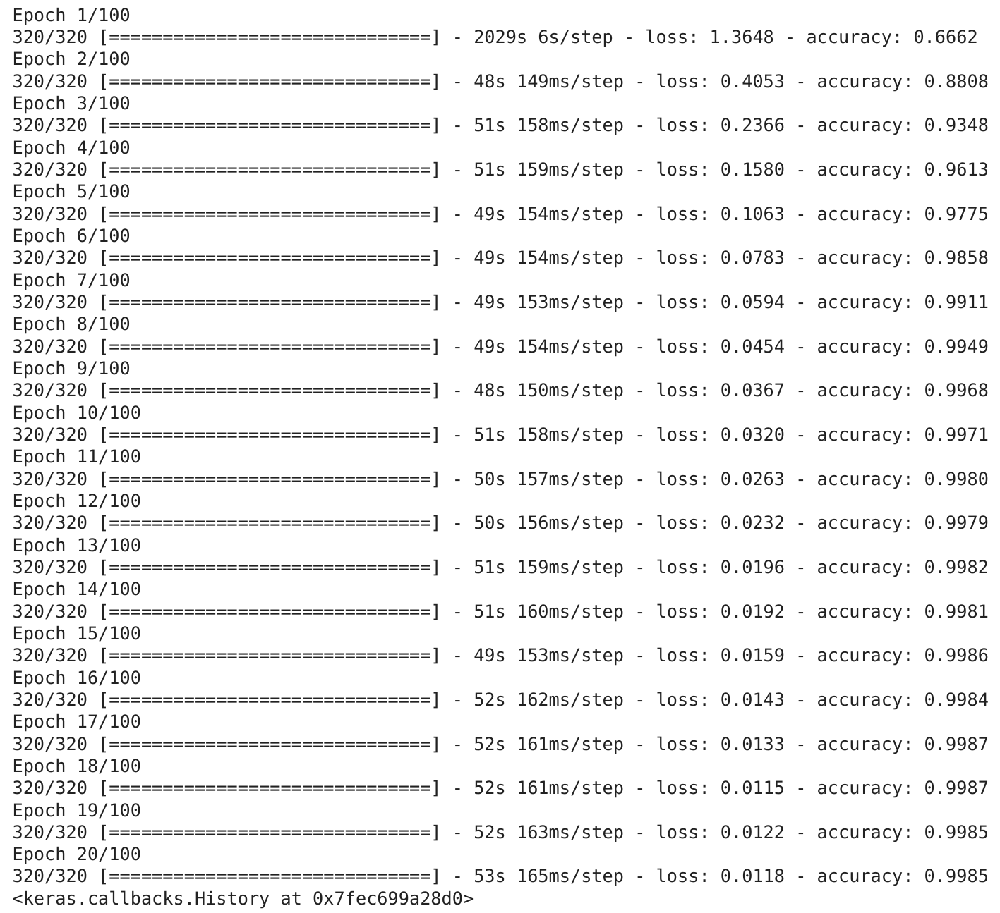
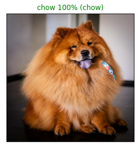

# Transfer Learning com TensorFlow 2.0 - resolvendo um problema de classificação

Neste capítulo, usaremos Machine Learning para resolver um problema de classificação, identificando diferentes raças de cães. Utilizaremos uma base de dados de identificação de cães [disponível no Kaggle](https://www.kaggle.com/c/dog-breed-identification/overview). A base consiste em uma coleção de mais de 10.000 imagens rotuladas em 120 raças de cães diferentes. Este é um problema de classificação de imagens *multiclasse*, pois estamos tentando classificar várias raças diferentes de cães. Se o problema fosse classificar imagens para identificar se é cão ou gato, isso seria um problema de classificação binária (*como vimos em Scikit-Learn*).

Classificação multiclasse de imagens é um problema interessante, pois envolve o mesmo tipo de tecnologia que a Tesla utiliza em seus carros autônomos. A etapa mais importante em um problema de `ML` é preparar os dados (*transforma-los em números*) e é justamente por onde iremos começar.

> Como utilizaremos TensorFlow para pré-processar os dados, ou seja vamos inserir nossos dados em `Tensors` (*matrizes de números que podem ser executados em GPUs*) permitindo que o modelo encontre padrões nos dados. Veremos como configurar o Google Colab para utilizar GPU.

Para o nosso modelo de `ML`, usaremos um modelo pré-treinado do `TensorFlow Hub`. Esse processo de utilizar um modelo pré-treinado e dadaptá-lo para o nosso problema é chamado de `Transfer Learning` (*aprendizado por transferência*). Faremos isso pois queremos aproveitar os padrões de um modelo que foi treinado exaustivamente para classificar imagens. ***Veremos em outros capítulos como criar modelos do zero para resolver diferentes problemas com TensorFlow.***

## Preparando o ambiente

- ### WIP
  - configurar o colab para usar gpu
  - importar o tensorflow
  - verificar a disponibilidade da gpu

## Preparando os dados

- ### WIP
  - upload dos dados do kaggle para google drive
  - explicar o processo de montagem do drive no colab
> Os dados: https://www.kaggle.com/c/dog-breed-identification/data

### Acessando os dados

Agora que temos os dados que iremos trabalhar disponíveis no Google Drive, podemos começar a verificação dos mesmos. Começando com o arquivo `labels.csv` que contém todos os `IDs` de imagem associada com as raças dos cães, ou seja (dados e rótulos).

```python
import pandas as pd
labels = pd.read_csv("drive/MyDrive/Dog Vision/labels.csv")
print(labels.describe())
print(labels.head())
```

```
count                              10222               10222
unique                             10222                 120
top     000bec180eb18c7604dcecc8fe0dba07  scottish_deerhound
freq                                   1                 126
                                 id             breed
0  000bec180eb18c7604dcecc8fe0dba07       boston_bull
1  001513dfcb2ffafc82cccf4d8bbaba97             dingo
2  001cdf01b096e06d78e9e5112d419397          pekinese
3  00214f311d5d2247d5dfe4fe24b2303d          bluetick
4  0021f9ceb3235effd7fcde7f7538ed62  golden_retriever
```

Existem 10.222 IDs diferentes (ou seja imagens diferentes) e 120 raças diferentes. Como temos os IDs das imagens e os rótulos (labels) em um DataFrame, precisamos criar:

- Uma lista com os caminhos dos arquivos para imagens de treino
- Uma matriz com todos os rótulos únicos
- Uma matriz geral de todos os rótulos

```python
filenames = ["drive/MyDrive/Dog Vision/train/" + fname + ".jpg" for fname in labels["id"]]

# listando os 10 primeiros
filenames[:10]
```

```
['drive/MyDrive/Dog Vision/train/000bec180eb18c7604dcecc8fe0dba07.jpg',
 'drive/MyDrive/Dog Vision/train/001513dfcb2ffafc82cccf4d8bbaba97.jpg',
 'drive/MyDrive/Dog Vision/train/001cdf01b096e06d78e9e5112d419397.jpg',
 'drive/MyDrive/Dog Vision/train/00214f311d5d2247d5dfe4fe24b2303d.jpg',
 'drive/MyDrive/Dog Vision/train/0021f9ceb3235effd7fcde7f7538ed62.jpg',
 'drive/MyDrive/Dog Vision/train/002211c81b498ef88e1b40b9abf84e1d.jpg',
 'drive/MyDrive/Dog Vision/train/00290d3e1fdd27226ba27a8ce248ce85.jpg',
 'drive/MyDrive/Dog Vision/train/002a283a315af96eaea0e28e7163b21b.jpg',
 'drive/MyDrive/Dog Vision/train/003df8b8a8b05244b1d920bb6cf451f9.jpg',
 'drive/MyDrive/Dog Vision/train/0042188c895a2f14ef64a918ed9c7b64.jpg']
```

Criamos uma lista de caminhos de arquivo para as imagens em vez de importá-las para começar. Trabalhar com os caminhos dos arquivos (*nesse caso strings*) é bem mais eficiente do que trabalhar diretamente com as imagens.

Bem, agora que temos os caminhos de arquivo em uma lista, vamos obter os rótulos. Vamos pegar os rótulos de `labels` e transformá-los em uma array NumPy:

```python
import numpy as np
labels_array = labels["breed"].to_numpy()
labels_array[:10]
```

```
array(['boston_bull', 'dingo', 'pekinese', 'bluetick', 'golden_retriever',
       'bedlington_terrier', 'bedlington_terrier', 'borzoi', 'basenji',
       'scottish_deerhound'], dtype=object)
```

Agora é possível verificar se a quantidade de rótulos é igual a quantidade de arquivos:

```python
if len(labels_array) == len(filenames):
  print("Número de labels é igual ao número de arquivos!")
else:
  print("Número de labels não bate com o número de arquivos, verifique os dados!")
```

> Número de labels é igual ao número de arquivos!

Tudo parece em ordem, agora podemos começar, primeiro encontraremos todos os nomes únicos de raças de cães:

```python
racas = np.unique(labels_array)
len(racas)

120
```

Estamos trabalhando com imagens de 120 raças diferentes de cães. Agora podemos utilizar `racas` para transformar o array de rótulos em um array de booleans, assim criaremos uma lista indicando qual é o rótulo real (True) e qual não é (False).

```python
boolean_labels = [label == np.array(racas) for label in labels_array]
boolean_labels[:2]


[array([False, False, False, False, False, False, False, False, False,
        False, False, False, False, False, False, False, False, False,
        False,  True, False, False, False, False, False, False, False,
        False, False, False, False, False, False, False, False, False,
        False, False, False, False, False, False, False, False, False,
        False, False, False, False, False, False, False, False, False,
        False, False, False, False, False, False, False, False, False,
        False, False, False, False, False, False, False, False, False,
        False, False, False, False, False, False, False, False, False,
        False, False, False, False, False, False, False, False, False,
        False, False, False, False, False, False, False, False, False,
        False, False, False, False, False, False, False, False, False,
        False, False, False, False, False, False, False, False, False,
        False, False, False]),
 array([False, False, False, False, False, False, False, False, False,
        False, False, False, False, False, False, False, False, False,
        False, False, False, False, False, False, False, False, False,
        False, False, False, False, False, False, False, False, False,
        False,  True, False, False, False, False, False, False, False,
        False, False, False, False, False, False, False, False, False,
        False, False, False, False, False, False, False, False, False,
        False, False, False, False, False, False, False, False, False,
        False, False, False, False, False, False, False, False, False,
        False, False, False, False, False, False, False, False, False,
        False, False, False, False, False, False, False, False, False,
        False, False, False, False, False, False, False, False, False,
        False, False, False, False, False, False, False, False, False,
        False, False, False])]
```

Mas pra que fazer isso? Lembre-se que em `ML` é importante converter os dados em números antes de entregá-los para um modelo. Nesse caso estamos transformando os nomes das 120 raças de cães em um array. Vamos ver um exemplo com uma única raça para entender os que houve com essa transformação:

```python
# Ex: transformando um array de boolenas de uma raça em inteiros
print(labels_array[0]) # label de uma raça
print(np.where(racas == labels_array[0])[0][0]) # index referente ao label
print(boolean_labels[0].argmax()) # index onde o label aparece na matriz booleana
print(boolean_labels[0].astype(int)) # convertendo os booleans em inteiros
```

```
boston_bull
19
19
[0 0 0 0 0 0 0 0 0 0 0 0 0 0 0 0 0 0 0 1 0 0 0 0 0 0 0 0 0 0 0 0 0 0 0 0 0
 0 0 0 0 0 0 0 0 0 0 0 0 0 0 0 0 0 0 0 0 0 0 0 0 0 0 0 0 0 0 0 0 0 0 0 0 0
 0 0 0 0 0 0 0 0 0 0 0 0 0 0 0 0 0 0 0 0 0 0 0 0 0 0 0 0 0 0 0 0 0 0 0 0 0
 0 0 0 0 0 0 0 0 0]
```

Perceba que agora temos os rótulos em formato numérico, hora de dividir os dados.

## Criando um conjunto de validação

A base de dados do Kaggle não separa um conjunto de validação (dados que podemos utilizar para testar o modelo antes de fazer previsões no conjunto de teste). Poderíamos utilizar a função `train_test_split` do `Scikit-Learn` ou apenas fazer divisões manuais nos dados. Vamos começar definindo nossas variáveis `X` e `y` como `dados` e `rótulos` respectivamente:

```python
X = filenames
y = boolean_labels
```

Como estamos trabalhando com uma base de dados com mais de 10.000 imagens, uma boa abordagem seria trabalhar com apenas uma parte delas para garantir que tudo esteja funcionando antes de treinar o modelo com toda a base. Isso porque os cálculos envolvendo mais de 10.000 imagens pode levar muito tempo. E um dos nossos objetivos em projetos de `ML` é reduzir o tempo entre os experimentos. Vamos começar um experimento com apenas 1000 imagens e aumentar esse valor conforme necessário.

```python
NUMERO_IMAGENS = 1000
NUMERO_IMAGENS

1000
```

Agora faremos a divisão dos dados em conjuntos de treino e validação. Usaremos o mesmo padrão de divisão visto anteriormente no capítulo de `Scikit-Learn`, uma divisão 80/20 (80% dos dados para treinamento e 20% para validação).

```python
from sklearn.model_selection import train_test_split

X_train, X_val, y_train, y_val = train_test_split(X[:NUMERO_IMAGENS],
                                                  y[:NUMERO_IMAGENS],
                                                  test_size=0.2,
                                                  random_state=13)

len(X_train), len(y_train), len(X_val), len(y_val)

(800, 800, 200, 200)
```

Reservamos 800 imagens para treino e 200 para validação, vamos verificar uma amostra dos dados:

```python
X_train[:3], y_train[:2]


(['drive/MyDrive/Dog Vision/train/032620ae0f847d957d94d1fd76cb17e8.jpg',
  'drive/MyDrive/Dog Vision/train/056b535b441278e83839984f1b1da0a6.jpg',
  'drive/MyDrive/Dog Vision/train/0fbacbbdb4ad588598757b6d4bd111f1.jpg'],
 [array([False, False, False, False, False, False, False, False, False,
         False, False, False, False, False, False, False, False, False,
         False, False, False, False, False, False, False, False, False,
         False, False, False, False, False, False, False, False, False,
          True, False, False, False, False, False, False, False, False,
         False, False, False, False, False, False, False, False, False,
         False, False, False, False, False, False, False, False, False,
         False, False, False, False, False, False, False, False, False,
         False, False, False, False, False, False, False, False, False,
         False, False, False, False, False, False, False, False, False,
         False, False, False, False, False, False, False, False, False,
         False, False, False, False, False, False, False, False, False,
         False, False, False, False, False, False, False, False, False,
         False, False, False]),
  array([False, False, False, False, False, False, False, False, False,
         False, False, False, False, False, False, False, False, False,
         False, False, False, False, False, False, False, False, False,
         False, False, False, False, False, False, False, False, False,
         False, False, False, False, False, False, False, False, False,
         False, False, False, False, False, False, False, False, False,
         False, False, False, False, False, False, False, False, False,
         False, False, False, False, False, False, False, False, False,
         False, False, False, False, False, False, False, False, False,
         False, False, False, False, False, False, False, False, False,
         False, False, False, False, False, False, False,  True, False,
         False, False, False, False, False, False, False, False, False,
         False, False, False, False, False, False, False, False, False,
         False, False, False])])
```

## Pré-processamento de imagens

Até aqui apenas os rótulos estão no formato numérico, as imagens ainda são apenas caminhos de arquivo. Precisamos transformar as imagens em `tensors`.
Lembre-se um `tensor` é uma forma de representar informações em números. Pense em um Tensor como uma combinação de matrizes NumPy, que pode ser processado em uma GPU. Vamos converter uma imagem em um array NumPy para entender o restante do processo:

```python
from matplotlib.pyplot import imread
image = imread(filenames[20]) # lendo uma imagen, no caso de ID 20
image.shape

(375, 500, 3)
```

Perceba o shape (forma) da imagem, que é (375, 500, 3), ou seja altura, largura e cor (RGB). Podemos converter facilmente em um tensor utilizando `tf.constant()`:

```python
tf.constant(image)[:2]

<tf.Tensor: shape=(2, 500, 3), dtype=uint8, numpy=
array([[[127, 128, 120],
        [123, 124, 116],
        [117, 120, 111],
        ...,
        [ 98, 123,  65],
        [ 97, 122,  64],
        [102, 127,  69]],

       [[117, 120, 111],
        [114, 117, 108],
        [112, 115, 106],
        ...,
        [ 97, 122,  64],
        [ 94, 119,  61],
        [ 98, 123,  65]]], dtype=uint8)>
```

> Por padrão vamos redimensionar as imagens para um shape (`224,224`), veremos mais detalhes dessa escolha adiante.

Para converter todas as imagens em tensors criaremos uma função:

```python
# definindo o tamanho padrão das imagens
IMG_SIZE = 224

def processa_imagem(image_path):
  
  # lendo o arquivo de imagem
  image = tf.io.read_file(image_path)
  # transforma a imagem em um tensor com 3 canais de cores (Red, Green, Blue)
  image = tf.image.decode_jpeg(image, channels=3)
  # converte os valores do canal de cor de 0-255 para valores entre 0-1
  image = tf.image.convert_image_dtype(image, tf.float32)
  # redimensiona a imagem para o novo shape (224,224)
  image = tf.image.resize(image, size=[IMG_SIZE, IMG_SIZE])
  return image
```

Agora temos uma função que converte as imagens em `Tensors`, precisamos construir agora uma outra função para transformar os dados em lotes (TensorFlow BatchDataset). Por exemplo, estamos trabalhando com uma base de 10.000 imagens, somados esses arquivos podem ocupar toda a memória da GPU, tentar calcular todo o conjunto de dados ao mesmo tempo poderia resultar em erro. Em vez disso é mais eficiente criar lotes menores dos dados e computar um lote por vez. Antes, precisamos de uma função simples para transformar os nomes dos caminhos dos arquivos de imagem e os rótulos em tuplas:

```python
def image_label(image_path, label):
  image = processa_imagem(image_path)
  return image, label
```

Agora criaremos uma função para gerar os lotes de dados. Como estamos trabalhando com 3 conjuntos diferentes de dados (treino, validação e teste), vamos garantir que a função possa trabalhar com cada conjunto. Por padrão vamos definir um tamanho de lote de `32`.

```python
# tamanho do lote
BATCH_SIZE = 32

# função que retorna os dados em lotes
def create_data_batches(x, y=None, batch_size=BATCH_SIZE, valid_data=False, test_data=False):
  
  # se os dados forem de teste, não temos rótulos (provavelmente)
  if test_data:
    print("Criando lotes de dados de teste...")
    data = tf.data.Dataset.from_tensor_slices((tf.constant(x)))
    data_batch = data.map(processa_imagem).batch(BATCH_SIZE)
    return data_batch
  
  # se os dados forem de um conjunto válido, não precisamos embaralhar
  elif valid_data:
    print("Criando lotes de dados de validação...")
    data = tf.data.Dataset.from_tensor_slices((tf.constant(x),
                                               tf.constant(y)))
    data_batch = data.map(image_label).batch(BATCH_SIZE)
    return data_batch

  else:
    # se os dados forem de treino, embaralhe
    print("Criando lotes de dados de treino...")
    # transformando caminhos de arquivos e rótulos em tensors
    data = tf.data.Dataset.from_tensor_slices((tf.constant(x),
                                              tf.constant(y)))
    
    # embaralha os caminhos de arquivos e rótulos
    data = data.shuffle(buffer_size=len(x))

    # cria tuplas (imagem, rótulo)
    data = data.map(image_label)

    # transforma os dados em lotes
    data_batch = data.batch(BATCH_SIZE)
  return data_batch
```

```python
train_data = create_data_batches(X_train, y_train)
val_data = create_data_batches(X_val, y_val, valid_data=True)

Criando lotes de dados de treino...
Criando lotes de dados de validação...


train_data.element_spec, val_data.element_spec

((TensorSpec(shape=(None, 224, 224, 3), dtype=tf.float32, name=None),
  TensorSpec(shape=(None, 120), dtype=tf.bool, name=None)),
 (TensorSpec(shape=(None, 224, 224, 3), dtype=tf.float32, name=None),
  TensorSpec(shape=(None, 120), dtype=tf.bool, name=None)))
```

Agora temos os dados em lotes, em pares de tensors (imagens e rótulos) prontos para serem utilizados em um GPU. Esse conceito pode ser um pouco difícil de entender, vamos tentar visualizar o que está acontecendo por baixo dos panos.

## Visualizando os lotes de dados

Vamos criar uma função para "plotar" 25 imagens:

```python
import matplotlib.pyplot as plt

def show_images(images, labels):
  plt.figure(figsize=(10, 10))
  # loop para exibir 25 imagens
  for i in range(25):
    # cria subplots 5 x 5
    ax = plt.subplot(5, 5, i+1)
    # mostra imagem
    plt.imshow(images[i])
    # adiciona label da imagem como título
    plt.title(racas[labels[i].argmax()])
    plt.axis("off")
```

Já sabemos que um lote (aqui no nosso caso) é uma coleção de tensors. Ou seja, para visualizar os dados em um lote é preciso desfazer o lote primeiro. Isso pode ser feito por meio da função `as_numpy_iterator()` em um lote de dados. Dessa forma vamos transformar um lote em algo que possa ser iterado. Esse processo pode demorar um pouco:

```python
train_images, train_labels = next(train_data.as_numpy_iterator())
show_images(train_images, train_labels)
```



Podemos fazer o mesmo para dados de validação:

```python
val_images, val_labels = next(val_data.as_numpy_iterator())
show_images(val_images, val_labels)
```



## Criando e treinando um modelo

Agora que os dados estão prontos, precisamos preparar a próxima etapa, a modelagem. Como o nosso objetivo nesse momento é realizar um experimento de `Transfer Learning` (aprendizagem por transferência), usaremos um modelo existente do [TensorFlow Hub (ou TensorHub)](https://tfhub.dev/). TensorFlow Hub é uma plataforma onde podemos encontrar modelos de Machine Learning pré-treinados para o problema que estamos trabalhando.

Como dito antes, construir um modelo de `ML` do zero e treiná-lo em lotes pode ser demorado (veremos em outros capítulos como fazer isso).
Transfer Learning ajuda a reduzir boa parte do tempo nesse processo, uma vez que o modelo vai pegar as instruções que outro modelo aprendeu e utilizar isso na resolução de seu próprio problema.

Sabemos que nosso problema é de classificação de imagens, podemos pesquisar no TensorFlow Hub pelo domínio do problema (imagem).
Isso resulta em uma lista de diferentes modelos pré-treinados que podemos escolher e aplicar para nossa tarefa. Por exemplo, o modelo [mobilenet_v2_130_224](https://tfhub.dev/google/imagenet/mobilenet_v2_130_224/classification/5) nos mostra que pode receber como entrada imagens no formato (`224,224`) e que o modelo foi bastante treinado para classificação de imagens. Vamos utilizá-lo!

```python
# configurando o formato de entrada para o modelo
INPUT_SHAPE = [None, IMG_SIZE, IMG_SIZE, 3] # lote, altura, largura, RGB

# configurado o formato de saída do modelo
OUTPUT_SHAPE = len(racas) # número labels únicos, as 120 raças

# url do modelo que escolhemos no TensorFlow Hub
MODEL_URL = "https://tfhub.dev/google/imagenet/mobilenet_v2_130_224/classification/5"
```

Agora que temos as entradas e saídas definidas, bem como o modelo que iremos utilizar, podemos começar a juntar as partes. Há muitas formas de se criar um modelo no TensorFlow, uma das formas de começar é utilizando a [API Keras](https://www.tensorflow.org/guide/keras/sequential_model).

Vamos criar uma função que recebe a forma da entrada, a saída e a url do modelo como parâmetros. Na função vamos definir as camadas em um modelo Keras de forma sequencial, para em seguida compilar o modelo (informando como ele deve ser avaliado e melhorado) e construindo o modelo (informando qual formato de entrada de dados ele deve receber).

```python
# função para criar modelo Keras
def create_model(input_shape=INPUT_SHAPE, output_shape=OUTPUT_SHAPE, model_url=MODEL_URL):
  print("Criando modelo com:", MODEL_URL) # url do modelo escolhido no tensorhub

  # configurando as camadas do modelo
  model = tf.keras.Sequential([
    hub.KerasLayer(MODEL_URL), # 1 (camada de entrada)
    tf.keras.layers.Dense(units=OUTPUT_SHAPE, 
                          activation="softmax") # 2 (camada de saída)
  ])

  # compilando o modelo
  model.compile(
      # o modelo quer reduzir o percentual de suas suposições
      loss=tf.keras.losses.CategoricalCrossentropy(),
      # essa função diz ao modelo como melhorar os palpites
      optimizer=tf.keras.optimizers.Adam(),
      metrics=["accuracy"] # o objetivo final é fazer esse valor subir
  )

  # construindo o modelo
  model.build(INPUT_SHAPE)
  
  return model
```

Para configurar as camadas do modelo, existem duas formas de se fazer isso no `Keras`, a forma funcional e a sequencial, estamos utilizando a sequencial. A documentação diz que a API funcional é o melhor caminho para definir modelos complexos, já a API sequencial é perfeitamente adequada para começar, que é justamente o que estamos fazendo.

A primeira camada que adicionamos é o modelo do TensorFlow Huyb: `hub.KerasLayer(MODEL_URL)`. Em outras palavras a nossa primeira camada é na verdade um modelo inteiro (*contendo muito mais camadas*). Essa camada de entrada recebe as imagens e busca por padrões nelas com base nos padrões que `mobilenet_v2_130_224` encontrou.

Na próxima camada `tf.keras.layers.Dense()` é a camada de saída do nosso modelo. Aqui fica disponível todas as informações descobertas na camada de entrada. O parâmetro `activation="softmax"` informa à camada de saída que queremos atribuir um valor de probabilidade a cada um dos 120 rótulos (raças de cães) em algum lugar entre 0 e 1. Quanto maior for o valor, mais o modelo acredita que a imagem de entrada deve receber o rótulo atribuído.

E a compilação do modelo ? Bem, digamos que você esteja em uma competição de natação em mar aberto. O problema é que você está com os olhos vendados. Felizmente você tem um amigo, `Adam`, que está areia observando e gritando as instruções de direção para você concluir a prova. Ao lado de Adam encontra-se um juiz que está avaliando o seu desempenho na prova. O juiz sabe onde você precisa chegar, então ele fica comparando como você está indo com onde você deveria estar. Essa comparação é a forma que você é pontuado. De volta para as terminologias:

- **loss** - é a função de perda, o objetivo do modelo é minimizar isso, fazendo chegar a 0 (*nadar até a linha de chegada sem errar o caminho*).
- **optimizer** - é o seu amigo Adam, ele é o responsável em dizer como navegar no mar (reduzindo a função de perda) com base no que você já foi feito.
- **metrics** - esse é o juiz que fica avaliando o seu desempenho. Ou no caso do nosso problema, fornece a precisão de quão bem o modelo está prevendo o rótulo correto da imagem.

Sempre que estivermos utilizando uma camada do TensorFlow Hub, usaremos `model.build()` para informar ao modelo qual formato de entrada ele pode esperar. No nosso exemplo, a forma de entrada é `[None, 224, 224, 3]`. O tamanho do lote é representado como `None` pois essa informação é inferida a partir dos dados que estamos passando ao modelo (32 nesse caso, pois foi assim que configuramos). Agora que vimos cada etapa da função, vamos utilizá-la para criar um modelo.

```python
model = create_model()
model.summary()
```



> Utilizamos a função `summary()` para ter uma ideia de como é o modelo.

Os parâmetros não treináveis (*Non-trainable params*) são os padrões aprendidos por `mobilenet_v2_130_224` e os parâmetros treináveis (*Trainable params*) são os que adicionamos em `tf.keras.layers.Dense()`.
Esse resultado mostra que a maior parte das informações em nosso modelo, já foram aprendidas e só precisamos pegar isso e adaptar para o nosso problema.

## Criando Callbacks

O nosso modelo está pronto para ser treinado, mas antes de prosseguir faremos alguns `Callbacks`. São funções auxiliares que um modelo pode usar durante o treino para fazer tarefas como salvar o progresso, verificar o progresso ou interromper o processo de treinamento de forma antecipada.
Criaremos dois callbacks para adicionar uma chamada ao [TensorBoard](https://www.tensorflow.org/tensorboard/get_started) e outra chamada de parada antecipada.

O `TensorBoard` fornece uma maneira visual de monitorar o progresso do modelo, durante e após o treinamento. Pode ser utilizado diretamente no notebook para rastrear métricas de desempenho de um modelo, como score de perda e precisão.

### WIP
  - configurar o tensorboard

```python
%load_ext tensorboard

import os
import datetime
def create_tensorboard_callback():
  # cria diretório para armazenar os logs do TensorBoard
  logdir = os.path.join("drive/MyDrive/Data/logs",
                        datetime.datetime.now().strftime("%Y%m%d-%H%M%S"))
  return tf.keras.callbacks.TensorBoard(logdir)
```

Temos ainda a [interrupção antecipada (*Early stopping*)](https://www.tensorflow.org/api_docs/python/tf/keras/callbacks/EarlyStopping) que ajuda a evitar o `overfitting`, interrompendo um modelo quando uma determinada métrica de avaliação para de melhorar. Basicamente vamos dizer para o modelo: procure por padrões até que a qualidade desses padrões comece a cair.

```python
# criando chamada de interrupção antecipada
early_stopping = tf.keras.callbacks.EarlyStopping(monitor="val_accuracy",
                                                  patience=3)
```

Como discutido antes, vamos treinar o nosso modelo em apenas 1000 imagens. Em outras palavras, treinaremos em 800 imagens e utilizaremos as outras 200 para validação, totalizando 1000. Faremos isso para garantir que tudo esteja funcionando, depois de confirmar isso poderemos treinar em todo o conjunto de dados.

Antes de treinar precisamos definir mais um parâmetro `NUM_EPOCHS` que determina quantas passagens dos dados gostaríamos que nosso modelo fizesse. Um passe equivale ao nosso modelo tentando encontrar padrões em cada imagem e verificar quais padrões se relacionam com cada rótulo.

Por exemplo `NUM_EPOCHS=1`, o modelo vai examinar os dados apenas uma única vez e provavelmente terá uma pontuação ruim, pois não tem chance de se corrigir. Um bom valor é difícil de definir, 10 pode ser um bom começo, mas 100 pode ser melhor. Esse é um dos motivos pelos quais criamos um `callback` de parada antecipada, se definirmos `NUM_EPOCHS=100` e o modelo parou de melhorar após 22, o treinamento será interrompido.

Bem, vamos verificar rapidamente se estamos utilizando uma GPU:

```python
print("GPU", "disponível!!!!)" if tf.config.list_physical_devices("GPU") else "not configurada :(")

GPU disponível!!!!)
```

Perfeito, temos uma GPU disponível para execução, agora vamos configurar `NUM_EPOCHS` e criar uma função simples para treinar um modelo.

```python
NUM_EPOCHS = 100

# função para treinar um modelo
def train_model():
  # criando o modelo
  model = create_model()

  # cria uma sessão do TensorBoard toda vez que um modelo for treinado
  tensorboard = create_tensorboard_callback()

  # treina o modelo com os dados e callbacks que criamos
  model.fit(x=train_data,
            epochs=NUM_EPOCHS,
            validation_data=val_data,
            validation_freq=1, # verifica a validação de métricas a cada epoch
            callbacks=[tensorboard, early_stopping])
  
  return model
```

Finalmente, ao treinar um modelo pela primeira vez, levará um tempo para carregar os dados. Como estamos utilizando uma GPU esse processo pode levar alguns minutos (no nosso caso).

```python
model = train_model()
```



Agora que nosso modelo foi trainado, vamos verificar os logs no TensorBoard e ver o seu desempenho de maneira visual.

```python
%tensorboard --logdir drive/MyDrive/Data/logs
```



O callback `early_stopping` entrou em ação e parou de treinar após 25 verificações. Isso ocorreu pois a precisão de validação não melhorou depois de 4 verificações. Podemos ver que o nosso modelo está aprendendo alguma coisa, a precisão da validação chegou a 66% em apenas alguns minutos. Isso significa que se aumentarmos o número de imagens, talvez possamos ver um aumento na precisão.

## Fazendo previsões e avaliando os resultados

Bem, antes de aumentarmos o número de imagens para treinar o modelo com mais dados, veremos outras formas de avaliar o nosso modelo. Embora a precisão seja um bom indicador e como o nosso modelo está performando, seria ainda melhor poder vê-lo em ação. Para isso podemos fazer previsões por meio da função `predict()`, passando os dados no mesmo formato em que o modelo foi treinado.

```
predictions = model.predict(val_data, verbose=1)
predictions

7/7 [==============================] - 2s 177ms/step
array([[6.1289142e-03, 4.9413438e-04, 1.8335391e-04, ..., 5.0873416e-03,
        1.0212163e-03, 1.8342169e-03],
       [2.9808136e-03, 3.8091789e-03, 1.7363916e-03, ..., 1.0431294e-03,
        1.7300938e-04, 4.0559638e-03],
       [9.8665347e-05, 4.7748103e-06, 9.3761346e-06, ..., 5.6768484e-05,
        9.2058966e-05, 2.0925076e-04],
       ...,
       [2.4115643e-05, 5.0457241e-04, 3.6022495e-04, ..., 3.2151077e-04,
        1.6623015e-03, 5.2641069e-05],
       [3.1822168e-05, 9.7815809e-04, 9.4177556e-04, ..., 7.8174734e-04,
        9.3225291e-04, 1.5031500e-05],
       [2.1962752e-03, 7.2391253e-05, 5.9957849e-04, ..., 2.1881016e-04,
        5.3851202e-04, 2.3197865e-03]], dtype=float32)
```

```python
predictions.shape

(200, 120)
```

Fazer previsões sobre os dados de validação (200 imagens) retorna uma matriz com um valor diferente para cada rótulo. Cada matriz contém 120 valores diferentes (um para cada raça de cão). Esses valores diferentes são as probabilidades de o modelo prever que uma determinada imagem é uma raça específica de cachorro. Quanto maior o valor, maior a probabilidade de o modelo relacionar que determinada imagem pertence a uma raça. Vamos converter uma matriz de probabilidades em um rótulo real:

```python
print(predictions[0])
print(f"Valor Máximo (probabilidade de previsão): {np.max(predictions[0])}")
print(f"Soma total: {np.sum(predictions[0])}")
print(f"Max index: {np.argmax(predictions[0])}")
print(f"Rótulo previsto: {racas[np.argmax(predictions[0])]}")
```

```
[6.12891419e-03 4.94134380e-04 1.83353914e-04 2.29427358e-04
 3.73498560e-03 6.29680348e-04 1.21862011e-03 5.69027266e-04
 5.72043791e-06 3.57908453e-03 2.28679317e-04 5.76176644e-05
 7.43210781e-04 6.54693213e-05 6.88183354e-04 2.73649484e-01
 2.04424170e-04 7.35868467e-04 1.87200130e-05 1.86801379e-04
 7.96007749e-04 3.71084618e-03 7.78313435e-04 1.21078745e-04
 1.79169734e-03 2.10062994e-04 6.47211345e-05 3.92607108e-05
 1.71959680e-02 9.54358838e-04 1.46281358e-03 5.85304631e-04
 2.20437490e-04 1.95942863e-04 3.64659145e-03 1.46316524e-04
 1.61483200e-04 4.42342076e-04 8.39865825e-04 7.80218223e-04
 1.91953883e-03 3.57783213e-03 1.95646053e-03 2.01559713e-04
 4.62555065e-04 1.78337761e-03 1.97481131e-05 5.32588303e-01
 5.08746707e-05 1.55199913e-03 1.01689156e-03 1.28392398e-03
 1.91731509e-04 5.89729811e-04 4.80399649e-05 2.92319944e-03
 4.93563311e-05 6.99758355e-04 1.33902836e-03 1.97827048e-03
 2.35292478e-03 2.23126786e-04 4.09513537e-04 2.40915819e-04
 8.94229510e-04 3.35462246e-04 1.45765400e-04 6.22630911e-03
 5.60026165e-05 6.55528856e-04 1.75896916e-03 5.94771009e-05
 4.95163724e-04 9.60865640e-04 8.21350981e-03 2.42739008e-03
 1.49727776e-03 2.79009313e-04 2.25998392e-05 7.21598553e-05
 2.00509187e-03 6.27041009e-05 2.57713371e-04 1.19005432e-04
 2.29247264e-04 2.88886193e-04 1.10973348e-03 6.52837101e-04
 5.14724117e-04 1.59008149e-03 2.06289100e-04 6.29047805e-04
 8.09656412e-05 2.13349325e-04 8.35536281e-04 4.90781385e-03
 2.14187196e-03 3.24452703e-04 8.27542535e-05 1.16136371e-05
 1.94864441e-03 7.23455974e-04 3.59507569e-04 9.97863826e-04
 4.22419806e-04 1.53413648e-03 5.75519865e-04 2.55084451e-04
 1.23032616e-04 5.00681235e-05 2.36897580e-02 1.00696562e-02
 2.20857211e-03 2.17336584e-02 7.59088784e-04 9.01289808e-04
 3.88310174e-04 5.08734165e-03 1.02121627e-03 1.83421688e-03]
Valor Máximo (probabilidade de previsão): 0.5325883030891418
Soma total: 1.0
Max index: 47
Rótulo previsto: german_short-haired_pointer
```

Para melhorar, seria interessante poder comparar uma previsão com o seu verdadeiro rótulo e imagem original. Vamos escrever uma pequena função para converter probabilidades de previsão em rótulos previstos (também conhecidos por níveis de confiança).

```python
def get_pred_label(prediction_probabilities):
  return racas[np.argmax(prediction_probabilities)]

pred_label = get_pred_label(predictions[0])
pred_label


'german_short-haired_pointer'
```

Temos uma lista de todas as diferentes previsões que nosso modelo fez, faremos o mesmo para as imagens de validação e rótulos de validação.

Lembre-se o modelo não treinou nos dados de validação, apenas os utilizou para se avaliar. Podemos utilizar as imagens de validação para comparar visualmente as previsões do nosso modelo e de modelos futuros com os rótulos de validação.

```python
def unbatchify(data):
  images = []
  labels = []
  # Loop para extrair os dados do lote
  for image, label in data.unbatch().as_numpy_iterator():
    images.append(image)
    labels.append(racas[np.argmax(label)])
  return images, labels

# desagrupa os dados de validação do lote
val_images, val_labels = unbatchify(val_data)
val_images[0], val_labels[0]
```

```
(array([[[0.30199423, 0.17258248, 0.13728836],
         [0.2740196 , 0.14460786, 0.10931374],
         [0.31081027, 0.1813985 , 0.14610438],
         ...,
         [0.1727071 , 0.09924757, 0.09284008],
         [0.15458685, 0.10815825, 0.08462884],
         [0.1589285 , 0.11579124, 0.09226183]],
 
        [[0.2646662 , 0.13525441, 0.0999603 ],
         [0.28669468, 0.15728292, 0.12198881],
         [0.29741678, 0.16800502, 0.1327109 ],
         ...,
         [0.16822693, 0.09476741, 0.08835991],
         [0.15711254, 0.1028408 , 0.08095706],
         [0.16344531, 0.1124649 , 0.08893549]],
 
        [[0.27388737, 0.14447562, 0.1091815 ],
         [0.28355125, 0.15413947, 0.11884536],
         [0.29154727, 0.16213548, 0.12684137],
         ...,
         [0.17158315, 0.09812362, 0.09171613],
         [0.15312406, 0.09607842, 0.08525909],
         [0.15924363, 0.1037114 , 0.09289208]],
 
        ...,
 
        [[0.45745805, 0.37902668, 0.34373254],
         [0.4576253 , 0.3791939 , 0.3438998 ],
         [0.4664319 , 0.38800052, 0.35270637],
         ...,
         [0.38155785, 0.30312645, 0.26783234],
         [0.42671952, 0.33233738, 0.30305785],
         [0.4091662 , 0.31175718, 0.2839911 ]],
 
        [[0.4911461 , 0.41271472, 0.3774206 ],
         [0.4567228 , 0.3782914 , 0.34299728],
         [0.46088153, 0.38245016, 0.34715602],
         ...,
         [0.35559455, 0.2850063 , 0.24579063],
         [0.37254903, 0.2953082 , 0.25941882],
         [0.37647063, 0.29922977, 0.26334038]],
 
        [[0.4597125 , 0.38128114, 0.345987  ],
         [0.47902521, 0.40059385, 0.3652997 ],
         [0.44550127, 0.36706987, 0.33177575],
         ...,
         [0.36276323, 0.292175  , 0.2529593 ],
         [0.3834035 , 0.31281525, 0.27359957],
         [0.38661253, 0.31602427, 0.2768086 ]]], dtype=float32),
 'german_short-haired_pointer')
```

Agora é possível obter os rótulos de previsão, rótulos de validação e as imagens de validação. Podemos visualizar uma imagem e seu rótulo previsto, bem como o rótulo verdadeiro.

```python
def plot_pred(prediction_probabilities, labels, images, n=1):
  pred_prob, true_label, image = prediction_probabilities[n], labels[n], images[n]
  
  # pega o rótulo previsto
  pred_label = get_pred_label(pred_prob)
  
  # plotando a imagem
  plt.imshow(image)
  plt.xticks([])
  plt.yticks([])

  # altera a cor do título dependendo da previsão estar certa ou errada
  if pred_label == true_label:
    color = "green"
  else:
    color = "red"

  plt.title("{} {:2.0f}% ({})".format(pred_label,
                                      np.max(pred_prob)*100,
                                      true_label),
                                      color=color)
```

```python
# exemplo de previsão
plot_pred(prediction_probabilities=predictions,
          labels=val_labels,
          images=val_images)
```



Visualizar os resultados dos nossos modelos é realmente útil para entender como o modelo está se saindo. Como este é um problema multiclasse (120 raças de cães diferentes), seria interessante também ver outras suposições que o modelo está fazendo. Para isso criaremos outra função:

```python
def plot_pred_conf(prediction_probabilities, labels, n=1):

  pred_prob, true_label = prediction_probabilities[n], labels[n]

  # pega o rótulo previsto
  pred_label = get_pred_label(pred_prob)

  # encontra o top 10 para previsões
  top_10_pred_indexes = pred_prob.argsort()[-10:][::-1]
  top_10_pred_values = pred_prob[top_10_pred_indexes]
  top_10_pred_labels = racas[top_10_pred_indexes]

  # configura o plot
  top_plot = plt.bar(np.arange(len(top_10_pred_labels)), 
                     top_10_pred_values, 
                     color="grey")
  plt.xticks(np.arange(len(top_10_pred_labels)),
             labels=top_10_pred_labels,
             rotation="vertical")

  # altera a cor do título conforme a previsão (certa/errada)
  if np.isin(true_label, top_10_pred_labels):
    top_plot[np.argmax(top_10_pred_labels == true_label)].set_color("green")
  else:
    pass
```

```python
plot_pred_conf(prediction_probabilities=predictions, labels=val_labels, n=9)
```



Agora podemos executar algumas funções para visualizar nossas previsões e ajudar na avaliação do modelo, vamos conferir:

```python
i_multiplier = 0
num_rows = 3
num_cols = 2
num_images = num_rows*num_cols
plt.figure(figsize=(5*2*num_cols, 5*num_rows))
for i in range(num_images):
  plt.subplot(num_rows, 2*num_cols, 2*i+1)
  plot_pred(prediction_probabilities=predictions,
            labels=val_labels,
            images=val_images,
            n=i+i_multiplier)
  plt.subplot(num_rows, 2*num_cols, 2*i+2)
  plot_pred_conf(prediction_probabilities=predictions,
                labels=val_labels,
                n=i+i_multiplier)
plt.tight_layout(h_pad=1.0)
plt.show()
```



## Salvando e carregando um modelo

É uma boa prática salvar um modelo logo depois de treiná-lo. Ao salvar significa que você pode compartilhar com outros desenvolvedores, ou utilizar em um aplicativo. O formato de um modelo Keras salvo é `h5`, faremos uma função com o método `save()` para salvar um arquivo `h5` em um diretório.

```python
def save_model(model, suffix=None):
  
  # criando o diretório onde o modelo sera salvo
  modeldir = os.path.join("drive/MyDrive/Data/models",
                          datetime.datetime.now().strftime("%Y%m%d-%H%M%s"))
  model_path = modeldir + "-" + suffix + ".h5" # formato do modelo
  print(f"Saving model to: {model_path}...")
  model.save(model_path)
  return model_path
```

E caso você precise carregar o modelo, teremos uma função que utiliza o caminho para o arquivo `h5` salvo, `tf.keras.models.load_model()` vai carregar o modelo no notebook.

> Como estamos utilizando um modelo do TensorFlow Hub, teremos que passar a instrução `hub.KerasLayer` como parâmetro.

```python
def load_model(model_path):
  print(f"Loading saved model from: {model_path}")
  model = tf.keras.models.load_model(model_path,
                                     custom_objects={"KerasLayer":hub.KerasLayer})
  return model
```

Agora vamos ao teste:

```python
save_model(model, suffix="1000-images-Adam")

Saving model to: drive/MyDrive/Data/models/20220221-20161645474573-1000-images-Adam.h5...
'drive/MyDrive/Data/models/20220221-20161645474573-1000-images-Adam.h5'
```

## Treinando um modelo com todos os dados

Já vimos que o modelo funciona em um subconjunto dos dados, podemos avançar e treinar um novo modelos com os dados completos. Vamos verificar os dados em `X` e os rótulos em `y`:

```python
len(X), len(y)

(10222, 10222)
```

Temos mais de 10.000 imagens e rótulos em nosso conjunto de dados de treinamento. Antes de treinar, teremos que transformá-los em lotes de dados. Dessa vez não precisaremos escrever muito código, usaremos a função criada no inicio do projeto `create_data_batches()`:

```python
full_data = create_data_batches(X, y)

Criando lotes de dados de treino...
```

Pronto, agora que os dados estão em um lote de dados, tudo que precisamos  agora é criar um modelo. Usaremos a função criada anteriormente `create_model()`:

```python
full_model = create_model()

Criando modelo com: https://tfhub.dev/google/imagenet/mobilenet_v2_130_224/classification/5
```

Agora alguns callbacks:

```python
# TensorBoard
full_model_tensorboard = create_tensorboard_callback()

# Early stopping
full_model_early_stopping = tf.keras.callbacks.EarlyStopping(monitor="accuracy",
                                                             patience=3)
```

> Treinar o modelo com mais de 10.000 imagens pode levar bastante tempo para terminar.

```python
# treinando o modelo com todos os dados de treino
full_model.fit(x=full_data,
               epochs=NUM_EPOCHS,
               callbacks=[full_model_tensorboard, 
                          full_model_early_stopping])
```



## Previsões nos dados de teste (completo)

Usaremos a função `create_data_batches()` para colocar os dados de previsões da base de teste em lotes:

```python
test_path = "drive/MyDrive/Dog Vision/test/"
test_filenames = [test_path + fname for fname in os.listdir(test_path)]

test_filenames[:10]
```

```
['drive/MyDrive/Dog Vision/test/e1deaf47925c840d804d7ff0324ee1fe.jpg',
 'drive/MyDrive/Dog Vision/test/e0a6b866af64299ecf76f7cb11c80674.jpg',
 'drive/MyDrive/Dog Vision/test/e4b7ff61849485992246c0f2ab7e8804.jpg',
 'drive/MyDrive/Dog Vision/test/e699b20911a55abda3558c5bcd37443d.jpg',
 'drive/MyDrive/Dog Vision/test/de5496c6b58f66ab890ab24087d9e220.jpg',
 'drive/MyDrive/Dog Vision/test/e219af838e1d6a18224eb9b478944778.jpg',
 'drive/MyDrive/Dog Vision/test/e73dc6a8f2d7c941f28c0a5298bc5bdc.jpg',
 'drive/MyDrive/Dog Vision/test/e0a21cb0d8d3014b6c56230350a9362f.jpg',
 'drive/MyDrive/Dog Vision/test/e47bc25097050ba689b64de02c725837.jpg',
 'drive/MyDrive/Dog Vision/test/e09f4ff3f7acee994812650a2fc7edef.jpg']
 ```

 ```python
test_data = create_data_batches(test_filenames, test_data=True)

Criando lotes de dados de teste...
```

> Como existem mais de 10.000 imagens de teste, fazer previsões em toda a base pode demorar um pouco, mesmo em uma GPU.

```python
test_predictions = full_model.predict(test_data,
                                             verbose=1)

324/324 [==============================] - 208s 622ms/step
```

```python
# verificando as previsões nos dados de teste
test_predictions[:10]
```

```
array([[4.0301520e-06, 4.1828032e-05, 1.5791221e-09, ..., 3.9228894e-06,
        3.4770914e-10, 2.3396865e-10],
       [2.7395019e-11, 7.6133766e-08, 1.5362861e-09, ..., 2.7218279e-05,
        8.2300048e-06, 5.3789286e-11],
       [7.5121376e-12, 2.1255443e-10, 3.2456470e-13, ..., 9.6879893e-10,
        1.4016718e-09, 2.6680713e-09],
       ...,
       [7.0882045e-08, 5.0273874e-10, 2.3055667e-11, ..., 7.0060409e-11,
        4.2239805e-15, 5.2385742e-14],
       [1.6729247e-07, 3.7636589e-08, 2.7725382e-09, ..., 6.2566934e-09,
        1.7995176e-06, 3.9208203e-07],
       [3.8880444e-11, 1.5927676e-11, 1.9205317e-09, ..., 2.9934097e-10,
        6.6410523e-11, 6.0468192e-10]], dtype=float32)
```

## Previsões em imagens personalizadas

Realizar previsões em uma base de testes já fornecida é ótimo! Mas queremos poder utilizar o nosso modelo em nossas próprias imagens. Para isso, precisamos do caminho de arquivo para nossa própria imagem, em seguida transformar esse caminho em lotes usando `create_data_batches()`. Como essa imagem personalizada não terá um rótulo, precisamos definir o parâmetro `test_data` como `True`. Então enviaremos o lote de dados da imagem personalizada para o método `predict()` do nosso modelo.

```python
# pegando o caminho de arquivo para a imagem personalizada
custom_path = "drive/MyDrive/Data/dogs/"
custom_image_paths = [custom_path + fname for fname in os.listdir(custom_path)]

# transforma a imagem personalizada em lote
custom_data = create_data_batches(custom_image_paths, test_data=True)

# faz previsões com os dados personalizados
custom_preds = full_model.predict(custom_data)
```

Agora que temos alguns arrays de previsões, precisamos convertê-los em rótulos para compará-los com cada imagem.

```python
# lista rótulos de previsão de imagem personalizados
custom_pred_labels = [get_pred_label(custom_preds[i]) for i in range(len(custom_preds))]
custom_pred_labels

['chow']
```

```python
# pega a imagem personalizada
custom_images = []
# loop para percorrer os dados fora de lote
for image in custom_data.unbatch().as_numpy_iterator():
  custom_images.append(image)
```

Finalmente vamos ver o resultado da previsão do modelo em uma imagem personalizada:

```python
# plotando a imagem
plot_pred(prediction_probabilities=custom_preds,
          labels=custom_pred_labels,
          images=custom_images, n=0)
```



O modelo foi capaz de classificar o meu cachorro corretamente.

---

## WIP

  - revisões
  - melhorias
  - dicas

